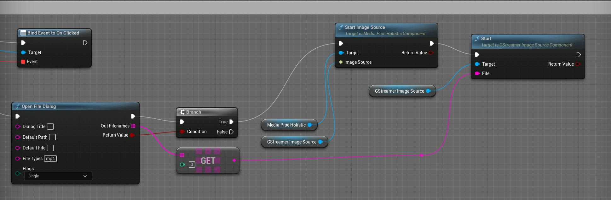

# Mediapipe4U 插件

基于 MediaPipe 的 UnrealEngine 动作捕捉插件。   

----

# 系统要求与限制

## 系统要求：

1. UnrealEngine 5.0 +
2. Windows 10 x64 及以上操作系统（ Windows 7 未经测试）

> 注意：手机端和 Mac 端未支持！！

---
## 性能表现：

由于 MediaPipe Windows 版本不支持 GPU 推理，Windows 依靠 CPU 完成人形姿态预测（具体信息参考 MediaPipe）：

**测试环境**

CPU： AMD 3600 CPU
内存: 32GB
显卡: 1660s（此型号显卡无光追）

**表现：** 

帧率(fps)： 18-24  

CPU 占用率：20% (测试 DEMO 仅包含 MetahumanLight 场景和 VRM 模型)  

---

## 支持的功能：

1. C++ 开发支持
2. 蓝图开发支持

> Mediapipe4U 全部使用 C++ 开发，因此完美支持 C++ 开发的。同时，尽可能做到了让所有功能暴露于蓝图中，你可以在蓝图开发环境下获得一致的开发体验。

## 模型要求：

### 骨骼

模型需要满足最小人形骨骼定义，定义如下：

图片中骨骼颜色标记说明：

- 红色: 必须提供，否则无法正常工作
- 黄色: 建议提供，否则影响部分功能
- 灰色：可以不提供，后续版本可能会使用
- 未标记：可以不提供（长期不会使用）

骨骼结构注意事项：

1. 除脊柱（Spine）和盆骨（Hips）外，骨骼必须具有正确的父子关系（父骨骼旋转能供移动子骨骼)，例如：LeftHand 必须是 LeftLowerArm 的直接子骨骼。 
2. 手掌部分骨骼必须全部提供，每根手指需要三根骨骼
3. 其他多余的骨骼不影响功能
4. 脊柱（Spine）可以是任意数量，但是盆骨（Hips）必须是他的祖先，脊柱(Spine)和盆骨（Hips）不要求直接父子关系，你可以使用任意一根脊柱骨骼来控制腰身的旋转

### Pose 要求

MediaPipe4U 适应任意的角色模型的初始 POSE （例如可以是 T-POSE，也可以是 A-POSE）, 但是角色必须面朝向 **Y** 轴正方向。

**但是**，如果你使用运行时重定向功能，原始骨骼和目标骨骼必须具有相同的骨骼结构（包括层级关系和各个骨骼的转轴朝向），也要求必须使用相同的 POSE 类型。

### 面部驱动（不保证效果，要求苛刻，不建议使用）

面部驱动兼容苹果 Arkit 表情，你的 MorphTarget 名称必须满足苹果命名规范，当然你可以通过 RetargetAsset 来适应任意的名称。

### 必要条件

使用动补功能，你的动画蓝图必须使用插件中的 MediaPipeAnimInstance 作为基类。

---

# 使用方法

## 准备动补的角色（Character）

1. 创建一个动画蓝图，基类选择 MediaPipeAnimInstance ：   

> 必须使用这个基类，否则无法正常使用使用动补功能   

2. 在动画蓝图左侧选择打开显示继承的变量，确保你可以看到 mediapipe 变量   

3. 依次放入三个节点: MediaPipePoseSolver, MediaPipeHandSolver, MediaPipeLocationSolver   

   

### 核心节点详细说明   

**MediaPipePoseSolver**: 身体动补算解节点，负责计算身体骨骼旋转，参数如下：

|参数|类型|说明|
|---|----|-----|
Alpha     | float (0-1.0)      | 和普通动画蓝图节点的 Alpha 参数相同，请参考 UE 文档
Smooth     | float (0-1.0)     | 动作平滑度，该参数影响阻尼滤波算法，平滑度越大抖动越少，但是动作"灵敏度"越低，简单来说，如果图像源是快速动作（例如街舞）请使用较小的平滑值，如果图像源速度较慢，可以增加平滑值以消除抖动噪声
|LockShoudlers| bool | 是否锁定整个肩膀(Shoudler, 目前 Shoudler 其实并未参与计算，未来可能会引入肩膀 IK 功能)到手腕 (hand) 的骨骼，值为 **true** 时该链上的骨骼不参与动补，否则参与动补，“锁定”含义下面均相同，不再重复说明 |
|LockLegs| bool | 是否锁定整个大腿( Leg )到脚踝 (Foot) 的骨骼 |
|LockHips| bool | 是否锁定盆骨，模型通常通常以盆骨作为根骨，锁定盆骨后人物将不会整体旋转 |
|LockSpine| bool | 是否锁定脊柱，锁定后角色上半身将不能旋转 |
|LockHead| bool | 是否锁定头部，锁定后角色头部不能旋转 |
|LockHand| bool | 是否锁定手部，锁定后角色手腕、手指将不能旋转，**注意**： LockShoudlers 被设为锁定时，手部也会强制锁定 |
|LockFoot| bool | 是否锁定脚踝，锁定后角色脚部不能旋转，**注意**： LockLegs 被设为锁定时，脚踝也会强制锁定 |
|UseLegIK| bool | 使用使用腿部 IK，使用脚部 IK 可以纠正膝关节扭曲，一般情况下开启，副作用是动作可能不如关闭 IK 到位 |
|UseArmIK| bool | 使用使用手臂 IK，使用手部 IK 可以纠正肘关节扭曲，一般情况下开启，副作用是动作可能不如关闭 IK 到位 |
|KalmanQ| float | 卡尔曼滤波 Q 参数，除非你对 Kalman 滤波非常熟悉，否则不建议更改 |
|KalmanR| float | 卡尔曼滤波 R 参数，除非你对 Kalman 滤波非常熟悉，否则不建议更改 |

> 说明：KalmanQ\KalmanR 参数默认因为不常用，默认显示不是 pin，所以节点上可能不能看到， 但是你可以可以在右侧细节面板中看见

**MediaPipeHandSolver**: 手指动补算解节点，负责计算手指骨骼旋转，参数同 **MediaPipePoseSolver**。

**MediaPipeLocationSolver**: 动补位移算解节点，负责计算橘色位移（相同参数不再介绍）：   

|参数|类型|说明|
|---|----|-----|
|LockHozantalMove| bool | 是否锁定横向位移（角色左右运动） |
|LockVerticalMove| bool | 是否锁定垂直位移（角色下蹲、跳跃） |
|LockForwardMove| bool | 是否锁定前后位移（角色靠近、走远） |
|CalibrateCountDownSeconds| float | 自动标定角色位置的延迟时间（秒），将在开始动补 XX 秒之后标定，标定前角色不会产生位移 |
|Speed | float | 角色移动速度, 位移计算类似于“惯性动补原理”，并非定位空间位置，而是预估角色移动速度，图像源动作的快慢可能会有不同的位移效果，通过该参数调节预估算法以匹配正确的位移速度 |
|MovementScale | FVector | 角色三个朝向（X,Y,Z）运动的效果缩放，同 speed 参数类似，但是可以精确控制各个轴向的移动效果 |
   

1. 动画蓝图参数：

### 骨骼

MediaPipe4U 理论上支持所有的人形骨骼，并不要求你的骨骼名称和必须遵循某一规范，同时，提供了两种预设以减少配置骨骼的枯燥工作。

你可以在动画蓝图上左侧 tab 页找到 MediaPipeAnimInstance 的参数（MediaPipe 类别下）

   

**BonePreset**    
使用骨骼预设：
- VRM: Vroid 骨骼, 支持通过 Vroid Studio 创建的角色
- UE5：UE5曼尼（mannequin 小金人）的骨骼，该骨骼其实也兼容 UE4 的曼尼（小白人）、
- Custom: 自定义骨骼（使用 **BoneSettings** 中配置的骨骼）

**BoneSettings**    
人形骨骼配置信息
> BoneSettings 仅当 BonePreset 设置为 Custom 时才可编辑

根据“模型要求”一节提到的信息配置模型骨骼

### 其他

**ResetOnPiplineStop**     

是否在 MediaPipe 停止时（停止动补时）将角色骨骼旋转回复到最初状态。

**SolveHand**

是否算解手掌（包括手指）动作

**SolveFingers**

是否算解手指动作， 注意，当 SolveHand 为 false 时，即使 SolveFingers 为 true 也不会算解手指，当 SolveFinger 开启时手腕旋转使用 MediaPipe 手部地标计算（更加精确），当 SolveFinger 关闭后使用 MediaPipe POSE 地标计算手腕

**SolveFace**

是否算解面部表情（仅在使用了 MediaPipe LiveLink 时有效）

**SolveLocation**   

是否算接位移   

---

## 准备 MediaPipe 运行时组件（Component）

MediaPipe 运行时需要一些组件，下面分别介绍：

**UMediaPipeImageSource** （仅当使用视频动补或图片动补时需要）

这是一个接口，并且可以通过蓝图或者 C++ 实现，为 MediaPipe 计算提供图像，你可以自己实现这个接口提供图像以进行 mediapipe 计算。   
> 注意：该接口实现需要自行保证多线程性能，例如图像缓冲队列，否则可能造成整个算解器性能低下，因此建议你使用 C++ 高效的实现该接口，例如可以从 UE4 内置的媒体播放器获得图像放入 mediapipe 中进行计算，或者从在线的视频流获得图像等。
---
### 内置 **UMediaPipeImageSource** 实现（组件）   

**StaticImageSouceComponent**

静态图片图像源，该组件通过输入单张的图片到 MediaPipe 完成算解过程。
> 注意，单张图片会自动启用 mediapipe static 模式，算解过程将得到优化，所以请勿自己实现单张图片的动补，使用该组件即可

**GStreamerImageSourceComponent** 

GStramer 图像源，该组件实现了从 GStramer 获取视频流作为图像源。

> GStreamer 是知名的第三方媒体库，可以实现采集，编码，解码，渲染，如果你对 Gstreamer 感兴趣，可以看这里 https://gstreamer.freedesktop.org/。使用 Gstreamer 是为了完美兼容 mp4，当然，如果你对 Gstreamer 熟悉，你甚至可以用他解码在线流媒体然后输出给 mediapipe 进行动补

GStreamer 的源代码遵循 LGPL 开源协议，MediaPipe4U 插件并未对 GStreamer 进行任何更改，所以你可以放心的商用和分发而不必担心版权问题，如果你自行修改了 GStreamer 实现了高级功能，请无比遵循 LGPL 协议，尊重知识产权也避免你的商业软件产生知识产权纠纷。

**MediaPipeHolisticComponent**

对 MediaPipe Holistic 计算器（Calculator）封装的组件，关于 MediaPipe Holistic 参考下面链接：

https://google.github.io/mediapipe/solutions/holistic.html

**MediaPipeLiveLinkComponent**

该组件提供将 MediaPipe 作为 LiveLink 源的能力，这样你可以像使用 Arkit 一样通过在动画蓝图中添加 LiveLinkPose 节点使用 MediaPipe4U 的面补功能，更多 LiveLink 详细信息请参阅 Unreal 官方文档。

### 创建 Actor 以包含 MediaPipe 所需组件：

创建一个 Actor，并添加上述组件，添加后你的 Actor 看起来应该如下图：

   

至此，你已经完成了所有运行 MediaPipe 动补的准备工作！！！   

---   

## 开始 MediaPipe 动补

### 摄像头动补：

你可以通过调用 **MediaPipeHolisticComponent** 的 **StartCamera** 函数来开始一个摄像头动补，如果你使用蓝图调用，看起来差不多是这样：

   

StartCamera 参数说明

|参数|说明|
|-------------|----------------|
|DeviceId|摄像头编号，一般 0 表示 PC 中的第一个摄像头|
|ResolutionX |摄像头水平分辨率|
|ResolutionY |摄像头垂直分辨率|

> 注意：一般摄像头都支持很多分辨率，图像不是越大越好，过大的图像反而影响计算效率，推荐 1280*720 即可

### 图片动补：

StartImageSource 中传入 StaticImageSouceComponent 即可，由于方法很简单，不再文字描述，参考下面蓝图节点：

   

### 视频动补：

StartImageSource 中传入 GStreamerImageSourceComponent 即可

   