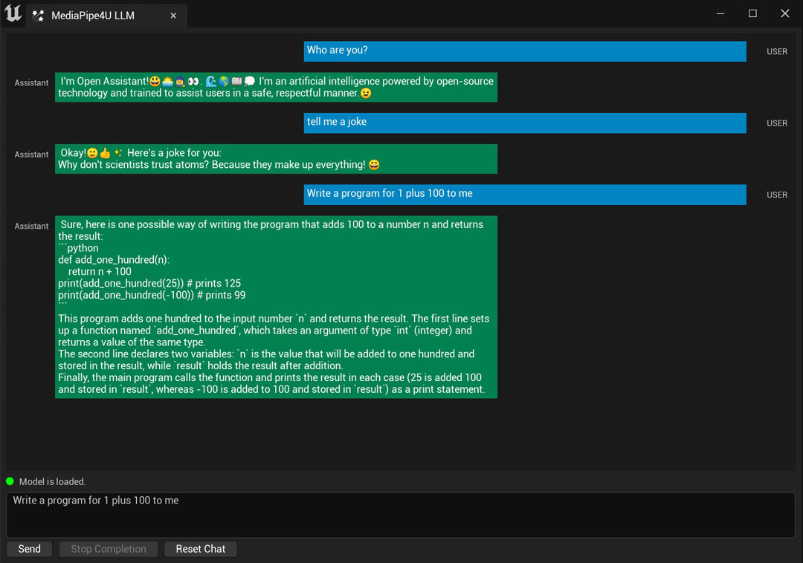

[简体中文](./README_CN.md)
 
 

An Unreal Engine plugin that helps you use AI and ML techniques in your unreal engine project.
 
 

<a href="">=14.36.32532-aff.svg"></a>
<a href="">=10.0.22621-orange.svg"></a>
<a href="">=2022.17.6.3-blue"></a>

<a href="https://opensource-labijie-com.translate.goog/Mediapipe4u-plugin/update_logs/?_x_tr_sl=zh-CN&_x_tr_tl=en&_x_tr_hl=zh-CN&_x_tr_pto=wapp">News</a>
| <a href="#document">Document</a>
| <a href="#download">Download</a>
| <a href="https://github.com/endink/MediaPipe4U-Demo">Demo Project</a>
| <a href="https://github.com/endink/Mediapipe4u-plugin/releases/tag/M4U_Remoting_App">M4U Remoting(Android App)</a>
| <a href="https://github.com/endink/Mediapipe4u-plugin/releases/tag/speech_models">Speech Model Packages</a>

<a href="https://opensource.labijie.com/Mediapipe4u-plugin/licensing/pay_license.html">Free Edtion vs Commercial Edition</a>

# Introduction

**MediaPipe4U** provides a suite of libraries and tools for you to quickly apply artificial intelligence (AI) and machine learning (ML) techniques in Unreal Engine project. You can plug these solutions into your UE project immediately, customize them to your needs. Include motion capture , facial expression capture for your 3D avatar, text to speech (TTS), speech recorgnization (ASR), etc. All features are real-time, offline, low latency and easy to use.

# What's news

`20230805`

- [new]:rainbow: Add the **offline** large language model (LLM) feature (MediaPipe4ULLM plugin) to support offline deployment and inference llama2 model ([Document](https://opensource.labijie.com/Mediapipe4u-plugin/llm/)).   
- [new]:rainbow: Add LLM Speech feature (MediaPipe4ULLMSpeech plugin), integrated MediaPipe4U Speech into LLM, can automatically read the result that generated by LLM.
- [new]:rainbow: Released a new ONNX voice model pack (better sound quality), adding four new voice model packs: Chinese, Chinese male voice, English, English female voice（[Speech Model Release Page](https://github.com/endink/Mediapipe4u-plugin/releases/tag/speech_models)）.
- [new] TTS inference supports Onnx engine and can get a higher quality vocoder.   
- [new] Add StartCameraAsync function, prevent UI block while camera starting.   
- [new] TTS blueprint functions added to MediaPipeSpeechActor (some functions in LocalTTSComponent no longer support access in blueprint).   
- [improve] TTS supports text reading queue, which can read multiple texts one by one (the `SpeakText` function on `MediaPipeSpeechActor` add the **StopPrevious** parameter).   
- [improve] Removes the pdb file to further reduce the package size.   
- [improve] When the NvAR SDK is not installed, packaging will no longer fail, but will give a warning message.   
- [fix] Fixed that if UE Editor's LiveLink UI is opened when start mocap, the program will crash.   
- [fix] Fix program crash when access UI in ASR speech recognited events ([#90](https://github.com/endink/Mediapipe4u-plugin/issues/90)).   
- [fix] Fixed the Pose Asset Baker tool crash on UE 5.2 ([#88](https://github.com/endink/Mediapipe4u-plugin/issues/88)).
- [fix] A small probability that TTS can not be stopped.
- [fix] An encoding issue exists in TTS/ASR parsing folders that cause the wrong folder being created on disk.

## Release Notes
For the release notes, ref below:
- [Release Notes (English, it's google translate)](https://opensource-labijie-com.translate.goog/Mediapipe4u-plugin/update_logs/?_x_tr_sl=zh-CN&_x_tr_tl=en&_x_tr_hl=zh-CN&_x_tr_pto=wapp)   
- [Release Notes (简体中文)](https://opensource.labijie.com/Mediapipe4u-plugin/update_logs/)   

# Features

- Motion Capture
  - Motion of the body
  - Motion of the fingers
  - Movement
  - Drive 3D avatar
  - Real-time
  - RGB webcam supported
- Face Capture
  - Facial expression.
  - Arkit Blendshape compatible (52 expression) 
  - Live link compatible
  - Real-time
  - RGB webcam supported
- Multi-source Capture
  - RGB WebCam
  - Video File
  - Image
  - Living Stream (RTMP/SMTP)
  - Android Device (M4U Remoting)
- LLM
  - Offline
  - Model Supports: LLaMA2
  - CPU Inference 
  - Pure C++: Plugin only, no Python or external programs required
- TTS
  - Offline
  - Real-time
  - Lip-Sync
- ASR
  - Offline
  - Real-time
- Animation Data Export
  - BVH export 
- Pure plugins
  - No external programs required
  - All in Unreal Engine

# Document

- [中文文档](https://opensource.labijie.com/Mediapipe4u-plugin/)   

- [English (sorry it's google translate)](https://opensource-labijie-com.translate.goog/Mediapipe4u-plugin/?_x_tr_sch=http&_x_tr_sl=zh-CN&_x_tr_tl=en&_x_tr_hl=zh-CN&_x_tr_pto=wapp)

- [日本語 (申し訳ありませんが、それは単なるGoogle翻訳です)](https://opensource-labijie-com.translate.goog/Mediapipe4u-plugin/?_x_tr_sl=zh-CN&_x_tr_tl=ja&_x_tr_hl=zh-CN&_x_tr_pto=wapp)

- [한국어 (죄송합니다, 이것은 단지 구글 번역입니다)](https://opensource-labijie-com.translate.goog/Mediapipe4u-plugin/?_x_tr_sl=zh-CN&_x_tr_tl=ko&_x_tr_hl=zh-CN&_x_tr_pto=wapp)

# Download   

| Unreal Engine | China Site | Global Site | Update |
|---| --- | --- |----|
| UE 5.0 | [cowtransfer](https://cowtransfer.com/s/24af2cb737ea4b) | [One Drive](https://1drv.ms/u/s!AkmROUeQfSBjzzL3p1oJhOwVLtwa?e=0dC6LE) | 2023-08-07 |
| UE 5.1 | [cowtransfer](https://cowtransfer.com/s/6bc307201a2741) | [One Drive](https://1drv.ms/u/s!AkmROUeQfSBjzzG2jd-jJtN9LMWa?e=FBh7UV) | 2023-08-07 |
| UE 5.2 | [cowtransfer](https://cowtransfer.com/s/3f80899c0a8c44) | [One Drive](https://1drv.ms/u/s!AkmROUeQfSBjzzAk1Wl2yf_wa8Ty?e=0ADBWg) | 2023-08-07 |

  
> Because the plugin is precompiled and contains a large number of C++ link symbols and debug symbols, it will cost **10G** disk space after decompression (most files are UE-generated binaries in Intermediate).   
> Don't need to worry about disk usage, this is just disk usage during development, after the project is packaged, the plug-in disk usage is **300M** only (most files are GStreamer dynamic library and speech models).

# Free License File Release

The license file will be published in the [discussion](https://github.com/endink/Mediapipe4u-plugin/discussions/82), and the plugin package file will automatically include an license file.   

# M4U Remoting App

| Android Version | Download Link | Update |
|---| --- | --- |
| Android 7.0 or later | [Download](https://github.com/endink/Mediapipe4u-plugin/releases/download/M4URemoting_20230421/M4URemoting_20230421.apk) | 2023-04-21 |

> **About M4U Remoting**   
>    
> <mark>Note</mark>    
> This is a commercial license exclusive feature: capturing facial expressions from android device.   
> Free license only supports using in UE Editor, cannot be packaged this feature.   
> [M4U Remoting Document](https://opensource.labijie.com/Mediapipe4u-plugin/features/m4u_remoting.html)
  
# Demo Project
Please clone this repository to get demo project:   
- https://github.com/endink/MediaPipe4U-Demo  

> The demo project does not contain plugins, you need to download the plugin and copy content to the project's plugins folder to run.

# Video Channels

**Video Tutorials (English)**

**Video Tutorials (Chinese)**

[bilibili](https://www.bilibili.com/video/BV1124y157hz/)

# FAQ

If you have any questiongs, please check [FAQ](./faq) first. The problems listed there may be also yours. If you can’t find an answer in the FAQ, please post an issue. Private message or emal may cause the question to be mised .

# Performance

Since the Windows version of MediaPipe does not support GPU inference, Windows relies on the CPU to inferring human pose estimation (see MediaPipe offical site for more details).

**Evaluation** 

Frame Rate： 18-24 fps 

CPU usage：20% (Based on DEMO project)  

**Testing Evnrioment**

CPU： AMD 3600 CPU   
RAM: 32GB   
GPU: Nvidia 1660s

# Follow Me

[bilibili](https://space.bilibili.com/481665211)   

[Youtube](https://www.youtube.com/channel/UCiOTp6S7N3GX46_nLQ17CrA)   

# Acknowledge     

1. M4U used [MediaPipe](https://github.com/google/mediapipe) for motion capture and face capture.
2. M4U used [NVIDIA Maxine AR SDK](https://github.com/NVIDIA/MAXINE-AR-SDK) for facal capture.
3. M4U used [Paddle Speech](https://github.com/PaddlePaddle/PaddleSpeech) for TTS.
4. M4U used [FunASR](https://github.com/alibaba-damo-academy/FunASR) for ASR.
5. M4U used [GStreamer](https://gstreamer.freedesktop.org/) for video and live streaming decoding.
6. M4U used [llama.cpp](https://github.com/ggerganov/llama.cpp) for inference of LLaMA2 model.
7. M4U borrowed a lot of code from [PowerIK](https://poweranimated.github.io/) for ground ik.
8. M4U borrowed a lot of ideas from [Kalidokit](https://github.com/yeemachine/kalidokit) for mocap.
9. M4U borrowed a lot of code from [wongfei](https://github.com/wongfei) for gstreamer/mediapipe integration.