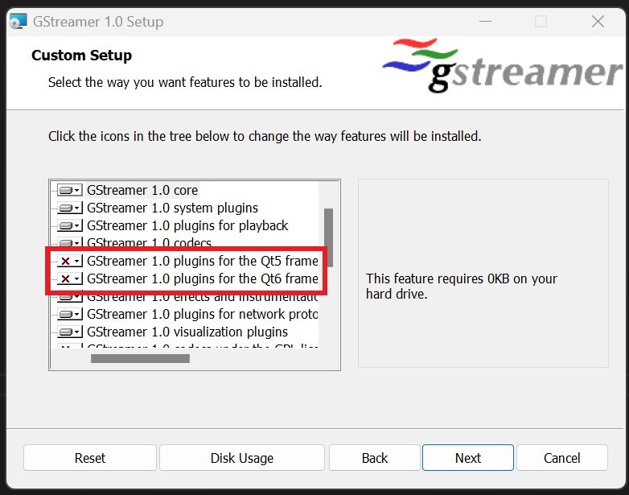
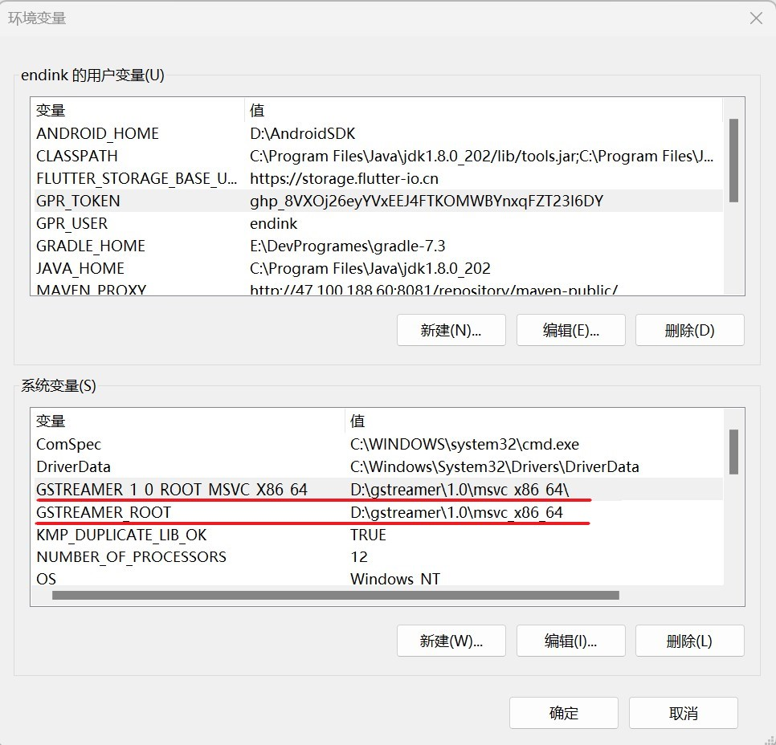

# GStreamer 配置

如果你需要从视频进行动补的功能，必须使用  **MediaPipe4UGStreamer** 和 **GStreamer**， 并且，你还需要配置 GStreamer。
**MediaPipe4U** 使用 GStreamer 来处理视频流（通过视频进行动作捕捉），

{: .highlight }
> UnrealEngine 中的 MediaPlayer 对于一些 H264 编码的视频文件并不能很好的解码。因此，**MediaPipe4U** 使用
> GStreamer 作为 MediaPlayer 的理想替代品。实际上，GStreamer 的功能非常强大，它支持各种视频文件、视频流（RTMP/FLV等等），WebRTC等等。
> 
> GStreamer 是一个流行的开源库，Nvidia 也用它来开发基于视频的 AI 框架，它绝对是一个可靠的视频处理方案。

## 下载 GStreamer   

到 GStremer 官网下载 GStreamer 开发包和运行库   

打开下载页面： https://gstreamer.freedesktop.org/download/

{: .warning }
> 你需要同时下载运行时(runtime installer) 和 开发包（development installer），安装时请将运行时和开发包安装到同一个目录。

## Runtime installer 安装建议

使用默认的运行时安装（Runtime installer）步骤安装之后, GStreamer 只包含基础的解码器，而且包含了多余的组件。因此，建议你选择 Custom 安装做出必要的调整：   

1. 安装 **libav** 插件集   

{: important}
>默认不会安装来自 FFmepg 的解码组件，这会让你解码一些网络视频流时遇到问题，建议安装 Livav 库包装，它会包含一些功能强大的解码器，基本可以解码市面上常见的视频格式。

2. 排除 QT 相关组件   

{: important}
>QT 是一个功能强大的 UI 开发框架，但是，对于 MediaPipe4U 来说，它是多余的，我们并不需要它，排除这些库可以减小你的打包尺寸。

> 当然，你也可以排除一些变

## 检查 GStreamer 环境变量

如果你使用的安装包，那么会自动配置环境变量，如果你使用二进制（binraries）方式安装，请自行配置环境变量。

**MediaPipe4U** 提供的 **GStreamer** 插件会检查以下环境变量来链接 GStremer 库。

- GSTREAMER_1_0_ROOT_MSVC_X86_64
- GSTREAMER_ROOT

请确保上述环境变量至少存在一个，并且值为 GStremer安装目录\1.0\msvc_x86_64\ , 如下图

> *图片仅为了说明，你只需要配置其中一个环境变量即可*   

只要以上配置正确 **MediaPipe4UGStreamer** 和 **GStreamer** 插件 就会正常工作了。