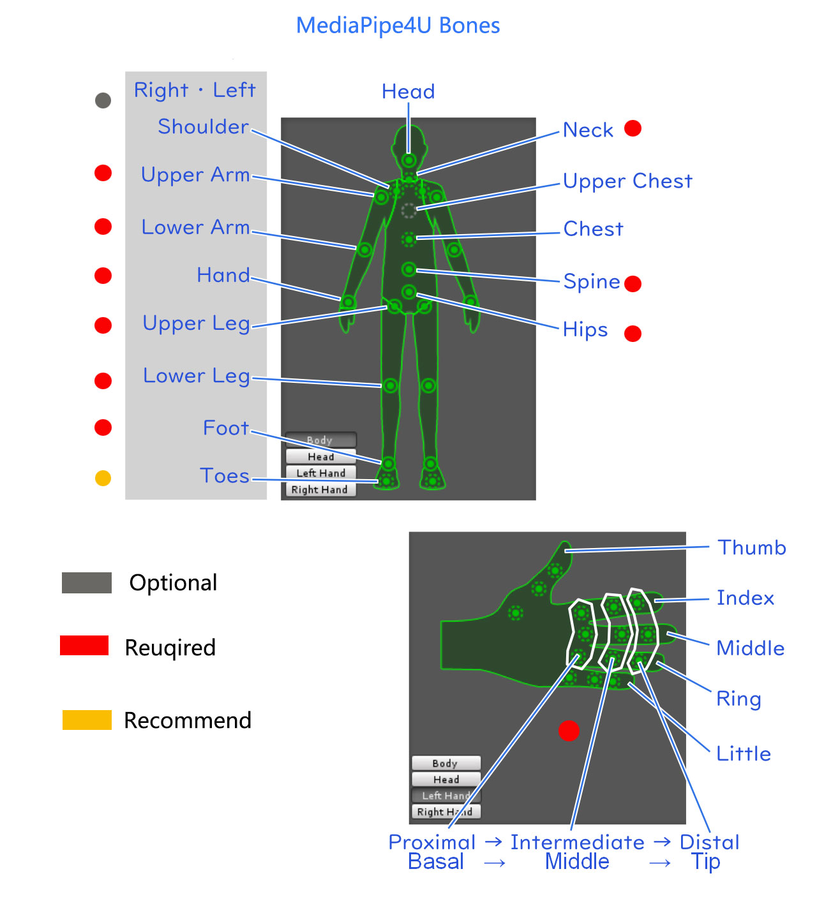

# 环境要求   


*请仔细阅读以下章节，确认你的环境是否满足 **MediaPipe4U** 要求。*

- [操作系统和 UnrealEgine 版本](#p1)
- [模型要求](#p2)    
- [角色初始POSE](#p3)  
- [动画蓝图要求](#p4)  

## <a id="p1">操作系统和 UnrealEgine 版本</a>

1. UnrealEngine 5.0 +
2. Windows 10 x64 及以上操作系统（ Windows 7 未经测试）

> 注意：手机端和 Mac 端未支持！！

## <a id="p2">模型要求</a>

### 骨骼

模型需要满足最小人形骨骼定义，定义如下：

图片中骨骼颜色标记说明：

- 红色: 必须提供，否则无法正常工作
- 黄色: 建议提供，否则影响部分功能
- 灰色：可以不提供，后续版本可能会使用
- 未标记：可以不提供（长期不会使用）

骨骼结构注意事项：

1. 除脊柱（Spine）和盆骨（Hips）外，骨骼必须具有正确的父子关系（父骨骼旋转能供移动子骨骼)，例如：LeftHand 必须是 LeftLowerArm 的直接子骨骼。 
2. 手掌部分骨骼必须全部提供，每根手指需要三根骨骼
3. 其他多余的骨骼不影响功能
4. 脊柱（Spine）可以是任意数量，但是盆骨（Hips）必须是他的祖先，脊柱(Spine)和盆骨（Hips）不要求直接父子关系，你可以使用任意一根脊柱骨骼来控制腰身的旋转

## <a id="p3">角色初始POSE</a>

MediaPipe4U 适应任意的角色模型的初始 POSE （例如可以是 T-POSE，也可以是 A-POSE）, 但是角色必须面朝向 **Y** 轴正方向。

**但是**，如果你使用运行时重定向功能，原始骨骼和目标骨骼必须具有相同的骨骼结构（包括层级关系和各个骨骼的转轴朝向），也要求必须使用相同的 POSE 类型。

### 面部驱动（不保证效果，要求苛刻，不建议使用）

面部驱动兼容苹果 Arkit 表情，你的 MorphTarget 名称必须满足苹果命名规范，当然你可以通过 RetargetAsset 来适应任意的名称。

## <a id="p4">动画蓝图要求</a>

使用 **MediaPipe4U** 的动补功能，你的动画蓝图必须使用插件中的 **MediaPipeAnimInstance** 作为基类。

---

