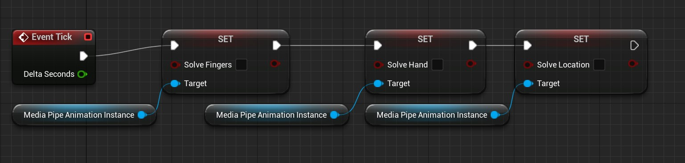

# 算解器 (蓝图)

**MediaPipe4U** 运行你在运行时动态调整一些参数，例如平滑、滤波器参数、关节锁定等。   
由于 **MediaPipe4U** 使用 C++ 开发，因此如果你是 C++ 项目，你将获得最大的自由度，对于蓝图项目，我们提供了蓝图函数库 **UMediaPipeUtils**，
目前这个类库可能不如 C++ 编程那么强大，但是我会陆续为它添加实用的功能。

## 获取 MediaPipeAnimInstance

如果我有个名为 **ABP_BaseCharacter_MediaPipe** 的动画蓝图（基类是 MediaPipeAnimInstance），并且已将它应用到带有名为 mesh 的骨骼网格的 Character上，
那么，我可以在该 Character 的蓝图中获取到 ABP_BaseCharacter_MediaPipe.

   

> 我将 MediaPipeAnimInstance 实例保存到一个名为 MediaPipeAnimationInstance 的蓝图变量中。

## 修改平滑

我们借助 **UMediaPipeUtils** 蓝图函数库很容易的修改身体、手指的动补平滑值：

   

## 开关算解器

   

## 切换全身/上半身模式

**UMediaPipeUtils** 提供了一个在上半身/全身动补之间方便的切换的函数，该函数的本质是改变关节的锁定状态，具体来说，上半身模式将锁定腿部和盆骨的旋转。
如果你实用 C++ ，你可以在运行时精确的控制关节的锁定状态。

   

## 其他实用函数

你可以在一个 Actor 上直接找到 **MediapPipeAnimInstance** 实例   

   

