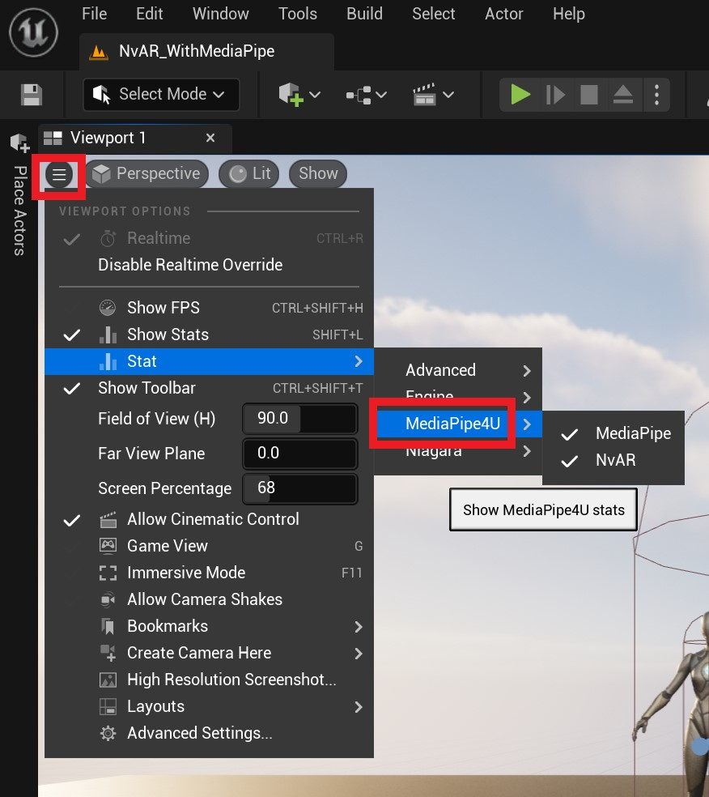
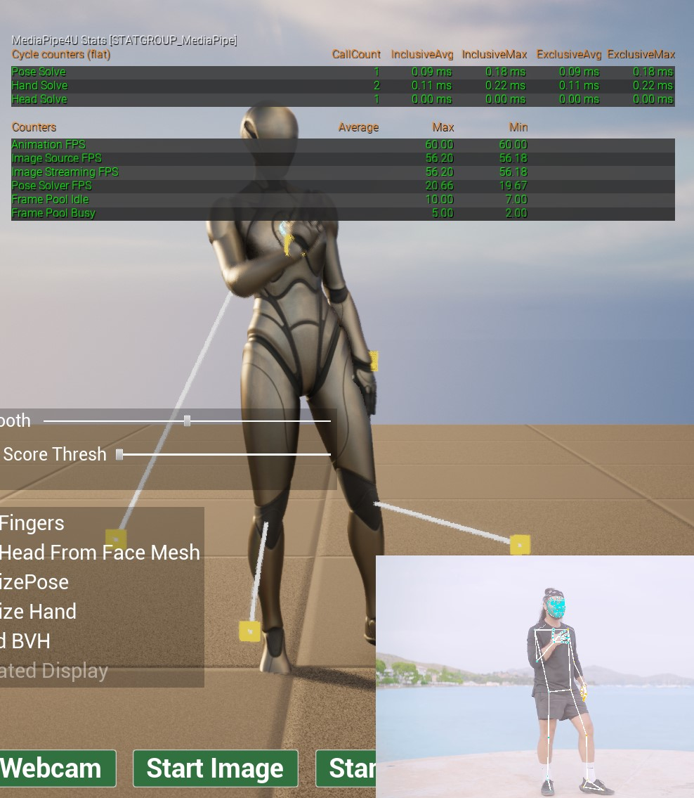

# 统计数据（Stat）

**MediaPipe4U** 使用标准的 Unreal Engine Stat 埋点来收集插件中的关键指标，方便排查性能问题。

## MediaPipe 统计数据

你可以在 UE Editor 的 View Port 菜单中打开 **MediaPipe4U** 的统计面板。   

   

>也可以使用命令：
> - stat mediapie
> - stat nvar

   

**关键性能**

|Stat| 说明 | 主要影响因素 |
|-------------| -------------------- | -------- |
| Pose Solver FPS | 算解器的帧率，一秒内解算的 MediaPipe 数据帧数量 | CPU 性能，图像的分辨率 |
| Animation FPS | **MediaPipe4U** 动画蓝图节点运行的帧率 | GPU 性能，CPU 性能 |
| Image Source FPS | 图像源（摄像头、视频）的帧率 | 摄像头分辨率，帧率，帧编码方式，CPU 性能 |
| Image Streaming FPS | 图像采样后流送到 MediaPipe 工作流的帧率 | 程序代码 |
| Image Pool Idle | 帧对象池中空闲的帧对象数量 | 下游 Consumer 处理性能，算解器性能 |
| Image Pool Busy | 正在图像工作管道中处理的帧数量 | 下游 Consumer 处理性能，算解器性能 |

**算解器性能**

|Stat| 说明 |
|-------------| -------------------- |
| Pose Solve | 姿态算解器处理一帧数据的花费的时间 |
| Hand Solve | 手部算解器处理一帧数据的花费的时间 |
| Head Solve | 头部算解器处理一帧数据的花费的时间 |
| Location Solve | 位移算解器处理一帧数据的花费的时间 |