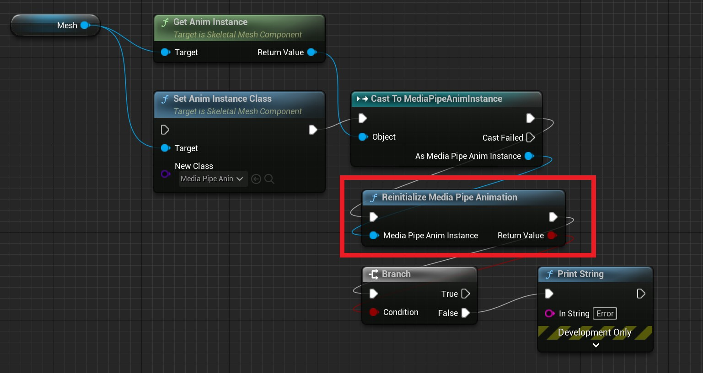

# 切换动画蓝图

你可能因为各种原因，需要在程序运行以后改变骨骼网格体上的动画蓝图。   

不论是蓝图还是 C++，你都可以通过设置 **USkeletalMeshComponent** 的 **SetAnimInstanceClass** 函数来改变一个骨骼体的动画蓝图。

[](images/set_anim_instance_class.jpg)   


然后，当你切换到一个 **MediaPipeAnimInstace** 的蓝图时，你还需要初始化 MediaPipe 工作环境。    

## 蓝图中切换动画蓝图

在蓝图中你可以使用 **ReinitializeMediaPipeAnimation** 函数完成这个过程：


[](images/reinitailize_mediapipe_anim.jpg)   

## C++ 中切换动画蓝图

如果你使用 C++ 编程，可以调用 **MediaPipeAnimInstace::Reinitailize** 函数完成这个过程： 

```cpp
USkeletalMeshComponent* Mesh = XXXX;
UClass* AnimInstanceClass = UMediaPipeAnimInstance::StaticClass(); //This should be your Blueprint class
Mesh->SetAnimInstanceClass(AnimInstanceClass);
UAnimInstance* AnimInstance = Mesh->GetAnimInstance();
if(UMediaPipeAnimInstance* MediaPipeAnimInstance = Cast<UMediaPipeAnimInstance>(AnimInstance))
{
    if(MediaPipeAnimInstance->ReInitialize())
    {
        // switch ok
    }
    else
    {
        // switch fault
    }
}
```
