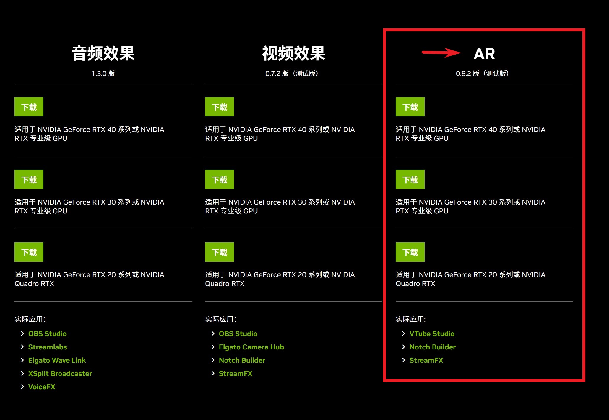
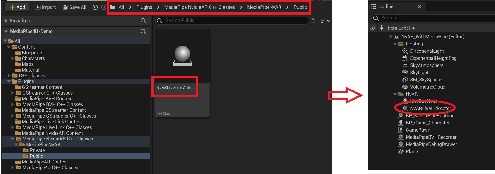
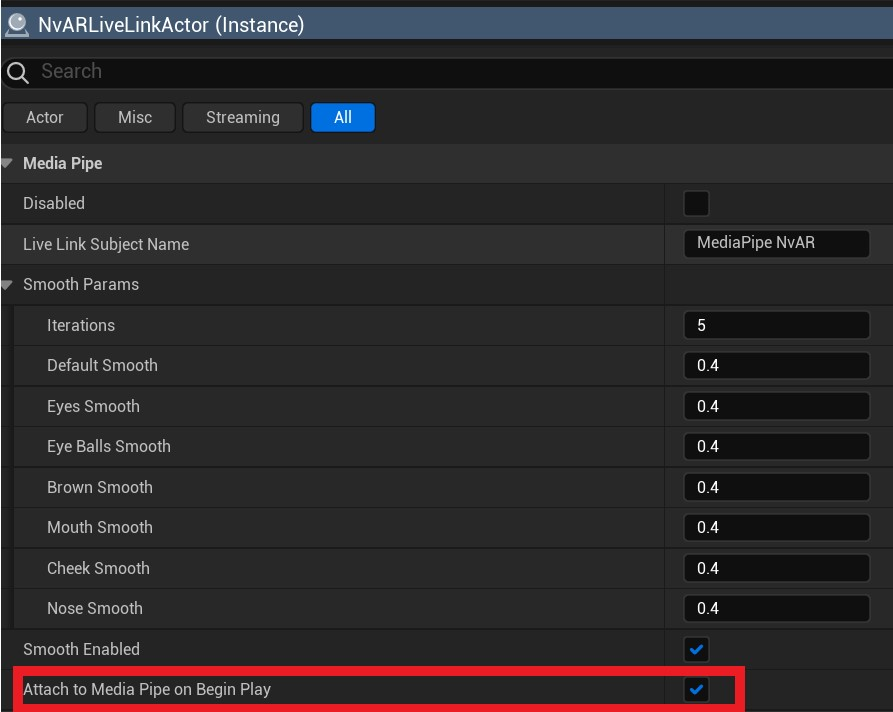
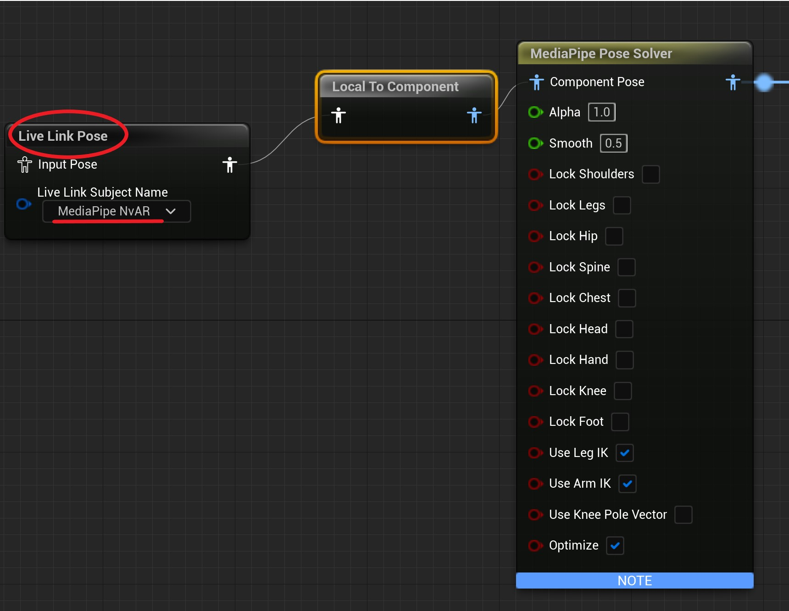
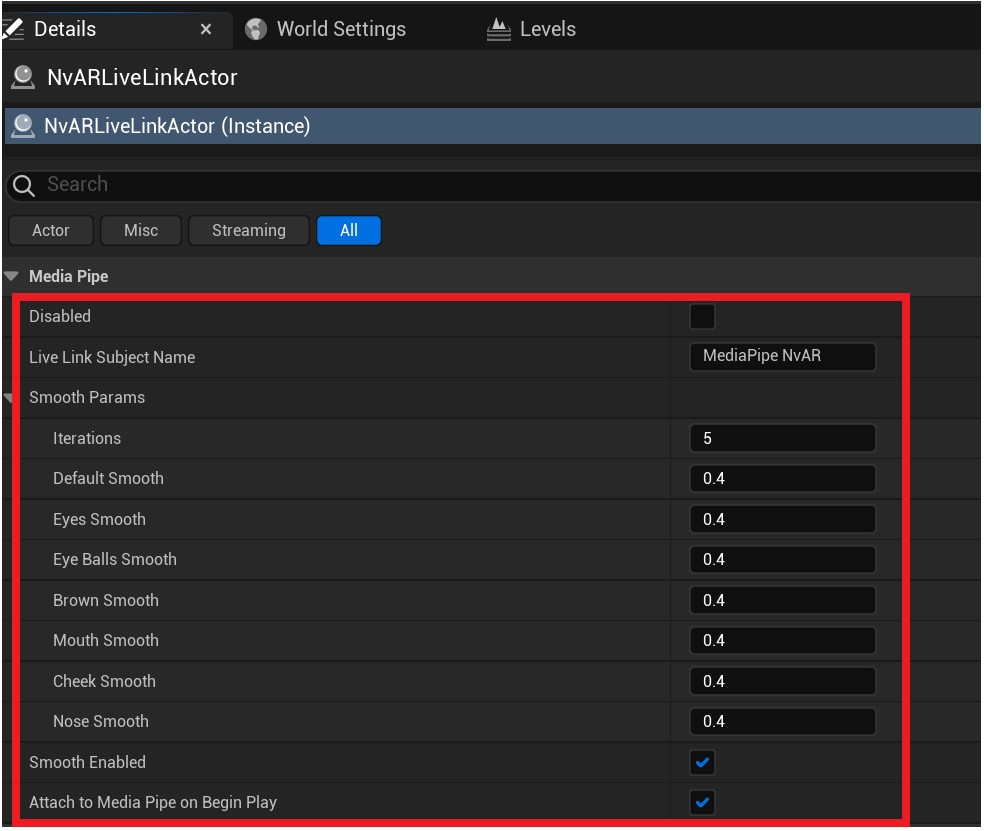

# Nvidia Maxine AR

**Nvidia Maxine AR** (以下简称 **NvAR**) 提供了将人脸 Landmarks 拟合到 Blendshape 的算法。   

**基本原理：**  

**NvARLiveLinkActor** 消费来自 **MediaPipeImageSource** 的图像帧到 NvAR 算解器，将输出结果转换成标准 Apple Arkit 的 BlendShape 权重，
最后，将这些权重以符合 Unreal Engine 要求的格式发送到 LiveLink 总线。  因此，你可以使用标准的 LiveLinkPose 动画蓝图节点接收表情曲线（Curve）驱动你的 3D 角色。

---

**MediaPipe4U** 封装了一个名为 "**MediaPipe4UNvAR**" 的插件，将 Nvidia 的算法集成到 MediaPipe4U 的工作流管道，可以让它和 MediaPipe 同时工作。
**MediaPipe4UNvAR** 可以在不使用 **MediaPipe4U** 动作捕捉的情况下单独工作，但是使用 **MediaPipe4UNvAR** 插件依赖 **MediaPipe4U** 插件（项目种必须包含 **MediaPipe4U** 插件）。    

**MediaPipe4UNvAR** 功能：

- 独立使用，无需 **MediaPipeAnimInstance** 但是依赖 **MediaPipe4U** 的 **ImageSource** 工作流。
- 兼容 LinkLive ，通过动画蓝图种的 LiveLink 节点消费 **NvAR** 表情算解结果。
- 兼容Apple Arkit 标准的 51 个 blend shape 名称（不支持 tongueOut）。
- 支持头部旋转 BlendShape, 如果你使用骨骼旋转头部，你需要自行将头部旋转的曲数值映射到骨骼旋转。

演示效果：

国内用户 Youtube 打不开，转到 B 站视频：

[B站演示效果](https://www.bilibili.com/video/BV1sD4y1N7HX/?share_source=copy_web&vd_source=f77a8ce9c4c322dcc88515970bea1630)

关于 **NvAR** 的相信信息，你看这里：   
https://developer.nvidia.com/maxine

# 系统要求

## 软件要求

|软件|版本要求|
|----|--------|
Windows OS | 64-bit Windows 10 or later
NVIDIA Graphics Driver for Windows | 511.65 or later
Nvidia Maxine AR SDK | 0.8.2

> MediaPipe4U 的 NvAR 插件无论是开发环境和打包后都要求 PC 已经安装 **Nvidia Maxine AR SDK**。
> 由于 NvAR 插件体积太大（1G以上），让用户自行安装会更方便，否则你的软件包也将非常大。

## 硬件要求

**NvAR** 必须使用 Nvidia GPU, 只支持以下三种架构

- **NVIDIA Turing™**: Geforce RTX 20XX
- **NVIDIA Ampere™**: Geforce RTX 30XX
- **NVIDIA Ada™**: Geforce RTX 40XX
- **Other have Tensor Cores**: H100,etg (but no sdk for downloading, ask nvidia ? )

> 官方要求说明：  NVIDIA GeForce RTX 20XX and 30XX Series, Quadro RTX 3000, TITAN RTX, or higher (any NVIDIA GPUs with Tensor Cores)

详细的系统和软件要求请阅读这里：

[https://docs.nvidia.com/deeplearning/maxine/ar-sdk-system-guide/index.html](https://docs.nvidia.com/deeplearning/maxine/ar-sdk-system-guide/index.html)

**注意:**不同的显卡有不同的可再发现组件包，如何阅读请继续阅读下面的章节。

## 依赖的 UnrealEngine 插件

- MediaPipe4U
- LiveLink

## 开始使用

### 1. 安装 Nvidia 的可再发行组件包（Redistributable SDK package

从以下网址下载适合你的显卡的组件包：   

[https://www.nvidia.com/broadcast-sdk-resources](https://www.nvidia.com/broadcast-sdk-resources)

### 2. 安装 MediaPipe4UNvAr 插件   

从下载插件目录找到插件 MediaPipe4UNvAR 目录，将它到你的 Unreal Egine 项目 Plugins 目录并启用它.

> **MediaPipe4UNvAR** 通过 LiveLink 来驱动角色，因此你也必须在项目中启用 **LiveLink** 插件

### 3. 添加 NvARLiveLinkActor

在场景中添加一个 **NvARLiveLinkActor** 。

### 4. 与 MediaPipe4U 动作捕捉集成

> 通过步骤 **3**, 我们已经准备好 **NvARLiveLinkActor** 来消费图像帧数据了。
>
> **NvARLiveLinkActor** 可以和 **MediaPipe4U** 动作捕捉协同工作，也可以独立工作。 
>    
> - 如果你想要在 **MediaPipe4U** 动作捕捉的同时，通过 NvAR 表情捕捉，本小步骤指引你完成这个功能。  
> - 如果你希望单独使用 **NvARLiveLinkActor** 从图像源中捕捉表情而不使用 **MediaPipe4U** 的动作捕捉功能，那么请跳过本小节，阅读小节 **5**
>

与 **MediaPipe4U** 动作捕捉集成只需要设置 **NvARLiveLinkActor** 上的变量为 **true** 即可。

**了解原理：**
MediaPipe 动作捕捉也要消费图像帧数据，通过设置 **NvARLiveLinkActor** 上的变量为 **true** ，使得 **NvARLiveLinkActor** 伴随 **MediaPipeHolisticComponent** 自动启停，你无需管理 **NvARLiveLinkActor** 的启动或停止， 并且自动消费来自 MediaPipe 的图像帧数据（视频、摄像头或者图片） 。

### 5. 独立使用 NvAR 表情捕捉

暂缺文档   

<!-- # > 如果你阅读过本节开头的"基本原理", 你就知道 NvAR 需要消费图像帧来计算表情权重。
# > 帧由图像源提供，图像源在 MediaPipe4U 中被抽象为 **MediaPipeImageSource** (实际它是一个 **IMediaPipeImageSource** 接口)。
# 
# - 5.1 准备图像源（**MediaPipeImageSource**）
# 
# 在场景中的任意 Actor 上附加一个图像源，**MediaPipe4U** 支持三种开箱即用的图像源：   
# 
# - **StaticImageSouceComponent** : 静态图片
# - **GStreamerImageSourceComponent** ：视频文件
# - **WebcamImageSourceComponent**: USB 摄像头
# 
# > 你也可以实现自己的图片源。但是，实现图像源必须使用 C++ 编程，因为图片源伴随着复杂的异步任务，多线程，图片解码等内容，稍有不当，会造成死锁，程序性能低下等严重问题，所以，用蓝图实现图像源并不合适。
# > 在 C++ 中，可以通过继承 **MediaPipeImageSourceComponent** 实现自己的图像源，**MediaPipeImageSource** 已经为你处理好多线程，帧缓冲池, 异步消费队列等棘手的问题，你只需要自己完成图片格式解码即可。 -->

不同的图像源有不同的使用方式，图像源的详细信息你可以查看 [准备 MediaPipe 运行时组件](../usage/prepare_components.md) 一章的内容。

### 6. 驱动 3D 角色（Avatar）

和使用 Apple 的 Arkit 一样，通过在动画蓝图中添加 LiveLinkPose 节点，并将 Subject 设置为 MediaPipe NvAR 即可驱动你的 3D 角色。

> 你也可以通过 PoseAsset 进行驱动面部动画， ModifyCurve 等节点也可以正常使用。

需要注意的是，的 **MediaPipe4UNvAR** 默认使用 "MediaPipe NvAR"（中间包含空格）作为 LiveLink Subject 名称，你的 LiveLink Pose 节点必须和这个名称保持一致。   
Subject 名称可以通过 **NvARLiveLinkActor** 上的属性 **LiveLinkSubjectName** 进行修改。

### 7. 属性

NvAR 产生的数据中带有抖动，**MediaPipe4U** 通过滤波算法来消除这些数据噪音，让表情更加平滑自然。   
你可以通过 **NvARLiveLinkActor** 中的 SmoothParams 来调整算法的参数。

**参数说明**

|参数|说明|
|----|--------|
Disabled | 使用禁用 NvAR 功能，当你不再需要 NvAR 表情捕捉时，尽可能禁用它可以提供应用程序性能。
LiveLinkSubjectName | 控制 LiveLink 数据发送到的 LiveLink Subject 名称。
SmoothParams | 用来平滑表情的滤波算法参数
SmoothEnabled | 是否启用表情平滑
bAttachToMediaPipeOnBeginPlay | 是否程序启动后自动将 **NvARLiveLinkActor** 附加到 **MediaPipe4U** 动作捕捉数据管道, 开启此属性后 **NvARLiveLinkActor** 将自动消费来自 MediaPipe 的图像帧产生表情动画

