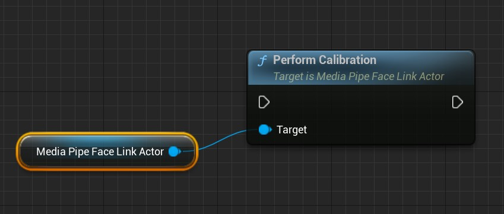

# 表情捕捉

MediaPipe4U 在一个独立的插件中包含了表情捕捉功能，该插件使用一个独立的 Actor（AActor Class）来完成从图像源（ImageSource）中求解 BlendShape 的功能。   

{: .highlight }
> 如果你在 Apple 设备上用过 Epic 的 Live Link Face App ，你可以把这个 Actor 看做 Live Link Face App 的模拟，它从图像源中求解兼容 Apple Arkit 标准的 51 个表情 (tongueOut 不支持)，并通过
> 和 Live Link Face App 一致的 Live Link 格式数据发送数据，因此你可以像接收 Live Link Face App 一样接收来自 MediaPipe4U 的 BS 计算结果。
> 
> 虽然它还不具备 Live Link Face App 的某些功能，例如，数据录制，头部算解等，但是，随着 MediaPipe4U 持续的开发，这些功能将会集成到这个 Actor 中。

---   

## 安装

1. 启用 Epic 的 Live Link 插件
2. 复制 MediaPipe4ULiveLink 文件夹到项目的 Plugins 目录。
3. 在项目中启用 **MediaPipe Live Link** 插件。
4. 在插件 C++ 目录中找到 **MediaPipeFaceLinkActor**, 将它拖放到你的 Level 中。
5. 选中 **MediaPipeFaceLinkActor**，在细节面板中对 Actor 进行配置。
   

当 MediaPipe 动作捕捉开始后（ MediaPipeHolisticComponent 组件 Start 之后），会自动开始表情捕捉，并且向 LiveLink 接收端（通常是你的 LiveLinkPose 动画蓝图节点）发送数据。

---   

## 属性

MediaPipeFaceLinkActor 属性很少，表情捕捉本身也不需要太多参数，MediaPipeFaceLinkActor 参数使用默认值已经工作良好。

**FaceSolution**    
FaceSolution 属性表示要使用的方案名称。FaceLinkActor 可以支持在多种 BlendShape (BS) 求解算法中切换，这里的每一种算法就是一个方案（Face Solution）"。   
默认值: **MediaPipe**    
> 默认的 MediaPipe 方案不依赖任何硬件，有着良好的适用性   

   
**AllowSolutionDegradation**   
是否允许方案（solution）降级回退。   
表情求解器启动后，当 FaceSolution 被设置为一个不存在的方案时，如果 bAllowSolutionDegradation 属性设置为 **true**，将回退到 "MediaPipe" 方案， 如果属性为 **false**，表情求解器将启动失败，并在日志中打印错误。
   
**LiveLinkSubjectName**    
用来指定 LiveLink 发送数据的 Subject 名称，如果你在动画蓝图中使用 LiveLinkPose 节点，这里的名称应该和 LiveLinkPose 节点上的 Subject 属性一致，以便动画蓝图节点可以从 MediaPipe4U 接收数据。   
默认值: **MediaPipe4U**  
   
**SmoothParams**    
指定表情的各个区域的平滑程度，和设置平滑算法的参数，关于这个参数的详细信息，下文进行详细说明。   
   
**SmoothEnabled**    
有的时候，可能你希望使用自己的平滑算法，这个开关用来开启/关闭插件内置的平滑算法。   
默认值: **true**

**PublishHeadRotation**   
是否启用头部旋转求解，如果为 true ，会额外传递三个曲线到 LiveLink, 它们分别是 **HeadPitch**, **HeadRoll**, **HeadYaw**。   
默认值: **true**

{: .warning}
> 并不是所有的 Face Solution 都支持头部旋转求解，你的程序应该考虑不同方案对头部旋转的支持会不同。

**Disabled**  
是否禁用 MediaPipe4U 的 BS 求解，当设置为 **true**，将不再发送 MediaPipeFaceLinkActor 数据。
   
---   

## Face Solution

MediaPipeFaceLinkActor 通过 Face Solution 支持不同的算法，因为某些算法对硬件可能有特殊要求，可以选择适合你的 Face Solution 进行面补。   

**支持的 Face Solution 名称:**
- MediaPipe
- NvAR (需要 MediaPipe4U NvAR 插件)   
  
> 目前来说 NvAR 方案精度高于 MediaPipe。

{:.important}
> 当 MediaPipe4U 动作捕捉开始以后，虽然你可以设置 FaceSolution，但是它并不会生效，必须停止动作捕捉再启动才能切换方案。简单来说，FaceSolution 不能 mediapipe 运行过程中切换。

你可以通过蓝图库 MediaPipeLiveLinkBlueprintLibrary 中的函数 **ListFaceSolutions** 列出当前可用的方案：

该函数返回一个方案列表和方案个数。

## 平滑   

MediaPipeFaceLinkActor 可以按面容的不同区域来平滑表情，主要通过 **SmoothParams** 属性来进行设置。   

**SmoothParams** 属性如下：   
| 属性 | 说明 |
|:----- |:----|
| Iterations     | 平滑算法迭代次数，主要用来消除抖动，数值越大，抖动越少，但是对表情的敏感度也会越低。 |
| EyesSmooth     | 眼睛区域的 BS 平滑度，0.0 - 1.0, 数值约大，平滑度越高。 |
| EyeBallsSmooth | 眼球区域的 BS 平滑度，0.0 - 1.0, 数值约大，平滑度越高。 |
| BrownSmooth    | 眉毛区域的 BS 平滑度，0.0 - 1.0, 数值约大，平滑度越高。 |
| MouthSmooth    | 嘴巴区域的 BS 平滑度，0.0 - 1.0, 数值约大，平滑度越高。 |
| CheekSmooth    | 脸颊区域的 BS 平滑度，0.0 - 1.0, 数值约大，平滑度越高。 |
| JawSmooth      | 下巴区域的 BS 平滑度，0.0 - 1.0, 数值约大，平滑度越高。 |
| NoseSmooth     | 鼻子区域的 BS 平滑度，0.0 - 1.0, 数值约大，平滑度越高。 |
| HeadSmooth     | 头部旋转平滑度，0.0 - 1.0, 数值约大，平滑度越高，要求 Face Solution 能够支持头部旋转求解。 |

---   
   
## 事件通知

MediaPipeFaceLinkActor 不支持手动启动/停止，而是自动跟随 mediapipe 启停。为此，MediaPipeFaceLinkActor 暴露了必要的事件，让你指导它何时启动和停止。   

**OnFaceLinkStarted**   
当 MediaPipeFaceLinkActor 开始表情捕捉流程时触发该事件。   

**OnFaceLinkStarted**   
当 MediaPipeFaceLinkActor 停止表情捕捉流程时触发该事件。   
   
**OnFaceCalibrated**   
当面容校准完成时触发该事件。
   
---   

## 校准

从不同的人面容中捕捉的表情可能会产生差异，例如一个人的眼睛大小可能影响 EyeBlink 相关的 BS 数值，为此 MediaPipeFaceLinkActor 提供了对面容进行校准的功能。
完成面容校准仅需调用 **PerformCalibration** 函数。

{: .warning}
> **PerformCalibration** 是一个异步函数，调用结束时面容并不会理解被校准，它需要等待下一帧 blend shapes 数据才能完成校准, 完成校准后会通过 **OnFaceCalibrated** 事件来
> 通知应用程序。   
>
> 同时你需要注意，**PerformCalibration** 必须在 mediapipe 运行过程中调用才能校准，因为它需要 bs 数据帧，如果在 mediapipe 停止状态调用 **PerformCalibration**，
> 将永远不会触发 **OnFaceCalibrated** 回调。
>
> 可以通过 **MediaPipeHolisticComponent::IsRunning** 函数或 **MediaPipeAnimationInstance::IsMediaPipeRunning** 函数来判断 mediapipe 是否正在运行。

如果你希望使用上次的校准数据（虽然并不推荐这样做）来校准面容，你也可以使用 **PerformCalibrationImmediately** 函数通过传递一个帧数据来立即校准。
PerformCalibrationImmediately 函数不关心 mediapipe 是否正在运行，因此你可以在任何时候校准面容。

{: .warning}
> 虽然你可以在任何情况下使用 PerformCalibrationImmediately 函数，但是你必须确保你将要校准的 Face Solution 和用来校准的帧数据是相同的 Face Solution，你应该注意下面的问题：    
> 1. 由于 **MediaPipeFaceLinkActor** 存在自动降级行为，要获取实际正在使用的 FaceSolution， 你不能通过 **FaceSolution** 来获取，而应该使用 **GetActualFaceSolution**
> 函数来获取正在运行的方案。
> 2. 必须注意： GetActualFaceSolution 仅在 mediapipe 运行过程中才能返回正确的方案名称，如果 mediapipe 停止，它将返回空字符串。
>
> 综上，不建议你在 mediapipe 停止时进行面容校准，这会增加很多不必要的麻烦，建议你永远在 mediapipe 运行过程中进行面容校准操作。

### 校准数据清理   

校准后将记录面容的信息，你可以通过 **UnCalibration** 函数来清理这些校准数据。

---   
   
## UE 编辑器中校准

为了方便开发，你也可以在编辑器中进行校准操作，细节面板中提供了校准和清理校准的按钮。

# 不同 Face Solution 对 Blend Shapes 的支持

|名称               | MediaPipe | NvAR  | 说明|
|:-----------------|:-----:|:------:|--------:|
|eyeBlinkLeft      |  ✅  |   ✅  |  左眼眨眼
|eyeLookDownLeft   |  ✅  |   ✅  |  左眼目视下方
|eyeLookInLeft     |  ✅  |   ✅  |  左眼注视鼻尖
|eyeLookOutLeft    |  ✅  |   ✅  |  左眼向左看
|eyeLookUpLeft     |  ✅  |   ✅  |  左眼目视上方
|eyeSquintLeft     |  ✅  |   ✅  |  左眼眯眼
|eyeWideLeft       |  ✅  |   ✅  |  左眼睁大
|eyeBlinkRight     |  ✅  |   ✅  |  右眼眨眼
|eyeLookDownRight  |  ✅  |   ✅  |  右眼目视下方
|eyeLookInRight    |  ✅  |   ✅  |  右眼注视鼻尖
|eyeLookOutRight   |  ✅  |   ✅  |  右眼向左看
|eyeLookUpRight    |  ✅  |   ✅  |  右眼目视上方
|eyeSquintRight    |  ✅  |   ✅  |   右眼眯眼
|eyeWideRight      |  ✅  |   ✅  |  右眼睁大
|jawForward        |  ✅  |   ✅  |  努嘴时下巴向前
|jawLeft           |  ✅  |   ✅  |  撇嘴时下巴向左
|jawRight          |  ✅  |   ✅  |  撇嘴时下巴向右
|jawOpen           |  ✅  |   ✅  |  张嘴时下巴向下
|mouthClose        |  ✅  |   ✅  |  闭嘴
|mouthFunnel       |  ✅  |   ✅  |  稍张嘴并双唇张开
|mouthPucker       |  ✅  |   ✅  |  抿嘴
|mouthLeft         |  ✅  |   ✅  |  向左撇嘴
|mouthRight        |  ✅  |   ✅  |  向右撇嘴
|mouthSmileLeft    |  ✅  |   ✅  |  左撇嘴笑
|mouthSmileRight   |  ✅  |   ✅  |  右撇嘴笑
|mouthFrownLeft    |  ✅  |   ✅  |  左嘴唇下压
|mouthFrownRight   |  ✅  |   ✅  |  右嘴唇下压
|mouthDimpleLeft   |  ✅  |   ✅  |  左嘴唇向后
|mouthDimpleRight  |  ✅  |   ✅  |  右嘴唇向后
|mouthStretchLeft  |  ✅  |   ✅  |  左嘴角向左
|mouthStretchRight |  ✅  |   ✅  |  右嘴角向右
|mouthRollLower    |  ✅  |   ✅  |  下嘴唇卷向里
|mouthRollUpper    |  ✅  |   ✅  |  下嘴唇卷向上
|mouthShrugLower   |  ✅  |   ✅  |  下嘴唇向下
|mouthShrugUpper   |  ✅  |   ✅  |  上嘴唇向上
|mouthPressLeft    |  ✅  |   ✅  |  下嘴唇压向左
|mouthPressRight   |  ✅  |   ✅  |  下嘴唇压向右
|mouthLowerDownLeft|  ✅  |   ✅  |  下嘴唇压向左下
|mouthLowerDownRigh|  ✅  |   ✅  |  下嘴唇压向右下
|mouthUpperUpLeft  |  ✅  |   ✅  |  上嘴唇压向左上
|mouthUpperUpRight |  ✅  |   ✅  |  上嘴唇压向右上
|browDownLeft      |  ✅  |   ✅  |  左眉向外
|browDownRight     |  ✅  |   ✅  |  右眉向外
|browInnerUp       |  ✅  |   ✅  |  蹙眉
|browOuterUpLeft   |  ✅  |   ✅  |  左眉向左上
|browOuterUpRight  |  ✅  |   ✅  |  右眉向右上
|cheekPuff         |  ✅  |   ✅  |  脸颊向外
|cheekSquintLeft   |  ✅  |   ✅  |  左脸颊向上并回旋
|cheekSquintRight  |  ✅  |   ✅  |  右脸颊向上并回旋
|noseSneerLeft     |  ✅  |   ✅  |  左蹙鼻子
|noseSneerRight    |  ✅  |   ✅  |  右蹙鼻子
|tongueOut         |  ⭕  |   ⭕  |  吐舌头
|HeadYaw           |  ⭕  |   ✅  |  左右转头
|HeadPitch         |  ⭕  |   ✅  |  上下抬头
|HeadRoll          |  ⭕  |   ✅  |  向肩膀偏头

> 关于 Arkit 的 BlendShape 标准，你可以查看[这里](https://developer.apple.com/documentation/arkit/arfaceanchor/blendshapelocation)
