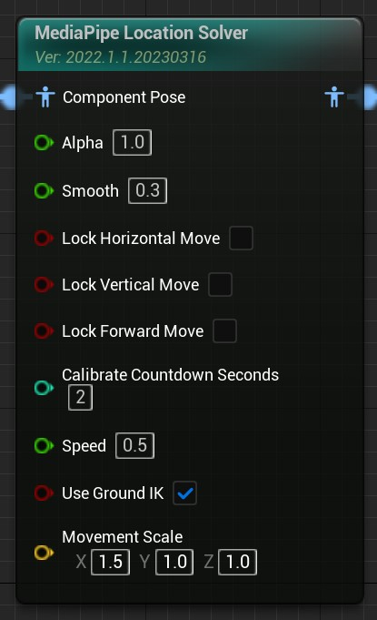

# 位置节点

MediaPipe4U 使用一个专门的动画蓝图节点，从动补数据中计算角色的位移。

## 安装位置节点

1. 在动画蓝图中放入 MediaPipe Location Solver 节点。
2. 在节点上设置主要的行为。
3. 选中节点，在细节面板中对节点进行详细的配置。

此时，MediaPipe4U 将从动补数据中算解出人物的位移数据，并且驱动 3D 角色在 X,Y, Z 轴向上移动。   
   

下面的设置能够调整位置节点的行为，对于位移的算解，我们主要关心移动轴的控制，位移的速度以及地标贴合。其他的很多属性与其他 MediaPipe4U 节点相同（因为所有的节点都从同一个基类继承）。

## 基本参数   

节点上包含的最常用的属性，仅调节这些属性就可以适应绝大多数的场景。

|属性| 默认值 | 说明 |
|--------------------| ------ | -- |
| Smooth | 0.3 | 对动补数据应用平滑，数值在 0~1 之间，数值越大越平滑。 |
|LockHorizontalMove  | false | 当为 **true** 时，将阻止角色进行水平（左，右）方向的位移。 |
|LockVerticalMove    | false | 当为 **true** 时，将阻止角色进行垂直（上，下）方向的位移。 |
|LockForwardMove     | false | 当为 **true** 时，将阻止角色进行前后位移。 |
|CalibrateCountdownSeconds | 5（秒） | 将在开始动补后 X 秒内进行位置校准。 |
|bUseGroundIK | true | 是否使用地表 IK，关于地表 IK，下面的小节将详细介绍。 |
| Speed | 0.5 | 预估的视频中人物和相机之间的距离变化的速度（人物远，近），这将影响人物深度信息的计算。 |
| MovementScale | Vector(1,1,1) | 用于放大（缩小）三个轴向上的位移效果。通常，角色朝向 Y 轴时，X 表示水平方向，Y 表示前后方向，Z 表示垂直方向。 |

## 位置校准 (Calibration)

如果使用了位置节点，当动补开始以后，**MediaPipe4U** 将自动开始进行位置校准，校准就是通过视频流中的一帧图像作为人物位置参考数据，通过 CalibrateCountdownSeconds 来设置何时抓取这张图片。 

> 例如 CalibrateCountdownSeconds 设置为 5， 表示大致从第 5 秒的视频中抓取图片作为位置参考。对于摄像头动补而言，CalibrateCountdownSeconds 的含义是，人物站在摄像头图像的正中间，5 秒钟之内保持不动，等待校准完成。

---   

## Ground IK

单目摄像头由于无法准确获取图像深度信息，因此可能在算解过程中造成人物位置发生偏移。
垂直方向的偏移可能造成角色“悬空”或脚部陷入地面，为此，位置节点中内置了地表 IK ，用来将角色的脚与地面贴合。 

想快速开始使用 GroundIK，最简单的方法就是观看视频教程：   
- [中文视频（bilibili）](https://www.bilibili.com/video/BV1eY4y1Q7AD)
- [English Video Tutorial（youtube）](https://youtu.be/cop7_kCaDn4)
   

> Ground IK 工作原理：
> - Ground IK 通过向地面发出射线 (Ray Trace)
> - 通过射线计算脚离地面的距离
> - 通过推动角色的盆骨（Hips）消除距离
> - 计算腿的骨骼链来让姿态自然

{: .warning }
由于 Ground IK 通过射线检测（Ray Trace）地面，你需要确保从腿部发出的射线除了地面外不回产生任何碰撞。可以通过单独建立碰撞通道（Collision Channel）来忽略除了地板外的所有碰撞体。
关于如何使用碰撞通道，请参考 UnrealEngine 官方文档。

通过单击位置节点，在细节面板中可以调整 Ground IK 的行为。

**CollisionChannel**     
射线检测的碰撞通道，确保脚部发出的射线只与地面碰撞   

**HipsRotationMultiplier**  
推动盆骨过程中如果法线偏移，轻微的旋转盆骨，该属性控制旋转的倍数

**MaxSquashIterations**  
推动盆骨造成腿部收缩时，腿部 IK 的算解迭代次数。

**MaxStretchIterations**  
推动盆骨造成腿部舒展时，腿部 IK 的算解迭代次数。

**FeetSmoothSpeed**  
当需要移动脚（Foot）的骨骼时，通常是脚线性平滑的移动，该属性控制 (厘米/秒) 增量移动的速度。

**FeetDampingDistance**  
抬脚的阻尼高度（厘米），在此高度以下时脚将吸附到地面，只有超过这个值才会抬起腿部。

**JumpVelocityThreshold**  
跳跃速度（厘米/秒）阈值，只有角色位移速度超过这个阈值，才认为角色正在跳跃，此时会缓慢降低脚步阻尼以完成起跳。

**InertiaSmoothFactor**  
惯性平滑因子，当脚移动时，需要消除位移的摇摆，移动过程必须具有增量非线性的阻尼效果，通过这个参数控制这种“移动速度”的平滑，数值越大，平滑度越高。