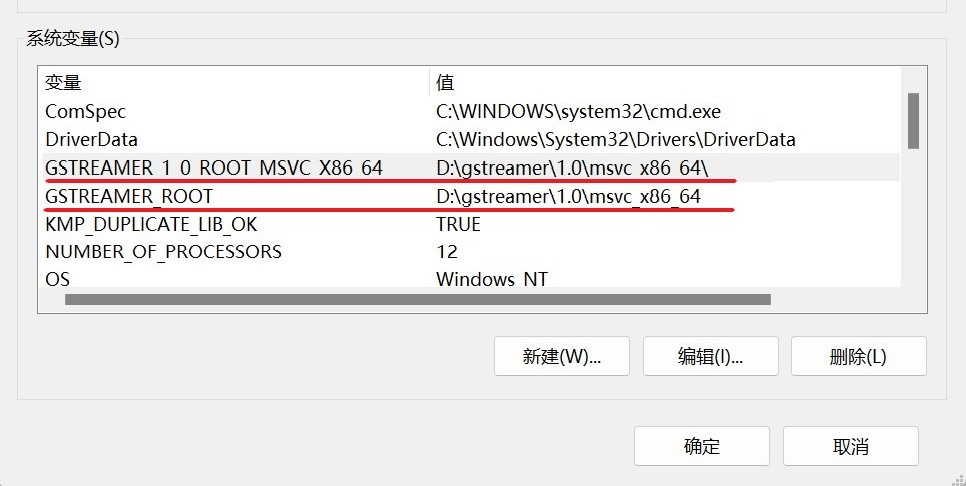

# Install GStreamer

:material-microsoft-windows:Windows Only  

If you require motion capture functionality from videos, you must use **MediaPipe4UGStreamer** along with **GStreamer**. Additionally, you need to configure GStreamer properly.  
**MediaPipe4U** utilizes GStreamer to process video streams (for motion capture via video input).

!!! note "Why GStreamer Is Required"

    Unreal Engine’s built-in MediaPlayer may not reliably decode certain H.264-encoded video files. Therefore, **MediaPipe4U** adopts  
    GStreamer as an ideal alternative to MediaPlayer. In fact, GStreamer is a powerful framework that supports various video formats,  
    video streaming protocols (RTMP/FLV, etc.), WebRTC, and more.  
    
    GStreamer is a widely used open-source library, also leveraged by Nvidia for developing AI frameworks based on video processing.  
    It is a highly reliable video processing solution.

## Download GStreamer  

Download both the GStreamer runtime package and development package from the official website.  

Visit the download page: [https://gstreamer.freedesktop.org/download/](https://gstreamer.freedesktop.org/download/)  

  

!!! warning "Important Notice"

    You must download and install **both** the runtime installer and the development installer. Ensure that they are installed  
    in the **same directory**.

## Recommended Runtime Installer Setup  

The default runtime installer setup only includes basic decoders and additional unnecessary components.  
It is recommended to select the **Custom** installation and adjust the options as follows:  

### 1. Install the **libav** Plugin Set  

!!! tip "Tip"

    By default, the installation includes only the official GStreamer video decoders. While these are sufficient for decoding  
    most video files, they may cause issues when handling network video streams.  
    It is recommended to install the **Libav** library package, which provides more powerful decoders,  
    supporting most common video formats.

  

### 2. Exclude Unnecessary QT Components  

  

!!! tip "About QT"

    QT is a powerful UI development framework. GStreamer includes support for QT-based development,  
    but it is **unnecessary** for **MediaPipe4U**.  
    Excluding these components helps **reduce package size**.

## Verify GStreamer Environment Variables  

If you installed GStreamer using the official installer, the environment variables will be set automatically.  
However, if you installed GStreamer manually using binary files, you must configure the environment variables manually.  

The **MediaPipe4U** GStreamer plugin checks for the following environment variables to locate the GStreamer libraries:  

- `GSTREAMER_1_0_ROOT_MSVC_X86_64`
- `GSTREAMER_ROOT`

> At least **one** of these environment variables must be set.  
> The official GStreamer installer will automatically configure `GSTREAMER_1_0_ROOT_MSVC_X86_64`.

Ensure that at least one of these variables is set, pointing to `<GStreamer Installation Directory>\1.0\msvc_x86_64\`, as shown below:  

> *The image is for reference only. You only need to configure one of the variables.*  

  

Once correctly configured, **MediaPipe4UGStreamer** and the **GStreamer plugin** will function as expected.
