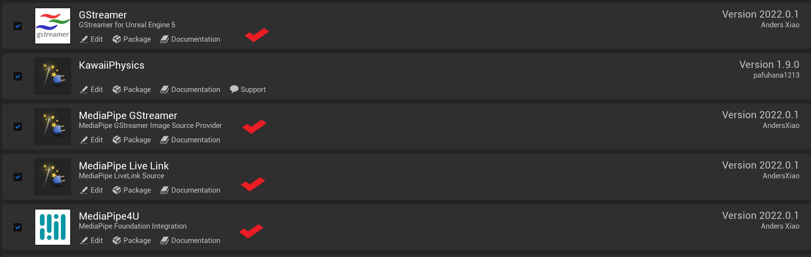

# Setup MediaPipe4U

## Plugin Contents

**MediaPipe4U** includes multiple Unreal Engine plugins. For the complete plugin directories and dependencies, see [Plugins and Dependencies](../package/plugin_content.en.md); the major feature plugins are introduced below.

`MediaPipe4U`

:   This is the core plugin of MediaPipe4U. It includes foundational frameworks such as OpenCV, MediaPipe, and DirectML, as well as common code for MediaPipe4U (e.g., image sources: camera sources, static image sources). Except for the `GStreamer` plugin, all other plugins in MediaPipe4U depend on it.

`MediaPipe4UPremium`

:   The foundation for advanced features, including licensing, GPU, remoting, editor, and file modules.

`GStreamer`

:   This is a wrapper for GStreamer within Unreal Engine, enabling you to use GStreamer in Unreal Engine.

`MediaPipe4UMotion`

:   This is the motion capture plugin. If you need motion capture functionality from images, you can use it (it can capture motion from cameras or static images).

`MediaPipe4ULiveLink`

:   This is the facial expression plugin. If you need facial expression capture functionality from images, you can use it.

`MediaPipe4UGStreamer`

:   This plugin provides an image source via GStreamer. If you want `MediaPipe4UMotion` or `MediaPipe4ULiveLink` to capture motion or facial expressions from videos, you can use it.

`MediaPipe4UBVH`

:   This plugin enables the conversion of Unreal Engine animations into BVH format animation files. When used with `MediaPipe4UMotion`, it can directly export character motions from videos to BVH files.

`MediaPipe4UNvAR`

:   This plugin allows the use of Nvidia Maxine's algorithms as an alternative to Google MediaPipe, enabling `MediaPipe4UMotion` and `MediaPipe4ULiveLink` to perform motion and facial expression capture using Nvidia's algorithms.

`MediaPipe4USpeech`

:   This plugin provides AI-powered speech-related capabilities, including real-time text-to-speech (TTS), speech recognition (ASR), and voice wake-up functionality, bringing "listening" and "speaking" abilities to your UE project.

`MediaPipe4ULLM`

:   This plugin allows you to connect to Ollama within your UE project, bringing large language model (LLM) inference capabilities to your UE project.

`MediaPipe4ULLMSpeech`

:   This plugin integrates `MediaPipe4USpeech` and `MediaPipe4ULLM`, making it easy to implement a voice-based chatbot powered by large language models (LLMs) in Unreal Engine.

## Setup in Unreal Engine

---
1. Copy the selected plugins and their direct dependencies from the downloaded MediaPipe4U plugin package to `[UE Project Root Directory]/Plugins`. For example, video-based facial-expression capture requires:

   - MediaPipe4U
   - MediaPipe4UPremium
   - MediaPipe4UMotion
   - GStreamer
   - MediaPipe4UGStreamer
   - MediaPipe4ULiveLink
   - Others...   
   
   After completion, your directory structure should typically look like this:   
   ```
   UEProjectSample
   ├─Binaries
   ├─Build
   ├─Config
   ├─Content
   ├─Intermediate
   ├─Plugins
   │ ├─GStreamer
   │ ├─MediaPipe4U
   │ ├─MediaPipe4UPremium
   │ ├─MediaPipe4UMotion
   │ ├─MediaPipe4UGStreamer
   │ ├─MediaPipe4ULiveLink
   │ ├─Others
   ├─Saved
   ├─Script
   └─Source

   ```

1. Open UE Editor and ensure the following plugins are enabled:

  [](images/plugin_enable.jpg)
