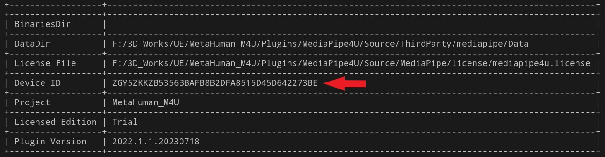

# 设备机器码

如果你购买 MediaPipe4U 的设备授权许可，需要提供设备机器码。

{: .warning}
> 通常你的开发 PC 和实际部署的 PC 可能不是同一个设备，你必须提供实际要部署的设备的机器码，这样我才能为你制作正确的许可证。

获取机器码有以下方式：
- 在 UE 编辑器中获取机器码
- 查看日志获取机器码
- 使用蓝图函数获取机器码

## 在 UE 编辑器中获取机器码

1. 打开 UE Editor，点击"编辑 >> 项目设置" （ Editor >> Project Settings）菜单打开项目设置页。
2. 在项目设置页左侧点击 "插件(Plugins) >> MediaPipe4U" 菜单项打开 MediaPipe4U 插件设置页。
3. 在MediaPipe4U 插件设置页中找到 Device Id ，这就是当前设备的机器码。

   

## 从启动日志中获取机器码

在 MediaPipe4U 启动时，会打印一个表格日志，其中包含了机器码。

   

{: .important}
> 当你要获取其他机器的机器码时，你可以打包一个程序，放在实际要部署的设备上，启动程序后，在 Saved 文件夹中找到日志文件，从日志文件中找到这个机器码。

## 在蓝图中获取机器码

你可以通过 **GetMediaPipeDeviceId** 函数来获取机器码。  

   

{: .highlight}
> C++ 用户可以通过 **UM4ULicenseBlueprintLibrary** 类访问到这两个蓝图函数。