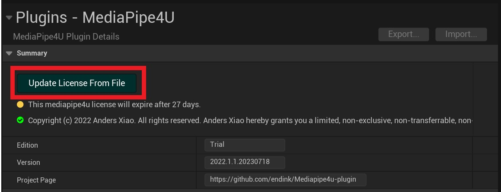
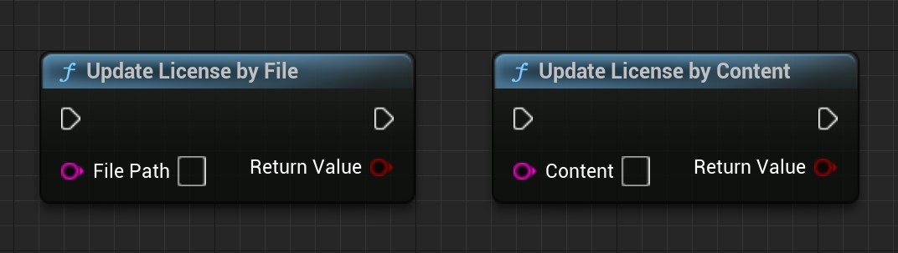

# How to Update the License

After the license expires, you can update it using the following methods:

- Update the license within the UE Editor, which is typically applicable during the development process.
- Use Blueprint functions to update the license, which can be used to develop an automated license update program.
- Manually update the license, which is the most basic update method.

!!! tip "Tip"
    Updating the license in the UE Editor and Blueprint requires the plugin version to be no lower than 2022.1.1.20230718.

The following sections will describe each method in detail.

## Update License in Unreal Editor

1. Open the UE Editor and click on `Edit >> Project Settings` to open the Project Settings page.
2. In the Project Settings page, click `Plugins >> MediaPipe4U` on the left-hand menu to open the MediaPipe4U plugin settings page.
3. In the MediaPipe4U plugin settings page, click the `Update License From File` button and select a new license file to update the existing license.

## Update License Using Blueprint

You can update the license by using either the `Update License By File` function or the `Update License By Content` function.  

The difference between these two functions is as follows:

**Update License By File**  
This function updates the license by providing a file from the local disk (full path).

**Update License By Content**  
This function updates the license by providing the contents of the license file.  
This is particularly useful when the license content is returned via an HTTP request.

!!! tip "Tip"
    C++ users can access these two Blueprint functions through the **UM4ULicenseBlueprintLibrary** class.

## Manually Update the License

Navigate to the directory `Plugins\MediaPipe4U\Source\MediaPipe\license` and replace the **mediapipe4u.license** file.

