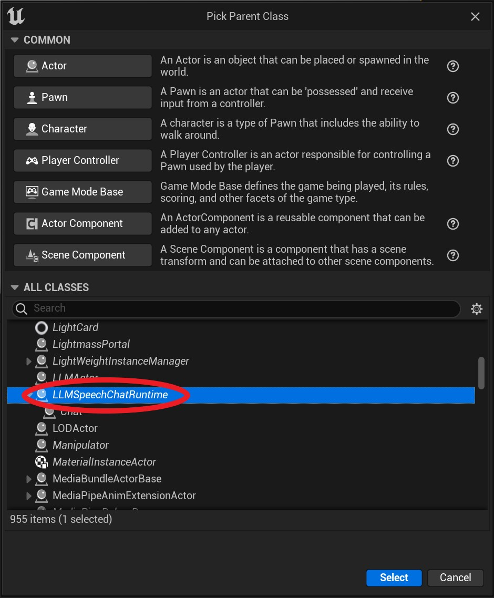
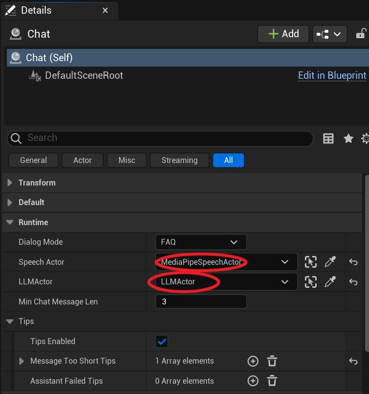
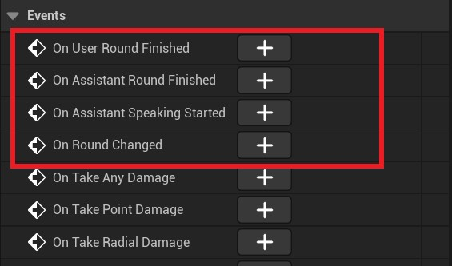

# Building a Chat Application

Combine MediaPipe4U's MediaPipeSpeechActor and LLMActor to build a microphone-driven chatbot.   
Building a robust chat application requires detailed knowledge of TTS, ASR, and LLM behavior, and interaction logic can still be error-prone.   
MediaPipe4U therefore provides **ChatRuntimeActor**, an out-of-the-box basic chat-flow object that simplifies chatbot construction.   

{: .important}
> Before reading this document, become familiar with MediaPipe4USpeech and MediaPipe4ULLM.
>
> Read these documents first:
>    
> - [Speech Quick Start](../speech/quick_start.md)
> - [Using LLM](./usage.md)

---   

## Preparation

Before building a chatbot:
1. Install TTS and ASR model packages: [documentation](../speech/config.md)
2. Install an LLM model: [documentation](./usage.md)
3. Prepare a 3D character configured for TTS and LipSync: [documentation](../speech/quick_start.md)

---   

## Build the Chatbot

After preparation, the scene contains:
- MediaPipeSpeechActor
- LLMActor

Complete the chatbot with these steps:
1. Create ChatRuntimeActor.
2. Configure LLMSpeechChatRuntime in Details.
3. Handle LLMSpeechChatRuntime events to display text, interrupt speech, and implement other logic.
4. Start LLMSpeechChatRuntime.

### a. Create ChatRuntimeActor

Create a Blueprint based on LLMSpeechChatRuntime; this example names it `Chat`.

### b. Configure LLMSpeechChatRuntime in Details

Select `Chat` and assign its SpeechActor and LLMActor in Details.

LLMSpeechChatRuntime properties:

**DialogMode**   
Controls LLM inference mode.
- FAQ: Question-and-answer mode. Context is cleared after every chat round, so previous rounds are unavailable, but inference is fastest.
- Chat: Multi-round chat mode using Context. Longer context slows inference.

{: .highlight}
> Context lets the LLM understand chat history and conduct multi-round conversations.   

**MinChatMessageLen**   
Minimum user-input length in characters. Shorter input is answered with Tips when configured, or ignored.   

**TipsEnabled**   
Whether to use fixed Tips. Tips provide predefined responses for situations such as inference failure or input that is too short.    

If `TipsEnabled` is **false**, the model ignores the user input.

{: .highlight}
> Tips are arrays. When a Tip is needed, one entry is selected randomly to vary responses.

Tip properties:

| Property | Description |
|-------|--------|
|MessageTooShorTips|Tips used when input is shorter than `MinChatMessageLen`|
|AssistantFailedTips|Tips used when LLM inference fails|

### c. Handle LLMSpeechChatRuntime Events

Events:

**OnUserRoundFinished**   
Triggered when user input finishes; its parameter contains ASR-recognized text.

**OnAssistantRoundFinished**   
Triggered when reading the LLM response finishes; its parameter contains the final response text.   

**OnAssistantSpeakingStarted**   
Triggered after LLM inference and before TTS reading begins.   

**OnRoundChanged**   
Triggered when the conversation switches between the "User Round" and "Assistant Round".   

### d. Start LLMSpeechChatRuntime

Call Run on LLMSpeechChatRuntime in Blueprint to start the chat flow.

---   

## Blueprint Functions

LLMSpeechChatRuntime provides functions for querying and controlling its state.   

**Run**   
Runs the chat flow.

**Shutdown**   
Shuts down the chat flow.

**IsReady**   
Whether required TTS, ASR, and LLM models are ready.   

**IsRunning**   
Whether the chat flow is running.   

**GetRound**   
Gets the current User or Assistant round.   

**IsUserRound**    
Whether the current round belongs to the user.     

**IsUserRound**    
Whether the current round belongs to the Assistant.   

**GetChatStatusText**   
Gets text describing the current chat-flow status, usually for display in the UI.   

---   

## Notes

With offline ASR, LLMSpeechChatRuntime forces ASR endpoint detection because only continuous chat is currently supported; users do not manually start or stop speaking.

{: .highlight}
> For offline ASR details, see [Offline Speech Recognition](../speech/asr/local_asr_component.md).
>
> To make users manually press a button to speak, build your own chat flow instead of using LLMSpeechChatRuntime.

Configure ASR endpoint detection carefully. LLMSpeechChatRuntime interacts with the LLM whenever it detects the end of an utterance.   
Set **MaxSilenceSeconds** on `LocalASRSolutionComponent` appropriately so speech completion is detected correctly.

