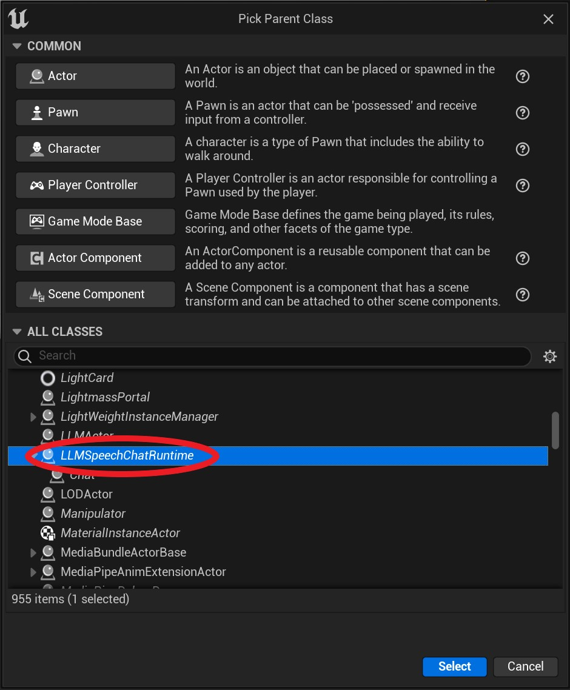
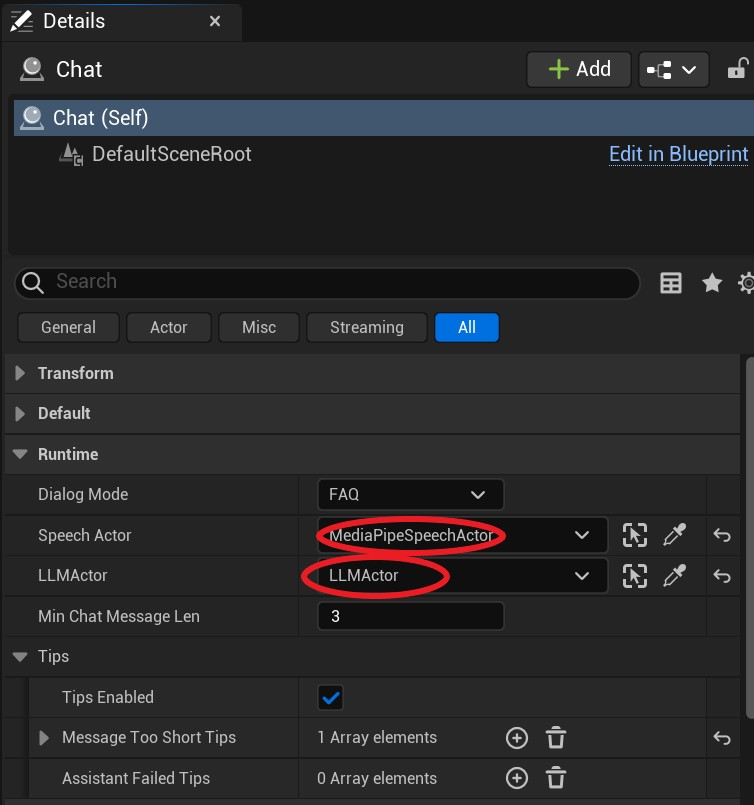
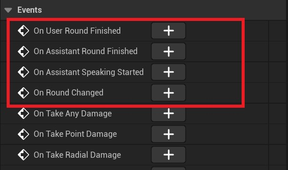

# 构建聊天程序

你可以组合 MediaPipe4U 的 MediaPipeSpeechActor 和 LLMActor 构建一个可以通过麦克风语音交互的聊天机器人程序。
创建一个健壮的聊天程序需要你非常了解 MediaPipe4U 中 TTS, ASR 和 LLM 的细节，即使这样，你可能在一些交互逻辑上不小心犯错。
为此，MediaPipe4U 提供了一个 **ChatRuntimeActor**，这是一个开箱即用的聊天基本流程对象。帮助你简化聊天程序的构建。

{: .important}
> 阅读本文档前，你需要熟悉 MediaPipe4USpeech 和 MediaPipe4ULLM 。
>
> 你应该阅读完这些文档后再阅读本文档：
>    
> - [Speech 快速入门](../speech/quick_start.md)
> - [LLM 使用](./usage.md)

---   

## 准备工作

在开始构建聊天机器人之前，你需要做好以下准备工作：
1. 安装语言模型包（包括 TTS 模型和 ASR 模型）：[参考文档](../speech/config.md)
2. 安装 LLM 模型：[参考文档](./usage.md)
3. 制作好一个 3D 角色，并且已经配置好 TTS 和 LipSync: [参考文档](../speech/quick_start.md)

---   

## 开始制作聊天机器人

当上述的准备工作完成后，你的场景中会有下面的 Actor:
- MediaPipeSpeechActor
- LLMActor

接着，你可以通过以下简单的步骤完成聊天机器人制作：
1. 创建 ChatRuntimeActor。
2. 在细节面板中配置 LLMSpeechChatRuntime 的行为。
3. 在 LLMSpeechChatRuntime 事件中处理逻辑（你可以通过这些事件显示文本，打断说话等）。
4. 启动 LLMSpeechChatRuntime。

### a. 创建 ChatRuntimeActor

新建一个蓝图，使用 LLMSpeechChatRuntime 作为基类, 本例中，这个蓝图命名为 `Chat`。

### b. 在细节面板中配置 LLMSpeechChatRuntime

选中`Chat`, 在细节面板设置好 `Chat` 需要的 SpeechActor 和 LLMActor。

LLMSpeechChatRuntime 属性说明：

**DialogMode**   
这个属性控制 LLM 模型推理的方式。
- FAQ: 问答模式，LLM 会在每轮聊天后清空上下文 Context ，简单说就是单论会话，无法感知上下文，但是这个模式 LLM 推理速度最快。
- Chat: 聊天模型，LLM 模型会使用上下文 Context，这个模型下，模型可以进行多轮聊天，但是上下文越长 LLM 推理速度越慢。

{: .highlight}
> 简单说：上下文可以让 LLM 能够理解聊天记录，具备多轮会话能力。   

**MinChatMessageLen**   
模型回答问题时，要求用户输入的最小长度（单位：字符数），当用户输入长度低于这个值时，模型会使用 Tips 回答（如果配置了 Tips）或者忽略本次输入。   

**TipsEnabled**
是否使用固定提示（Tips）。     
Tips 用来预设一些特定情况下的机器人说辞。例如：推理失败时，用户输入太短等。    

如果 `TipsEnabled`  被设置为 **false**， 模型将忽略本次用户输入。

{: .highlight}
> Tips 都是数组形式，在需要以 Tips 内容回答时，会从数组中随机抽取一个预设的 Tips，以增加回答的多样性。

Tips 说明：

| 属性 | 说明 |
|-------|--------|
|MessageTooShorTips|当用户输入文本长度小于`MinChatMessageLen`时的提示|
|AssistantFailedTips|当使用 LLM 推理失败时的提示|

### c. 在 LLMSpeechChatRuntime 事件中处理逻辑

事件说明：

**OnUserRoundFinished**   
在用户输入完成时触发，会将 ASR 识别到的文本放到事件参数中。

**OnAssistantRoundFinished**   
在 LLM 输出语音朗读结束时触发，会将 LLM 最终回答的文本放到事件参数中。   

**OnAssistantSpeakingStarted**   
在 LLM 推理结束后，开始 TTS 朗读之前触发。   

**OnRoundChanged**   
在聊天回合切换时触发（回合含义，轮到用户说话是 "User Round"，轮到 LLM 说话是 "Assistant Round"）。   

### d. 启动 LLMSpeechChatRuntime

通过在蓝图中调用 LLMSpeechChatRuntime 的 Run 函数，可以启动聊天流程。

---   

## 蓝图函数

LLMSpeechChatRuntime 提供了一些蓝图函数，方便你获得 LLMSpeechChatRuntime 的状态。   

**Run**   
运行聊天流程。

**Shutdown**   
关闭聊天流程

**IsReady**   
判断聊天流程所需的模型（TTS/ASR/LLM）是否准备就绪。   

**IsRunning**   
判断当前聊天流程是否正在运行。   

**GetRound**   
获取当前回合是"用户回合"还是"助理（Assistant）回合"。   

**IsUserRound**    
判断是否是用户回合。     

**IsUserRound**    
判断是否是助理（Assistant）回合。   

**GetChatStatusText**   
获取当前聊天流程的状态文字说明。     
这通常用于界面显示。   

**GetChatStatusText**   
获取当前聊天流程的状态文字说明。     
这通常用于界面显示。   

---   

## 注意事项

当你使用离线 ASR 时，LLMSpeechChatRuntime 将强制启用 ASR 的端点检测，因为当前仅支持持续聊天的流程（聊天过程中无需用户控制"开始说话"或"结束说话"）。

{: .highlight}
> 关于离线 ASR 的详细信息请参考[离线语音识别](../speech/asr/local_asr_component.md)。
>
> 如果你需要用户手动点击一个按钮来开始说话（例如：按住说话），你需要自己构建聊天流程而不能使用 LLMSpeechChatRuntime。

你需要特别留意 ASR 端点检测的配置，LLMSpeechChatRuntime 会在每次检测到用户一句话结束就会发起和 LLM 的交互。   
 `LocalASRSolutionComponent` 的 **MaxSilenceSeconds** 要设置为合适的值, 以正确判断用户说话结束。

