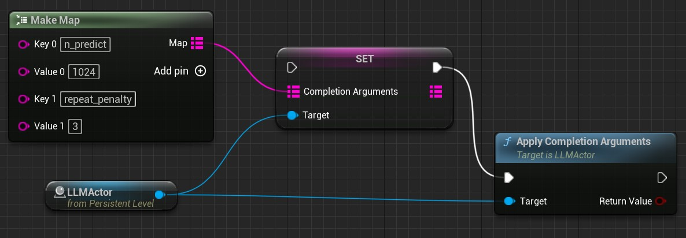

# Completion Arguments   
Large language models generally expose complex parameters that control generated content. MediaPipe4ULLM represents completion arguments with a Map.   

- Map key: parameter name
- Map value: parameter value

Completion arguments can be changed at any time during a chat. The following example changes them:   

{: .highlight}
> Parameter names vary by model. Because there are many parameters, only common ones are explained. The complete list below is consolidated from third-party documentation and is not translated further:

---   

## LLaMA Models

LLaMA inference is based on [llama.cpp](https://github.com/ggerganov/llama.cpp), where you can find these parameters.

{: .highlight}
> Common parameters:   
> - `temperature`: Controls randomness. Lower values mean less randomness; 0 always produces the same output.
> - `n_predict`: Influences generated-text length. Higher values produce longer text; -1 means unlimited. The unit is tokens, not characters.
> - `top_p`: Controls determinism. Lower values are more deterministic and less random; higher values are less deterministic.
>
> - `n_keep`: Although models support setting the number of fixed context tokens, MediaPipe4ULLM calculates this automatically to prevent token truncation, so it cannot be set.

**LLaMA Completion Arguments**   

`temperature`: Adjust the randomness of the generated text (default: 0.8).   
`top_k`: Limit the next token selection to the K most probable tokens (default: 40).   
`top_p`: Limit the next token selection to a subset of tokens with a cumulative probability above a threshold P (default: 0.9).   
`n_predict`: Set the number of tokens to predict when generating text. **Note:** May exceed the set limit slightly if the last token is a partial multibyte character. When 0, no tokens will be generated but the prompt is evaluated into thecache. (default: 512, -1 = infinity).   
`n_keep`: Specify the number of tokens from the initial prompt to retain when the model resets its internal context (**Unavailable in MediaPipe4ULLM**).      
`prompt`: Provide a prompt. Internally, the prompt is compared, and it detects if a part has already been evaluated, and the remaining part will be evaluate. A space is inserted in the front like main.cpp does.   
`stop`: Specify a array of stopping strings.These words will not be included in the completion, so make sure to add them to the prompt for the next iteration (default: [INST]).   
`tfs_z`: Enable tail free sampling with parameter z (default: 1.0, 1.0 = disabled).   
`typical_p`: Enable locally typical sampling with parameter p (default: 1.0, 1.0 = disabled).   
`repeat_penalty`: Control the repetition of token sequences in the generated text (default: 1.1).   
`repeat_last_n`: Last n tokens to consider for penalizing repetition (default: 64, 0 = disabled, -1 = ctx-size).   
`penalize_nl`: Penalize newline tokens when applying the repeat penalty (default: true).   
`presence_penalty`: Repeat alpha presence penalty (default: 0.0, 0.0 = disabled).   
`frequency_penalty`: Repeat alpha frequency penalty (default: 0.0, 0.0 = disabled);   
`mirostat`: Enable Mirostat sampling, controlling perplexity during text generation (default: 0, 0 = disabled, 1 = Mirostat, 2 = Mirostat 2.0).   
`mirostat_tau`: Set the Mirostat target entropy, parameter tau (default: 5.0).   
`mirostat_eta`: Set the Mirostat learning rate, parameter eta (default: 0.1).   
`seed`: Set the random number generator (RNG) seed (default: -1, -1 = random seed).    
`ignore_eos`: Ignore end of stream token and continue generating (default: false).   
`logit_bias`: Modify the likelihood of a token appearing in the generated text completion. For example, use `"logit_bias": 15043:1.0` to increase the likelihood of the token 'Hello', or `"logit_bias": 15043:-1.0` to decrease itslikelihood. Setting the value to false, `"logit_bias": 15043:1.0,11111:0.8` ensures that the token `Hello` is never produced (default: '').     

> For more model parameters, see [llama.cpp](https://github.com/ggerganov/llama.cpp).

{: .note}
> `logit_bias` and `stop` use a different format from llama.cpp. M4U represents arrays as comma-separated strings, while llama.cpp uses JSON:
> - `logit_bias` format: `p1:p1_value, p2:p2-value`.
> - `stop` format: `v1, v2, v3`.
> 
> - The default `n_predict` differs from llama.cpp; M4U uses **512**.
