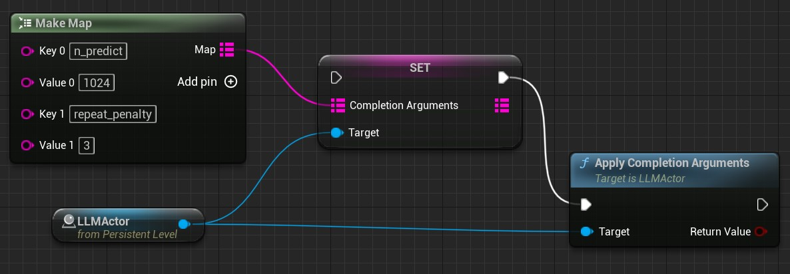

# 会话参数   
通常，大语言模型都有复杂的参数来控制模型生成内容，为此 MediaPipe4ULLM 使用字符串参数格式适应多种模型，参数格式为：
```shell
--[参数名]=[参数值]
```

会话参数可以在聊天过程中随时变更，下面是一个变更会话参数的示例：   
[](./images/llm_set_complietion_args_bp.jpg)

{: .highlight}
> 不同的模型，参数名称可能不同，由于模型参数众多，仅说明常用参数，完整参数列表来源于第三方文档，这里不再提供中文翻译，仅统一整理方便查阅：

---   

## LLaMA 模型

LLaMA 模型推理基于 [llama.cpp](https://github.com/ggerganov/llama.cpp) 项目，因此你可以在 llama.cpp 文档中找到这些参数。

{: .highlight}
> 常用参数：   
> - `temperature`: 温度表示模型生成内容时的随机性，较低的温度意味着较少的随机性，温度为 0 将始终产生相同的输出
> - `n_predict`: 通过调整此值，可以影响 LLM 生成文本的长度。较高的值将导致较长的文本，-1 表示不限制文本长度。注意：单位是 token 数量, 并不是字符。
> - `n_keep`: 虽然模型支持调整上下文固定的 token 数量，但是 MediaPipe4ULLM 会自动计算这个值，因此你无法设置该值。


**LLaMA 完成参数说明**   

`temperature`: Adjust the randomness of the generated text (default: 0.8).   
`top_k`: Limit the next token selection to the K most probable tokens (default: 40).   
`top_p`: Limit the next token selection to a subset of tokens with a cumulative probability above a threshold P (default: 0.9).   
`n_predict`: Set the number of tokens to predict when generating text. **Note:** May exceed the set limit slightly if the last token is a partial multibyte character. When 0, no tokens will be generated but the prompt is evaluated into thecache. (default: 512, -1 = infinity).   
`n_keep`: Specify the number of tokens from the initial prompt to retain when the model resets its internal context (**Unavailable in MediaPipe4ULLM**).      
`prompt`: Provide a prompt. Internally, the prompt is compared, and it detects if a part has already been evaluated, and the remaining part will be evaluate. A space is inserted in the front like main.cpp does.   
`stop`: Specify a array of stopping strings.These words will not be included in the completion, so make sure to add them to the prompt for the next iteration (default: [INST]).   
`tfs_z`: Enable tail free sampling with parameter z (default: 1.0, 1.0 = disabled).   
`typical_p`: Enable locally typical sampling with parameter p (default: 1.0, 1.0 = disabled).   
`repeat_penalty`: Control the repetition of token sequences in the generated text (default: 1.1).   
`repeat_last_n`: Last n tokens to consider for penalizing repetition (default: 64, 0 = disabled, -1 = ctx-size).   
`penalize_nl`: Penalize newline tokens when applying the repeat penalty (default: true).   
`presence_penalty`: Repeat alpha presence penalty (default: 0.0, 0.0 = disabled).   
`frequency_penalty`: Repeat alpha frequency penalty (default: 0.0, 0.0 = disabled);   
`mirostat`: Enable Mirostat sampling, controlling perplexity during text generation (default: 0, 0 = disabled, 1 = Mirostat, 2 = Mirostat 2.0).   
`mirostat_tau`: Set the Mirostat target entropy, parameter tau (default: 5.0).   
`mirostat_eta`: Set the Mirostat learning rate, parameter eta (default: 0.1).   
`seed`: Set the random number generator (RNG) seed (default: -1, -1 = random seed).    
`ignore_eos`: Ignore end of stream token and continue generating (default: false).   
`logit_bias`: Modify the likelihood of a token appearing in the generated text completion. For example, use `"logit_bias": 15043:1.0` to increase the likelihood of the token 'Hello', or `"logit_bias": 15043:-1.0` to decrease itslikelihood. Setting the value to false, `"logit_bias": 15043:1.0,11111:0.8` ensures that the token `Hello` is never produced (default: '').     

> 更多模型参数，可以参考 [llama.cpp](https://github.com/ggerganov/llama.cpp)

{: .note}
> `logit_bias` 和 `stop` 参数的格式和 llama.cpp 中不同，M4U 使用英文逗号（,）分割字符串表示数组，llama.cpp 使用 json 格式：
> - `logit_bias`格式为 `p1:p1_value, p2:p2-value`。
> - `logit_bias`格式为 `v1, v2, v3`。
> 
> - `n_predict`的默认值和 llama.cpp 不同，M4U 使用 **512** 作为默认值。
