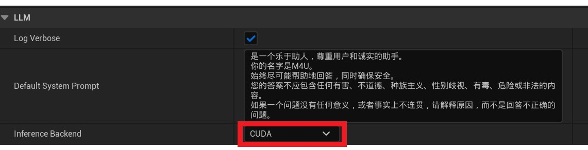

# CUDA Acceleration

CUDA acceleration is supported for LLM inference and can be several times faster than CPU inference.

---   

## System Requirements

CUDA acceleration requires an **Nvidia** GPU and the CUDA Toolkit:

- CUDA Toolkit 11.x (M4U is built with CUDA 11.6)
- A graphics driver compatible with CUDA 11.x; the latest driver is recommended
  - Windows driver 511.23 or later
  - Linux driver 510.39.01 or later (M4U does not currently support Linux)
- Sufficient VRAM; see the following sections for requirements.

{: .highlight}
> For graphics-driver and CUDA version compatibility, see [this page](https://docs.nvidia.com/cuda/cuda-toolkit-release-notes/index.html#cuda-toolkit-major-component-versions).
>
> CUDA Toolkit downloads:    
> https://developer.nvidia.com/cuda-toolkit-archive 

--- 

## Enable LLM CUDA Acceleration   

### Enable the LLM CUDA Inference Backend   
After preparing the CUDA environment, enable acceleration as follows:   

1. Select `Edit` >> `Project Settings`.   
2. In the left pane, select `Plugins` >> `MediaPipe4U LLM`.    
3. Set `InferenceBackend` to CUDA.   
4. Restart UE Editor.

[](./images/llm_settings_cuda.jpg)

### Configure the Model

The setting above uses CUDA for matrix operations, but good acceleration also requires loading the model into VRAM.   

{: .warning}
> Do not use CUDA acceleration without enough VRAM; performance may become worse than CPU inference.
>
> If the model remains in system memory, frequent transfers to VRAM make memory bandwidth a bottleneck.    
> If the model cannot run in VRAM, this may even be slower than CPU inference, which requires no memory exchange.

The most important model parameter for CUDA acceleration is:   
- **n-gpu-layers**

{: .important}
> For model-parameter configuration, read [Using LLM - Configure the Model](./usage.md#configure-the-model).


`n-gpu-layers` specifies how many model layers are placed in VRAM. For example:
```
--n-gpu-layers=10
```

This places 10 layers in VRAM. If the model has more than 10 layers, data is still exchanged between system memory and VRAM. Put all layers in VRAM for best performance. 

{: .highlight}
> If sufficient VRAM is available, set n-gpu-layers to 100 so models of any supported size are loaded entirely into VRAM. 

Layer counts for currently supported **LLaMA** models:

|LLaMA/LLaMA2 Model Size|Layers|
|:----------|-------:|
|   7B      |   32   |
|   13B     |  	40   |
|   33B     |   52   |
|   65B     |   64   |
|   7B      |   32   |

---   

## Memory/VRAM Usage

More model layers require more VRAM. To determine model layers and memory requirements, start the LLM in CPU mode and inspect the startup log:

```shell
llama_model_load_internal: format     = ggjt v3 (latest)
llama_model_load_internal: n_vocab    = 55296
llama_model_load_internal: n_ctx      = 2048
llama_model_load_internal: n_embd     = 4096
llama_model_load_internal: n_mult     = 5504
llama_model_load_internal: n_head     = 32
llama_model_load_internal: n_head_kv  = 32
llama_model_load_internal: n_layer    = 32
llama_model_load_internal: n_rot      = 128
llama_model_load_internal: n_gqa      = 1
llama_model_load_internal: rnorm_eps  = 5.0e-06
llama_model_load_internal: n_ff       = 11008
llama_model_load_internal: freq_base  = 10000.0
llama_model_load_internal: freq_scale = 1
llama_model_load_internal: ftype      = 2 (mostly Q4_0)
llama_model_load_internal: model size = 7B
llama_model_load_internal: ggml ctx size =    0.08 MB
llama_model_load_internal: mem required  = 3773.79 MB
```
Here, `n_layer` is the model layer count and `mem required` is required memory; with CUDA acceleration, this is also the required VRAM.

### Quantized Model Sizes

| Model | Measure      | F16    | Q4_0   | Q4_1   | Q5_0   | Q5_1   | Q8_0   |
|------:|--------------|-------:|-------:|-------:|-------:|-------:|-------:|
|    7B | file size    |  13.0G |   3.5G |   3.9G |   4.3G |   4.7G |   6.7G |
|   13B | file size    |  25.0G |   6.8G |   7.6G |   8.3G |   9.1G |    13G |

{: .important}
Memory/VRAM required to load a model is approximately, but slightly greater than, its size on disk.

---   
## Measured Acceleration

Test environment:   

CPU: AMD 3600   
GPU: 2060 (6G)   
RAM: 32G   
Model: LLaMA2-7b (Q4_0 quantized)   


`CPU inference`: ~6 tokens/s      
`CUDA acceleration`: ~35 tokens/s   
> (`--n-gpu-layers=32`)   
