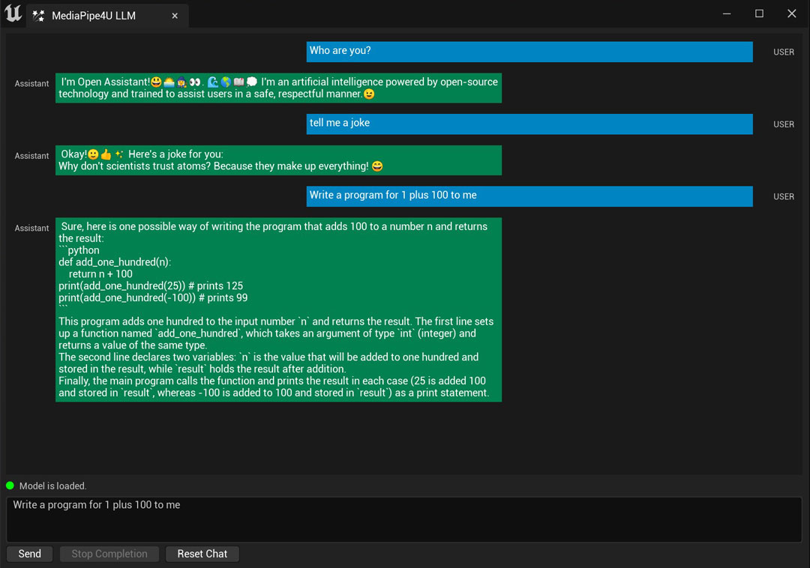

# UE Editor Toolkit

After configuring LLM according to [Using LLM](./usage.md), building an interface can still be time-consuming.
The MediaPipe4ULLM plugin provides tools for use in Unreal Editor, allowing you to quickly test model results and visually observe LLM interactions.

{: .highlight}
> You can use the [Using LLM](./usage.md) documentation to build the same chat interface as this tool.

## How to Use    
Configure the model by following [Using LLM](./usage.md), then add `LLMActor` to the scene. You can then use the LLM tool to chat with the model.    

In Unreal Engine Editor, open `Window`>>`MediaPipe4U`>>`MediaPipe4U LLM`. The LLM tool window appears.

### Features

`Send`: Enter chat text in the input box and click `Send` to send a chat instruction to the LLM.   
`Stop Completion`: Click `Stop Completion` while the model is generating to stop generation.
`Reset Chat`: Start a new chat session.

{: .highlight}
> If you integrate speech features, the LLM tool also reads the content generated by the LLM aloud.

