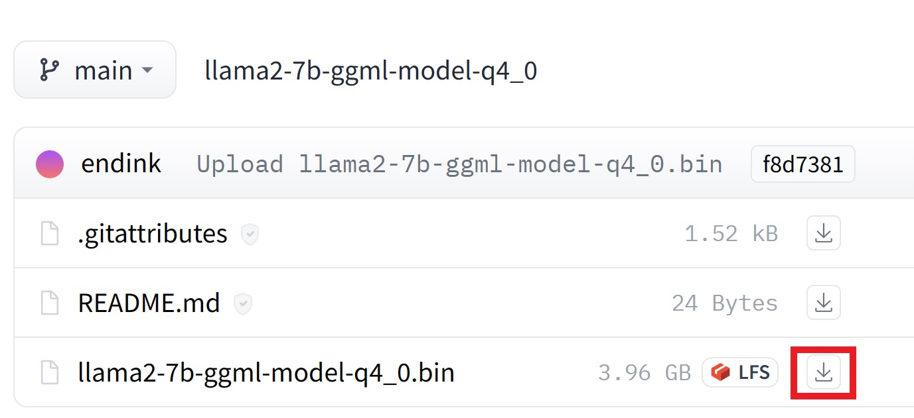
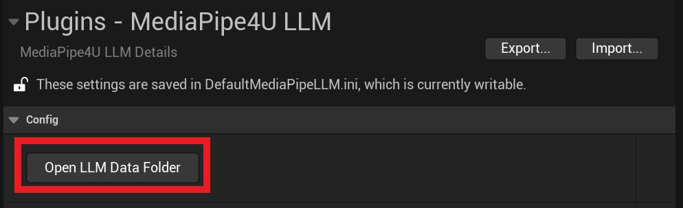
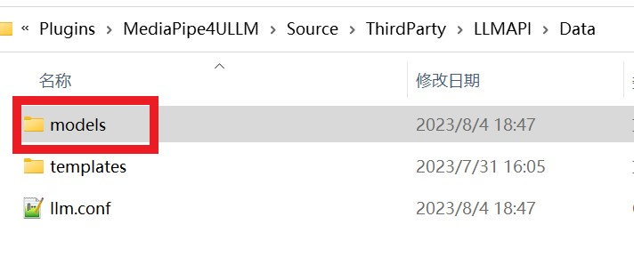
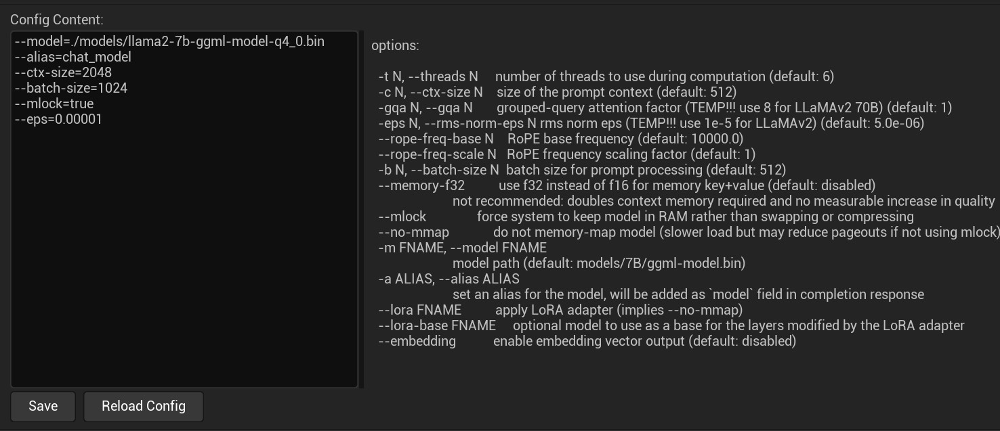
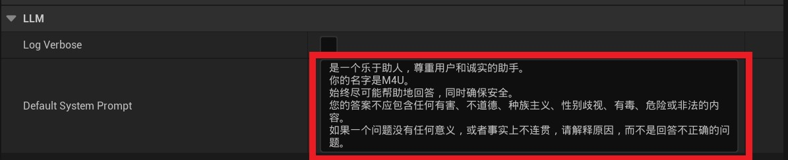
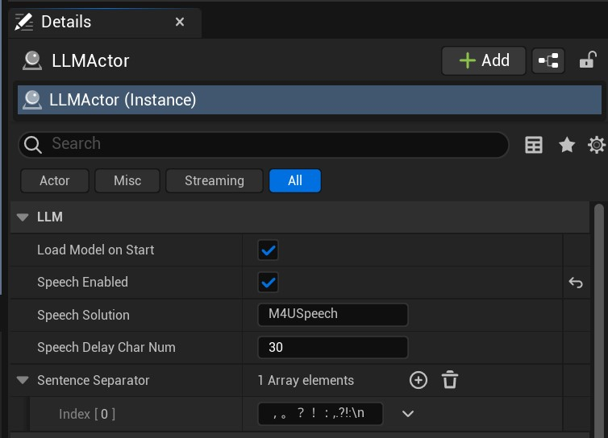

# Using LLM

Using the LLM features requires the following steps:   

1. Install and configure a model
2. Add an LLMActor component
3. Bind callback events
4. Start inference

{: .note}
> Large language models are a complex technology. You should read this document thoroughly, and you may need to understand several core concepts of large language models:
>
> - Prompt: instructions provided to the model   
> - Context: the conversation context   
> - Token: the units generated by the model   
>   
> There are many other concepts you will need to learn on your own.

---   

## Install and Configure a Model

LLM configuration includes the following:   
- Installing a model
- Configuring the model
- Configuring the system prompt
- Configuring logging

### a. Install a Model

Before using the speech suite, you must first download an LLM model file. Quantized models supported by [llama.cpp](https://github.com/ggerganov/llama.cpp) are currently supported.

You can download Chinese models that I have already quantized from my [Hugging Face repository](https://huggingface.co/endink/):

[https://huggingface.co/endink/llama2-7b-ggml-model-q4_0/tree/main](https://huggingface.co/endink/llama2-7b-ggml-model-q4_0/tree/main)

[](./images/llm_hf_download.jpg)


### b. Configure the Model

After downloading the model file (this example uses **llama2-7b-ggml-model-q4_0.bin**; use the actual name of the file you downloaded), place it in the correct plugin location. **MediaPipe4ULLM** provides a configuration interface that makes these operations convenient:

Open the plugin settings in Unreal Engine Editor as follows:
> Use the following steps to open the plugin settings:
> 1. Click `Edit` >> `Project Settings`.
> 2. On the left side of the `Project Settings` page, find and click `Plugins` >> `MediaPipe4U LLM`. 
> 3. Copy **llama2-7b-ggml-model-q4_0.bin** into the `models` subdirectory of the MediaPipe4ULLM data directory.

[](./images/llm_open_data_folder.jpg)

The MediaPipe4ULLM plugin settings provide an `Open LLM Data Folder` button, which opens the MediaPipe4ULLM plugin data directory.   

{: .important}
> If clicking `Open LLM Data Folder` does not open the directory automatically, you can locate it manually:   
> The directory path is `[Plugins]\MediaPipe4ULLM\Source\ThirdParty\LLMAPI\Data` 
>
> `[Plugins]`: the plugins directory of your Unreal project.

[](./images/llm_models_folder.jpg)

After copying llama2-7b-ggml-model-q4_0.bin into the `models` directory, you must also complete the model configuration. The model configuration file is **llm.conf** in the MediaPipe4ULLM data directory.   

Open it in any text editor (such as Windows Notepad) and edit it:

```shell
--model=./models/llama2-7b-ggml-model-q4_0.bin
--alias=chat_model
--ctx-size=2048
--batch-size=1024
--mlock=true
--eps=0.00001
```

You can also edit it in the plugin settings interface, but remember to click `Save` after editing to save the configuration.   
[](./images/llm_edit_config.jpg)

{: .important}
> The configuration parameter format is:      
> - `--``[parameter name]`=`[parameter value]`
>
> Specify one parameter per line. The `--` prefix cannot be omitted.

The interface also provides parameter descriptions. Common parameters are briefly described below:

**model**   
The path to the model file. It may be an absolute path or a path relative to the directory containing the configuration file. Relative paths begin with `./`.

**ctx**   
The model context length, which must be set according to the model. The maximum length for LLaMA models is 2,048 characters, while the maximum length for LLaMA 2 models is 4,096. A longer context improves understanding in multi-turn conversations but slows inference. I believe 2,048 is sufficient for typical scenarios.

**mlock**   
Whether to lock memory to prevent swapping with virtual memory, which can improve performance (this parameter may not currently take effect).

> Other parameters are not commonly used. Refer to their descriptions in the plugin settings interface.

### c. Configure the System Prompt

Configure the model's system prompt through the plugin settings interface:

[](./images/llm_system_prompt_settings.jpg)

The system prompt remains fixed in the context during multi-turn conversation inference and serves as the default prompt. You can therefore use it to have the model play a role or follow a rule. Here is an example:

```
You are a chemistry genius. Your name is Wang Xiao'er. You are a 16-year-old boy. You should answer questions in Chinese whenever possible, provide an answer whenever possible, and keep your responses positive and optimistic.
```
{: .note}
> Although you can use a prompt to give the model a persona, the model may not follow your characterization strictly because of its size and comprehension capabilities. It only attempts to understand the prompt. Keep the prompt as simple as possible and avoid complex logic.
>
> The prompt occupies context space (the maximum character length configured by `ctx`), so it should not be excessively long.   

### d. Configure Logging

**Log Verbose**   
Controls verbose log output. When enabled, the logs become extremely detailed. You normally should not enable verbose logging; it is generally used for development and debugging or when you want to understand the model's inference process.

> Model installation and configuration are now complete. Continue reading the following sections to learn how to use MediaPipe4ULLM.

---   

## Generate Content with LLM

An LLM is a complex generative model that can produce sophisticated results, such as poems, code, logical calculations, stories, and articles.   
Larger models produce more accurate results, but inference is also slower.

{: .highlight}
> MediaPipe4U LLM currently supports only the LLaMA model family (LLaMA/LLaMA2). Because the current implementation uses CPU inference, a 7B model is recommended.


Use an LLM in Unreal Engine with the following steps:

1. Add **LLMActor** to the scene
2. Configure **LLMActor** in the Details panel
3. Add event (delegate) callbacks in Blueprint and process generated results in the callbacks
4. Call the Chat function to start inference

[](./images/llm_actor_details.jpg)

{: .highlight}
> The core MediaPipe4ULLM workflow:   
> 
> Use the `Chat` function to send chat content to the LLM.   
> Receive results generated by the LLM in the `OnLLMTokenGenerated` event. 

### LLMActor Properties   

LLMActor requires only a few properties to work well.

**LoadModelOnStart**   
Controls whether the model is loaded automatically when the game starts.   
Default: **true**


{: .important}
> Loading an LLM model is slow. To avoid blocking the game thread, loading is performed asynchronously.   
> 
> You can call `GetModelState` to obtain the model state and determine whether it loaded successfully.   
> You can also use the `OnModelsLoadCompleted` event to receive notification when model loading completes.

**SentenceSeparator**   
The punctuation characters used to split returned results into sentences. Sentence splitting lets you process generated results sentence by sentence, for example when integrating non-streaming TTS.

**SpeechEnabled**   
Whether generated content is read aloud.   
This feature depends on the LLM extension plugin **MediaPipe4ULLMSpeech**. Speech (TTS) integration is described in a separate document.   
Default: **false**   

**SpeechSolution**   
The speech solution to use (for developing a custom TTS implementation). Custom speech solutions are described in a separate document.      
   

**SpeechDelayCharNum**   
The number of characters by which speech playback is delayed when using a speech solution.

{: .highlight}
> Speech playback and LLM content generation may run at different speeds (model generation is slow during CPU inference).
> 
> Reading the output immediately can cause many pauses in the speech.   
> 
> Use `SpeechDelayCharNum` to set the number of characters to buffer before playback starts. Speech begins only after the accumulated text contains more characters than `SpeechDelayCharNum`, helping align speech playback with the LLM's generation speed. 
>
> The number of buffered characters when playback begins may not equal `SpeechDelayCharNum` (it is usually greater), because delayed text accumulates by sentence rather than by individual character.

**CompletionArguments**   
Model-related parameters applied to the chat session.   
Different models have different parameter types. For more information about model parameters, read [Completion Arguments](./completion_args.md).   


### LLMActor Events   

**OnModelsLoadCompleted**   
Triggered when model loading completes. Whether loading succeeded is available from the event's `ModelState` parameter.

**OnLLMTokenGenerated**   
Triggered when the LLM generates a character. This event is commonly used to display text on screen with a typing effect.

{: .important}
> The word "Token" in the `OnLLMTokenGenerated` event name does not refer to the LLM concept of a "token."   
> `OnLLMTokenGenerated` is triggered per character (an English character, Chinese character, or punctuation mark).
> 
> For ease of use, MediaPipe4ULLM wraps the underlying implementation and triggers `OnLLMTokenGenerated` only when multiple tokens have been combined into a character.

**OnSentenceGenerated**   
Triggered when the LLM generates a sentence.      
Sentences are split using the separators configured by `SentenceSeparator`.

**OnCompletionFinished**   
Triggered when the LLM has generated the complete result.   
When `OnCompletionFinished` is triggered, one turn of the LLM conversation is complete.   


### LLMActor Blueprint Functions   

**LoadModelAsync**   
Starts loading the model asynchronously. When `LoadModelOnStart` is set to **false**, you can call this function to load the model manually.


**ResetChat**   
Resets a chat session, clearing the chat context and starting a new session.    
The Options parameter configures model session parameters. Session parameters are explained in detail later in this documentation.   


**Chat**   
Chats with the LLM by sending a chat instruction to the LLM model.   
If no chat session currently exists, a session is created using the model parameters.      
If a chat session already exists, chat instructions continue to use the current context.   

**HasChatSession**   
Returns a Boolean indicating whether a chat session (context) currently exists.   
If **true**, a chat session exists (chat has started); otherwise, it returns **false**.      

**CancelCompletion**   
Stops the LLM from generating content, effectively canceling the current chat turn.   

{: .important}
> After `CancelCompletion` is executed, neither the user input nor the LLM output from that turn is saved to the context. Cancellation interrupts content generation, and incomplete content is unsuitable for inclusion in the context.   

**IsCompleting**   
Returns a Boolean indicating whether the LLM is generating content.   
If **true**, content is being generated; otherwise, the LLM is waiting for user input.   

**ApplyCompletionArguments**   
Applies chat session parameters.   
When a new chat session starts, the parameters configured in `CompletionArguments` are applied automatically.   
In some cases, you may want to change parameters during a conversation. Set the new parameters in `CompletionArguments`, then call `ApplyCompletionArguments`.

{: .important}
> You cannot call `ApplyCompletionArguments` while the model is generating content. Call `ApplyCompletionArguments` before the `Chat` function.   
> 
> After `ApplyCompletionArguments` is called, subsequent chat turns use the new parameters. You can adjust chat session parameters at any time to control behaviors such as:   
> - Generated content length
> - Repetition penalty
> - Word occurrence frequency
>
> For more information about chat session parameters, read [Completion Arguments](./completion_args.md).

---   

## Speech Integration    

**MediaPipe4ULLM** integrates with **MediaPipe4USpeech**, allowing you to use local TTS to read LLM-generated content conveniently.    
### Enable Speech Integration:
1. Add `MediaPipeSpeechActor` to the scene.
2. Configure MediaPipe4USpeech.
3. Set the `SpeechEnabled` property of `LLMActor` to **true** (the default is false).   


{: .highlight}
> To learn how to use `MediaPipeSpeechActor` and correctly configure offline TTS (MediaPipe4USpeech), read the following document:
>
> [Speech Quick Start](../speech/quick_start.md)


