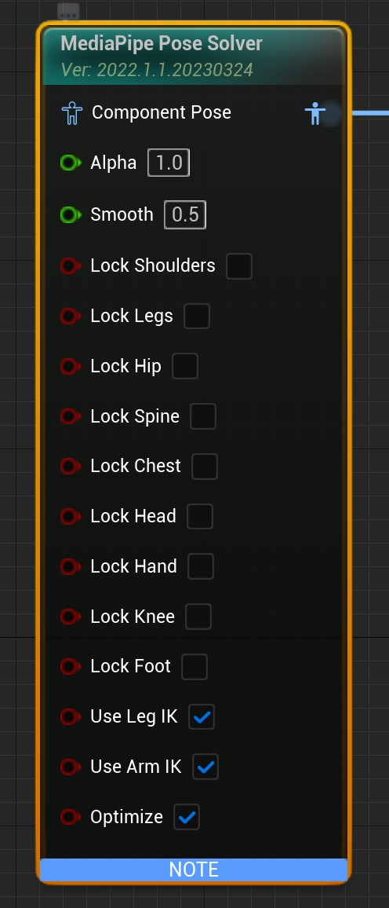

# 姿势算解节点

MediaPipe4U 使用一个专门的动画蓝图节点，从动补数据中计算角色的关节旋转，从而同步图像中的人物姿势到 3D 角色。

## 安装节点

1. 在动画蓝图中放入 MediaPipe Pose Solver 节点。
2. 在节点上设置主要的行为。

此时，MediaPipe4U 将从动补数据中算解出关节的旋转，并且驱动 3D 角色做出近似图像中人物的姿势。

## 参数列表

|参数|类型|说明|
|---|----|-----|
|Alpha     | float (0-1.0)      | 和普通动画蓝图节点的 Alpha 参数相同，请参考 UE 文档
|Smooth     | float (0-1.0)     | 动作平滑度，该参数影响阻尼滤波算法，平滑度越大抖动越少，但是动作"灵敏度"越低，简单来说，如果图像源是快速动作（例如街舞）请使用较小的平滑值，如果图像源速度较慢，可以增加平滑值以消除抖动噪声
|LockShoudlers| bool | 是否锁定整个肩膀(Shoudler, 目前 Shoudler 其实并未参与计算，未来可能会引入肩膀 IK 功能)到手腕 (hand) 的骨骼，值为 **true** 时该链上的骨骼不参与动补，否则参与动补，“锁定”含义下面均相同，不再重复说明 |
|LockLegs| bool | 是否锁定整个大腿( Leg )到脚踝 (Foot) 的骨骼 |
|LockHips| bool | 是否锁定盆骨，模型通常通常以盆骨作为根骨，锁定盆骨后人物将不会整体旋转 |
|LockSpine| bool | 是否锁定脊柱，锁定后角色上半身将不能旋转 |
|LockChest| bool | 是否锁定前胸。**注意**：如果 LockSpine 设为 **true**, 前胸也也将被锁定 |
|LockHead| bool | 是否锁定头部，锁定后角色头部不能旋转 |
|LockHand| bool | 是否锁定手部，锁定后角色手腕、手指将不能旋转，**注意**： LockShoudlers 被设为锁定时，手部也会强制锁定 |
|LockKnee| bool | 是否锁定膝盖，锁定后角色膝盖不能旋转，**注意**： LockLegs 被设为锁定时，膝盖也会强制锁定 |
|LockFoot| bool | 是否锁定脚踝，锁定后角脚踝部不能旋转，**注意**： LockLegs 被设为锁定时，脚踝也会强制锁定 |
|UseLegIK| bool | 使用使用腿部 IK，使用脚部 IK 可以纠正膝关节扭曲，一般情况下开启，副作用是动作可能不如关闭 IK 到位 |
|UseArmIK| bool | 使用使用手臂 IK，使用手部 IK 可以纠正肘关节扭曲，一般情况下开启，副作用是动作可能不如关闭 IK 到位 |
|KalmanQ| float | 卡尔曼滤波 Q 参数，除非你对 Kalman 滤波非常熟悉，否则不建议更改 |
|KalmanR| float | 卡尔曼滤波 R 参数，除非你对 Kalman 滤波非常熟悉，否则不建议更改 |
|Optimize| bool | 是否进行额外的优化 |

## 手臂 IK

当 UseArmIK 启用时，姿势求解器使用 TwoBone IK 算法代替直接旋转骨骼来完成手臂（上臂到手腕）动作，这主要是防止肘关节扭曲，如果你在不启用 Arm IK 的情况下
角色姿势良好，建议你关闭此功能，可以让角色姿势更加贴近图像源中的人物姿势。

## 腿部 IK

当 UseLegIK 启用时，姿势求解器使用 TwoBone IK 算法代替直接旋转骨骼来完成腿部（大腿到脚踝）动作，这主要是防止膝关节扭曲，如果你在不启用 Arm IK 的情况下
角色姿势良好，建议你关闭此功能，可以让角色姿势更加贴近图像源中的人物姿势。

## 姿势优化

由于动补存在精度、遮挡、IK 算法上的问题，直接使用算解后的姿势可能在某些细节方面不尽人意。可以通过将 Optimize 设置为 **true** 来优化这些细节。
目前已经计划和完成的优化有：

- [x] 脚踝旋转矫正
- [x] 膝盖极向矫正
- [ ] 关节旋转约束

> 随着 MediaPipe4U 的更新，新的优化措施会不断的加入，建议启用优化。

这是一个极端姿势求解后优化对比

{: .important}
> 如果启用 Optimize 后会调整姿势中的不合理关节旋转，如果优化使姿势出现问题，请关闭此开关
