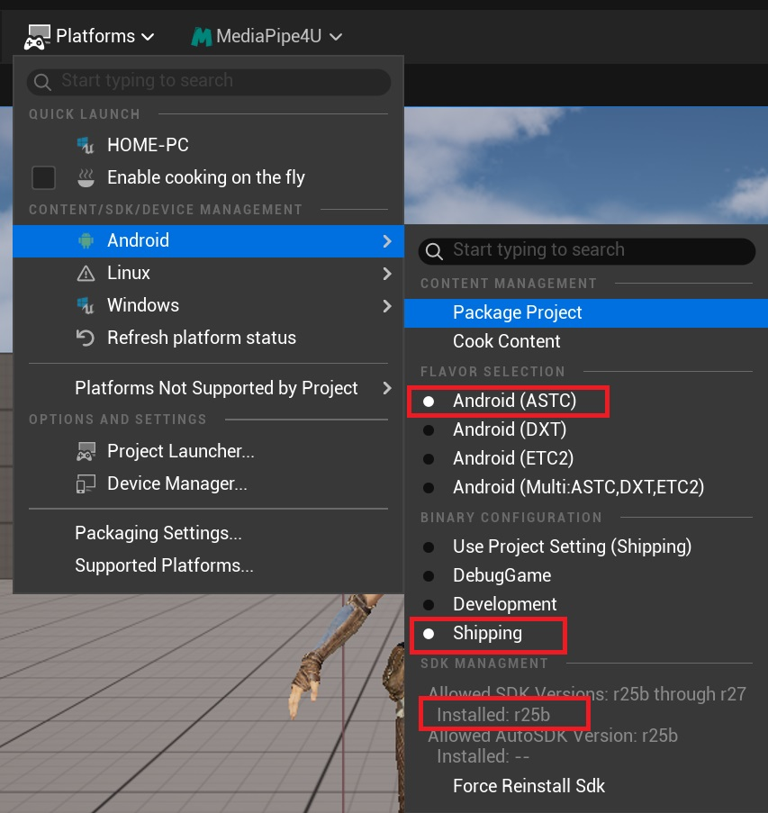
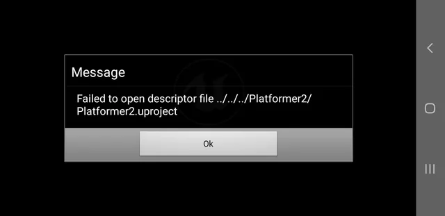

# Android Packaging

In most cases, `MediaPipe4U` can be packaged and distributed with your project, subject to several limitations.   

## Limitations

1. On Android, `MediaPipe4U` supports only `Development` and `Shipping` packages; `DebugGame` is **not supported**.
2. `MediaPipe4U` supports only `arm64` (`ARMv8-A`), and **does not support** packaging for other platforms such as x64.
3. Some MediaPipe4U plugins **do not support** Android and must be removed from Android projects. See [Plugins and Dependencies](./plugin_content.en.md).

## Android Packaging Configuration

For Android packaging, refer to the [Environment Requirements](../install/requirement.en.md) for the MediaPipe4U requirements.

> Use Android Studio to install the Android SDK, NDK, and Build Tools.
   
---  

## Package Android in UE Editor

Select `Platform` >> `Android` >> `Package Project`.

!!! warning
	
	UE Editor may use `DebugGame` by default. Because `MediaPipe4U` is precompiled, this mode is unsupported; switch to `Development` or `Shipping`.

	Using Debug Game produces an error similar to:   

	Missing precompiled manifest for 'MediaPipeAndroid', 'XXX\MediaPipeAndroid.precompiled. This module can not be referenced in a monolithic precompiled build, remove this reference or migrate to a fully compiled source build.   

	UATHelper: Packaging (Android (ASTC)): This module was most likely not flagged during a release for being included in a precompiled build - set 'PrecompileForTargets = PrecompileTargetsType.Any;' in MediaPipeAndroid.Build.cs to override.

For the detailed Android packaging process, see the Unreal Engine documentation:

[https://dev.epicgames.com/documentation/en-us/unreal-engine/packaging-android-projects-in-unreal-engine](https://dev.epicgames.com/documentation/en-us/unreal-engine/packaging-android-projects-in-unreal-engine){: target='_blank'}

## Failed to Open Descriptor File Error

After deployment to a physical Android device, `Failed to open descriptor file` may appear:

This is a longstanding Unreal Engine error without a standard solution. Try the following steps:   

### Conventional Approach

First, delete these build-cache directories from the project root:

- Binarires
- Build 
- Intermediate 

Then check these settings:

- Use the NDK version for your Unreal Engine version in the [Environment Requirements](../install/requirement.en.md)
- Switch the build to `Development` if currently using `Shipping`
- Explicitly set local SDK and NDK paths under `Android SDK` in Project Settings
- Set SDK API Level to `matchndk`

Finally, package again.

### Use AGDE Instead of UE Editor

If the above does not work, use AGDE instead of Unreal Engine Editor:   

1. Install the AGDE plugin in Visual Studio.
2. Delete Binarires, Build, and Intermediate.
3. Build the project in Visual Studio using Windows and Development so it can open in UE Editor.
4. Open UE Editor and package the Android project in `Development`. **Do not** run the Android project in any mode; only package it.
5. Close UE Editor after packaging.
6. In Visual Studio, select the physical device and run/debug in `Development`. Visual Studio compiles the Android C++ code and deploys the APK.

!!! tip Detailed AGDE Usage
    
    See the [Unreal Engine documentation](https://dev.epicgames.com/documentation/en-us/unreal-engine/debugging-unreal-engine-projects-for-android-in-visual-studio-with-the-agde-plugin){: target='_blank'}.   

	AGDE primarily supports debugging Android C++ code and deploying from Visual Studio.       

	It cannot debug Java code; use Android Studio for Java debugging.
