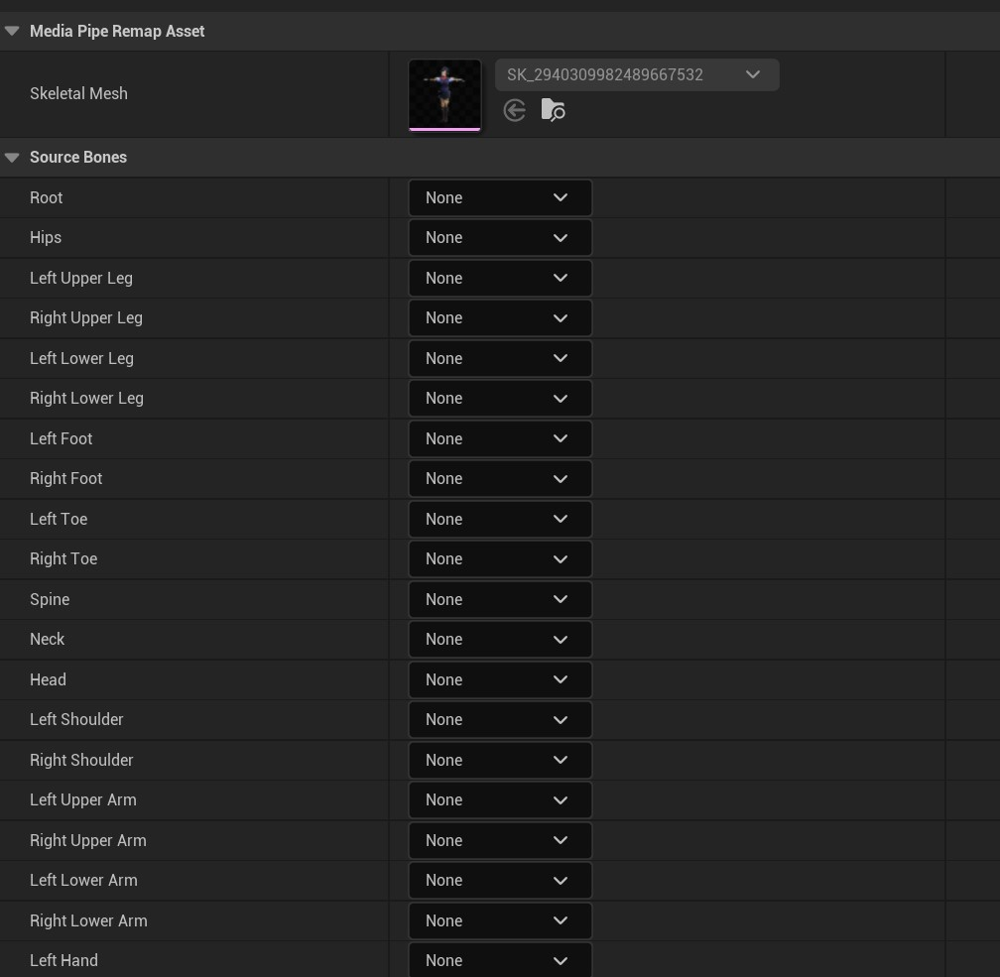

# 自定义骨骼

**MediaPipe4U** 提供的了三种骨骼预设，这些骨骼无需手动映射即可开始动补：   

- UE5：UE5曼尼（小金人）的骨骼，该骨骼其实也兼容 UE4 的曼尼（小白人）、Metahuman
- VRoid (VRM): 使用 VRoid Studio 制作的 VRM 模型骨骼
- CharacterCreator: 使用 CharacterCreator3/4 角色的标准骨骼

如果你的骨骼不是预设骨骼之一，本章节介绍映射任意的骨骼。       
>阅读本节内容之前，请先阅读 [准备动补角色](prepare_character.md) 一节，本节内容假设你已按照 [准备动补角色](prepare_character.md) 小节的步骤完成了动画蓝图节点配置。    

------   

## 创建 MediaPipe 映射资产

在内容浏览器任意文件夹单击鼠标右键 ---> 动画 --> MediaPipe Remap
> 你也可以点击内容浏览器左上角的添加按钮打开新建资产菜单

[](images/new_remap_asset_menu.jpg)     

你将创建一个 RemapAsset, 双击打开它，你会看到一个空白的编辑窗口，这是因为重定向资产是骨骼网格绑定的，你必须先指定要用 MediaPipe4U 驱动的骨骼网格：
点击 Select 按钮选择一个骨骼网格。

[](images/select_ske_for_remap.jpg)   


当选择骨骼后，编辑界面将出现骨骼绑定列表，将列表中的 **MediaPipe4U** 需要的骨骼映射到你的骨骼网格体中的骨骼。

[](images/remap_window.jpg)  

下面是骨骼位置参考图：   

[](images/avatar_bones.jpg)  

完成骨骼映射后保存资产，你现在有一个可供 **MediaPipe4U** 驱动的骨骼映射表了。    


---    

## 在动画蓝图中配置映射

动画蓝图中配置映射资产只需要完成以下步骤：
1. 动画蓝图变量 **BonePreset** 设置为 **Custom**。
2. 动画蓝图变量 **BoneRemap** 设置为你创建的 MediaPipe 映射资产。

[](images/remap_workflow.jpg)  


> 动画蓝图必须继承自 **MediaPipeAnimInstance** 同时需要开启显示继承的变量，详情见 [准备动补角色](prepare_character.md)

完成以上设置后保存并编译你的动画蓝图即可开始 MediaPipe 动补。

## :bulb:注意事项

你的手臂（**Arm**）和腿（**Leg**）必须是三段式骨骼，否则你将无法使用插件中的**扭曲矫正**和**IK**（PoseSolver 动画蓝图节点的 ArmIK 和 LegIK）功能。   
以手臂为例说明这个问题：

**正常的手臂骨骼层级:**   
> LeftUpperArm - LeftLowerArm - LeftHand
```
└─LeftUpperArm
    └─LeftLowerArm
        └─LeftHand
```
或者   

> LeftUpperArm - LeftLowerArm2 - LeftHand   
> 
```
└─LeftUpperArm
    └─LeftLowerArm1
    └─LeftLowerArm2
          └─LeftHand
```

**:o:错误的手臂骨骼层级:**     
> LeftUpperArm - LeftLowerArm1 - LeftLowerArm2 - LeftHand
```
└─LeftUpperArm
    └─LeftLowerArm1    （手臂有四段）
       └─LeftLowerArm2
          └─LeftHand
```
