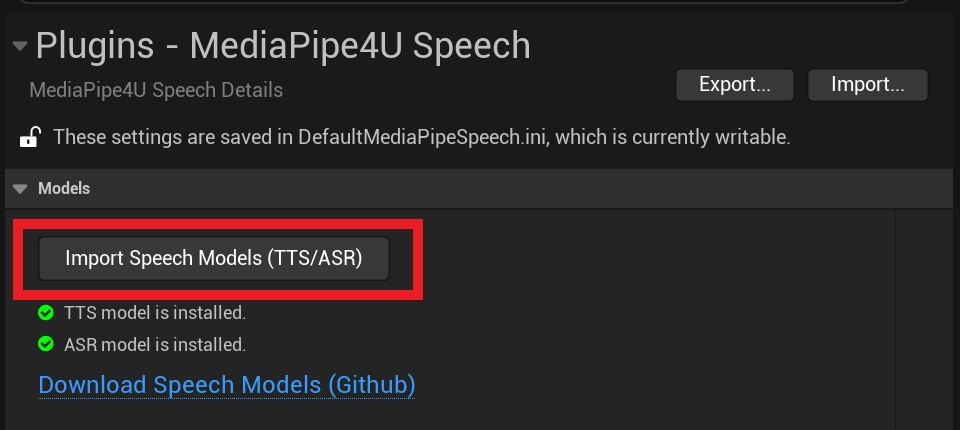

# 配置插件

由于语音模型包体积庞大，插件中不包含语音模型包，你需要自单独下载，语音模型包在 [语音模型包发布页](https://github.com/endink/Mediapipe4u-plugin/releases) 中提供了下载连接。   

{: .important}
> 不同的语言，有不同的模型包, 下载时请选择正确的语音。例如：如果你使用英文模型包，中文字符将无法识别。   
> 模型包在开发环境安装后，打包程序会自动包含模型文件，模型包尺寸巨大（1G），如果你不希望打包后的程序包含模型文件，需要手动修改 Speech 插件的 Build.cs。


## 安装语音模型包

语音模型包的安装可以通过 UE 编辑器完成，也可以手动复制文件夹的方式来完成。   
**语音模型发布页：**     

[https://github.com/endink/Mediapipe4u-plugin/releases](https://github.com/endink/Mediapipe4u-plugin/releases)

---   

### 在 Unreal Editor 中安装

1. 在 [语音模型发布页](https://github.com/endink/Mediapipe4u-plugin/releases) 下载模型包（通常是一个 .zip 压缩文件）
1. 打开 UE Editor，点击`编辑 >> 项目设置` （`Editor >> Project Settings`）菜单打开项目设置页。
1. 在项目设置页左侧点击`插件(Plugins) >> MediaPipe4U Speech`菜单项打开 MediaPipe4U Speech 插件设置页。
1. 在 MediaPipe4U Speech 插件设置页总点击 `Import Speech Models` 按钮，选择下载的 .zip 文件完成模型包安装。

[](images/import_models_in_ue.jpg)   

{: .highlight}
> MediaPipe4U Speech 插件设置页中还有模型包状态提示，但这只是粗略的检查模型包文件夹是否存在。   
> 当模型包没有安装时，状态指示器将显示红色，并又文字提示。   
>    
> MediaPipe4U Speech 插件设置页中你还可以快速打开在线的 MediaPipe4U [语音模型包发布页]((https://github.com/endink/Mediapipe4u-plugin/releases))。


---   

### 手动安装安装

当你下载语音模型包之后，进行解压，包含了 **MediaPipe4USpeech** 插件，但是并不包含声学模型和声码器模型，你需要手动下载单独发布的模型包，才能让语音套件功能正常工作。   
按以下步骤完成 **MediaPipe4USpeech** 的配置：

1. 在 [语音模型发布页](https://github.com/endink/Mediapipe4u-plugin/releases) 下载模型包（通常是一个 .zip 压缩文件）
2. 解压缩模型包文件
3. 拷贝解压缩后的内容到 `[Plugins Folder]\MediaPipe4USpeech\Source\ThirdParty\SpeechAPI\Data` 文件夹

模型包安装成功后，目录结构看起来像下面这样：

```
[Plugins Folder]\MediaPipe4USpeech\Source\ThirdParty\SpeechAPI\Data
├─asr
│  ├─fsmn_vad_model
│  ├─paraformer_model
│  └─punc_model
└─tts
    ├─dict
    │  ├─fastspeech2_nosil_baker_ckpt_0.4
    │  ├─jieba
    │  │  └─pos_dict
    │  ├─speedyspeech_nosil_baker_ckpt_0.5
    │  └─tranditional_to_simplified
    ├─models
    └─speech
        ├─dict
        └─models
```

> `Plugins Folder` 是你的项目 Plugins 目录。

{: .highlight}
> MediaPipe4USpeech 语音合成（TTS）基于 [PaddleSpeech](https://github.com/PaddlePaddle/PaddleSpeech) 开发，使用 PaddleLite 推理库执行推理，理论上，你可以转换任意的 PaddleSpeech 模型到 PaddleLite 格式，
> 然后将他应用于 **MediaPipe4USpeech**。   
>    
> MediaPipe4USpeech 语音识别（ASR）基于 [FunASR](https://github.com/alibaba-damo-academy/FunASR) 开发，你可以从 [Model Scope](https://www.modelscope.cn/models) 中下载 FunASR 模型， 然后将他应用于 **MediaPipe4USpeech**。
