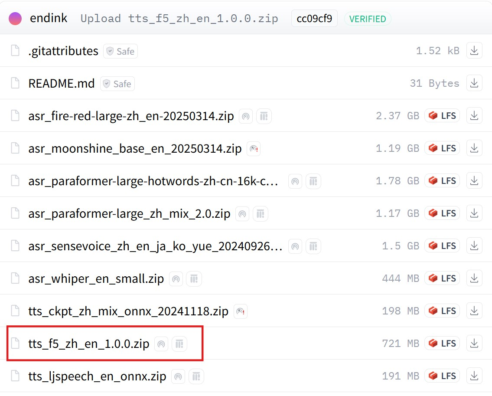
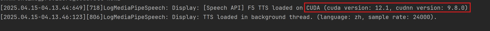

# F5-TTS

Unlike traditional TTS models, F5-TTS supports voice cloning: it can clone a voice from an audio file and imitate its speaker.

## About F5-TTS

F5-TTS is a high-performance open-source text-to-speech system released in 2024 by Shanghai Jiao Tong University, the University of Cambridge, and Geely Automobile Research Institute (Ningbo) Co., Ltd.
It uses zero-shot learning to quickly generate natural, fluent speech faithful to the source text.

For details, visit:   

[https://github.com/SWivid/F5-TTS](https://github.com/SWivid/F5-TTS){: target='_blank'}

## System Requirements

**CUDA** inference is **recommended**. When MediaPipe4U loads an F5-TTS model, it checks the local CUDA environment and falls back to DirectML if the requirements are not met.

!!! warning "Inference Latency"

    F5-TTS uses a large generative architecture, so CPU inference **cannot meet** real-time requirements. F5-TTS speech packages therefore use GPU inference automatically.

    CUDA is preferred for Nvidia GPUs and requires CUDA 12 and cuDNN 9.x.   

    If your GPU does not support CUDA 12, such as an **AMD** or older Nvidia GPU, or CUDA/cuDNN versions are incompatible, DirectML is used instead. DirectML requires no additional Windows software, but insufficient GPU performance may cause noticeable latency.

    > On the same measured GPU, CUDA was approximately **2.5 times** as fast as DirectML. 

    **CPU** inference is possible but generally too slow to be usable. You may still try it on a sufficiently powerful CPU.   

    > To use CPU inference, set onnx_provider to **cpu** in `tts.conf`.


CUDA requirements:

| Component | Version Requirement | Download |
|---------|----------|-----------|
| CUDA Toolkit | `12.x` (`12.6` recommended) | [https://developer.nvidia.com/cuda-toolkit](https://developer.nvidia.com/cuda-toolkit){: target='_blank'} |
| CUDNN | `9.x` (`9.8` recommended) | [https://developer.nvidia.com/cudnn-downloads](https://developer.nvidia.com/cudnn-downloads){: target='_blank'} |

!!! tip "VRAM Requirements"

    Minimum free VRAM: **4 GB**.        
    Recommended free VRAM: **6 GB** or more.    

    Also account for Unreal Engine's VRAM usage. Insufficient VRAM can cause Unreal Engine to exhaust video memory.


## F5-TTS Speech Package

MediaPipe4U provides an F5-TTS model package. Open the [speech-model download page](https://huggingface.co/endink/M4U-Speech-Models/tree/main){: target='_blank'},
find an F5 package, and download it.  




### Verify That F5-TTS Loaded with CUDA

Inspect the log to verify that F5-TTS loaded with CUDA:



!!! tip

    You can also set CUDA and CUDNN paths with environment variables:
  
    - `M4U_CUDA_HOME`: CUDA path
    - `M4U_CUDNN_HOME`: cuDNN path

## Basic Usage

F5-TTS packages are used like other TTS packages, but additionally support voice cloning.

## Voice Cloning

After installing an F5-TTS model package, the following structure appears under `Plugins\MediaPipe4USpeech\Source\ThirdParty\SpeechAPI\Data`:

```
├─tts
│  │  tts.conf
│  │
│  ├─dict
│  │  │
│  │  ├─ ...
│  │
│  ├─models
│  │      ....
│  │
│  └─speakers
│          en-AU-F-Natasha.wav
│          en-US-F-Aria.wav
│          en-US-M-Christopher.wav
│          en-US-M-Guy.wav
│          mp3_to_wav_24k.bat
│          speaker_conf.yaml
│          zh-CN-F-Xiaoxiao.wav
│          zh-CN-M-Yunxi.wav
│          zh-CN-M-Yunyang.wav
│          zh-TW-F-HsiaoChen.wav
```

The `speakers` folder contains audio files and a configuration file:

- `xxx.wav`: Audio used to clone a voice.
- `speaker_conf.yaml`: Speaker configuration.
- `mp3_to_wav_24k.bat`: MP3-to-WAV conversion script.

> Previewing these WAV files reveals short speech samples. F5-TTS clones voices from these samples.

To clone a voice, prepare a PCM audio file, usually WAV. For MP3 input, install `FFmpeg` and run `mp3_to_wav_24k.bat` to convert it.

!!! warning "Audio File Requirements"

    - F5-TTS requires **mono**, **24000 Hz** (24K) audio.  
    - Audio must be no more than **15** seconds; no more than **10** seconds is recommended.

    Convert incompatible audio with `FFmpeg`.

    `FFmpeg` conversion command:   
    ```shell
    ffmpeg -i <your audio file> -acodec pcm_s16le -ac 1 -ar 24000 output.wav -y  
    ``` 
    > This creates the converted `output.wav` in the current folder.

After preparing the audio file, edit `speaker_conf.yaml`, which is a YAML file.

Open `speaker_conf.yaml` in a text editor and add an entry matching its format:

- `name`: Speaker display name
- `audio`: Reference audio file
- `prompt`: Text spoken in the reference audio
- 
```
speakers:

  - name: en-US-M-Guy
    audio: en-US-M-Guy.wav
    prompt: The sun was setting slowly, casting long shadows across the empty field.
```

Save `speaker_conf.yaml` and run MediaPipe4U again; the new speaker appears.

Use `ListSpeakers` on `MediaPipeSpeechActor` to verify the speaker and use the cloned voice to read text.
