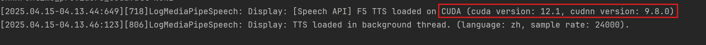

# F5-TTS

## F5-TTS 介绍

F5-TTS 是由上海交通大学、剑桥大学和吉利汽车研究院（宁波）有限公司于 2024 年共同开源的一款高性能文本到语音 (TTS) 系统。
通过零样本学习快速生成自然、流畅且忠实于原文的语音。相比传统 TTS 模型具备语音克隆(Voice Clone)能力。

了解 F5-TTS 详细信息，请访问：   

[https://github.com/SWivid/F5-TTS](https://github.com/SWivid/F5-TTS)


## F5-TTS 语音包

`MediaPipe4U` 提供了 F5-TTS 模型的语音包，你可以打开 MediaPipe4U 的[语音模型包下载页](https://huggingface.co/endink/M4U-Speech-Models/tree/main){: target='_blank'}，
找到 F5 语音包并下载它。  


## 系统要求

由于 F5-TTS 采用生成式架构，模型较大，使用 CPU 推理性能**无法满足**实时性需求，因此，如果你使用 F5-TTS 语音包，将自动使用 GPU 进行推理。

我们**推荐**使用 CUDA 进行推理，`MediaPipe4U` 加载 F5-TTS 模型时，将自动检查本机 CUDA 环境，如果 CUDA 环境不满足，将切换到 DirectML 进行推理。

CUDA 要求：

| 组件 | 版本要求 | 下载地址 |
|---------|----------|-----------|
| CUDA Toolkit | `12.x` (推荐 `12.6`) | https://developer.nvidia.com/cuda-toolkit |
| CUDNN | `9.x`（推荐 `9.8`） | https://developer.nvidia.com/cuda-toolkit |

### 如何确认 F5-TTS 已经使用 CUDA 加载

你可以通过观察日志，确认 F-TTS 是用 CUDA 加载：



!!! tip

    你还可以通过环境变量来设置 CUDA 和 CUDNN 路径：
  
    - `M4U_CUDA_HOME`： Cuda 路径
    - `M4U_CUDNN_HOME`： Cuda 路径

## 基本使用

F5-TTS 语音包的使用与其他 TTS 语音包使用没有区别，但是 F5-TTS 具备了其他语音模型包没有包含的语音克隆能力。

## 音色克隆

当你安装号 F5-TTS 语音模型包以后，你将在 `Plugins\MediaPipe4USpeech\Source\ThirdParty\SpeechAPI\Data` 目录下看到如下结构：

```
├─tts
│  │  tts.conf
│  │
│  ├─dict
│  │  │
│  │  ├─ ...
│  │
│  ├─models
│  │      ....
│  │
│  └─speakers
│          en-AU-F-Natasha.wav
│          en-US-F-Aria.wav
│          en-US-M-Christopher.wav
│          en-US-M-Guy.wav
│          mp3_to_wav_24k.bat
│          speaker_conf.yaml
│          zh-CN-F-Xiaoxiao.wav
│          zh-CN-M-Yunxi.wav
│          zh-CN-M-Yunyang.wav
│          zh-TW-F-HsiaoChen.wav
```

我们重点关注 `speakers` 文件夹, 在这个文件夹中，你会看到一些音频文件和一个配置文件：

-`xxx.wav`: 表示用于克隆音色的音频文件。
-`speaker_conf.yaml`: 发音人配置文件。
-`mp3_to_wav_24k.bat`: mp3 转 wav 脚本。

> 通过双击预览这些 wav 文件，你会发现，他们都是简单的一段朗读语音，F5-TTS 具备从这些语音中克隆音色的能力。

要克隆音色，你需要准备好一段 PCM 音频文件通常是 .wav 文件，如果你的音频是 mp3 文件，只需要再安装好 `FFmepg` 后运行 `mp3_to_wav_24k.bat` 转换即可。

!!! warning "音频文件要求"

    - F5-TTS 要求音频使用**单声道**，**240000** 采样率的音频格式文件。  
    - 音频文件长度不超过 **15** 秒，建议不超过 **10** 秒。

    如果你的音频文件不满足要求，你可以用 `FFmepg` 进行转换

    `FFmepg` 转换音频格式命令：   
    ```shell
    ffmpeg -i <your audio file> -acodec pcm_s16le -ac 1 -ar 24000 output.wav -y  
    ``` 
    > 上述命令在当前文件夹生成一个 `output.wav` , 这就是转换好的文件。

当准备好你的音频文件后，修改 `speaker_conf.yaml` 文件，注意，这是一个 yml 格式的文件：

用记事本打开`speaker_conf.yaml`，模仿这个文件格式添加一个条目，其中：

- `name`: 发音人显示名称
- `audio`: 参考音频（即音频文件）
- `prompt`: 音频提示词，音频文件中朗读的内容
- 
```
speakers:

  - name: en-US-M-Guy
    audio: en-US-M-Guy.wav
    prompt: The sun was setting slowly, casting long shadows across the empty field.
```

保存 `speaker_conf.yaml` ， 这时候你再运行 `MediaPipe4U` 程序即可发现新的发音人。

你可以通过 `MediaPipeSpeechActor` 的 `ListSpeakers` 函数检查发音人是否生效，并可以使用这个音色朗读文本。