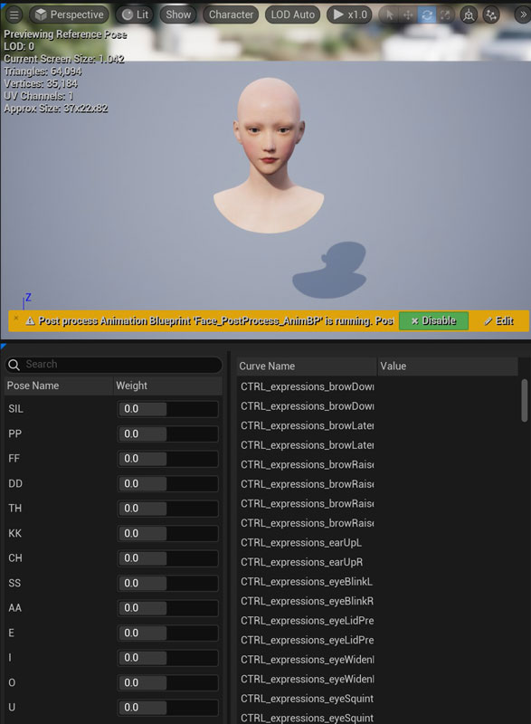
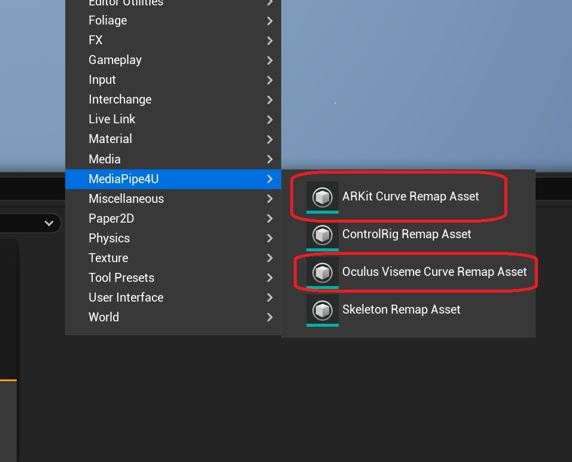
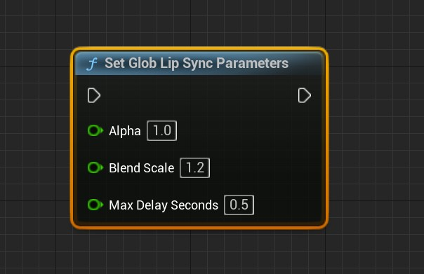
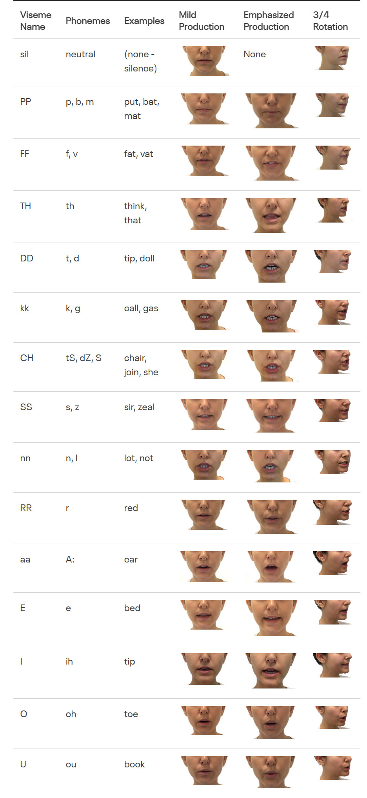

# Lip Sync

The `MediaPipe4USpeech` plugin provides real-time, offline synchronization between speech and lip animation for convincing 3D-character reading.

This document explains how to integrate lip sync with TTS.

## Create a Lip-Animation Asset (PoseAsset)   

MediaPipe4U supports multiple Curve Schemas and uses **ARKit** expressions by default. Create a PoseAsset containing curves for either schema.

- `Viseme expressions`: **15** viseme animations.
- `ARKit expressions`: **52** ARKit expression animations.

!!! tip "Choosing a Curve Schema"

    Most digital-human and VTuber models support ARKit expressions and may already include an ARKit-compatible PoseAsset.   
    
    For better lip results, creating Viseme curves in a tool such as ZBrush may be preferable.

=== "ARKit Curve Schema"

    Create **52** expression animations matching Apple ARKit. Each expression is a BlendShape or curve in a PoseAsset.     

    See the [Apple documentation](https://developer.apple.com/documentation/arkit/arfaceanchor/blendshapelocation){: target='_blank'} or [https://arkit-face-blendshapes.com/](https://arkit-face-blendshapes.com/){: target='_blank'}.  

    
       
    > Curve or BlendShape names must follow the **52** Apple ARKit names, case-insensitively. 

=== "Oculus Viseme Curve Schema"

    Create **15** lip animations matching OVRLipSync. Each is a BlendShape or PoseAsset curve.   

    

    See the [OVRLipSync documentation](https://developer.oculus.com/documentation/unity/audio-ovrlipsync-viseme-reference){: target='_blank'} or the appendix below.   
       
    > Curve or BlendShape names must be SIL, PP, FF, TH, DD, KK, CH, SS, NN, RR, AA, E, I, O, and U, case-insensitively.  

### MediaPipe LipSync Animation Blueprint Node

Create an Animation Blueprint and add `MediaPipe LipSync`. When using a PoseAsset, also add Evaluate Pose.

> ARKit_PoseAsset in the image is an Evaluate Pose node.

### LipSync Node Properties

**Alpha**   
Controls lip-shape smoothing. Lower values produce smoother animation.

**WeightScale**   
Scales lip animation. Higher values make mouth opening more pronounced when a voice produces weak recognition results.

**MaxDelaySeconds**   
Speech delay in seconds. With segmented audio chunks, frames delayed beyond this value no longer produce lip animation.

:rainbow: **CurveSchema**     
Expression-animation curve schema.

- `OculusViseme`: Requires **15** Viseme curves in the PoseAsset.
- `ARKit`: Requires **52** ARKit expression curves in the PoseAsset.

> The PoseAsset type must match `CurveSolution`.

Default: `ARKit`

**ApplyMode**   
How lip animation is rendered.

- `WeightedMovingAverage`: Ignores current-pose curve values and moves smoothly forward.
- `Blend`: Blends lip animation with current-pose curve values.   

Default: `WeightedMovingAverage`   

**VisemeCurveRetargetAsset**

Maps custom names for 15 Viseme curves to standard names. Effective only when `CurveSolution` is **OculusViseme**.

**ARKitCurveRetargetAsset**

Maps custom names for 52 ARKit curves to standard ARKit names. Effective only when `CurveSolution` is **ARKit**.

**UseGlobalParameters**   
Whether to use global lip-animation parameters, allowing dynamic runtime adjustment.   
Default: **true**

### Create a Retarget Asset (Optional)

When curve names do not follow the standard, create a retarget asset and assign it to `VisemeCurveRetargetAsset` or `ARKitCurveRetargetAsset`. Right-click empty space in the Content Browser to open the asset menu:

### Create a Character

1. Create a `Character` and assign an Animation Blueprint containing `MediaPipe LipSync` to its `Mesh`.   
2. Place the `Character` in the Level.
3. Assign it to `LipSyncCharacter` on `MediaPipeSpeechActor`. 
4. Verify that `LipSync` is enabled on `MediaPipeSpeechActor`.

 

## Start Lip Sync

After completing these steps, when TTS begins reading through `SpeakTextAsync` on `MediaPipeSpeechActor`, the 3D character generates matching lip animation.

## Set Lip Animation at Runtime

When `UseGlobalParameters` is **true** on `MediaPipe LipSync`, adjust lip-animation parameters dynamically from another Blueprint.   

Call `SetGlobLipSyncParameters`:

!!! warning

    Global parameters affect every LipSync node.   
    When the Level contains multiple LipSync nodes, set UseGlobalParameters to false.

## OvrLipSync License

`MediaPipe4USpeech` integrates the `OVRLipSync` C++ library to generate Viseme BlendShape values.   

!!! warning "OvrLipSync"

    OVRLipSync includes a separate Facebook (Meta) license file. Comply with its terms.   
            
    MediaPipe4U distributes OVRLipSync libraries under section 1.1.1 of the [Meta Platforms Technologies SDK License](https://developer.oculus.com/licenses/oculussdk/) and includes the separate license file.   
    
    > 1.1.1 If the SDK includes any libraries,
    > sample source code, or other materials that we make available specifically for incorporation in your Application (as indicated by applicable documentation), 
    > you may incorporate those materials and reproduce and distribute them as part of your Application, including by distributing those materials to third parties contributing to your Application.   
    >   
    
    If this interpretation is incorrect, please contact the author and the LipSync feature will be removed promptly.

## Appendix

=== "OVRLipSync Viseme Reference"

    > See the [Facebook website](https://developer.oculus.com/documentation/unity/audio-ovrlipsync-viseme-reference){: taget='_blank'} for details.

    

=== "ARKit Curve (BlendShape) Names"

    -  1: *eyeBlinkLeft*,
    -  2: *eyeLookDownLeft*,
    -  3: *eyeLookInLeft*,
    -  4: *eyeLookOutLeft*,
    -  5: *eyeLookUpLeft*,
    -  6: *eyeSquintLeft*,
    -  7: *eyeWideLeft*,
    -  8: *eyeBlinkRight*,
    -  9: *eyeLookDownRight*,
    -  10: *eyeLookInRight*,
    -  11: *eyeLookOutRight*,
    -  12: *eyeLookUpRight*,
    -  13: *eyeSquintRight*,
    -  14: *eyeWideRight*,
    -  15: *jawForward*,
    -  16: *jawLeft*,
    -  17: *jawRight*,
    -  18: *jawOpen*,
    -  19: *mouthClose*,
    -  20: *mouthFunnel*,
    -  21: *mouthPucker*,
    -  22: *mouthRight*,
    -  23: *mouthLeft*,
    -  24: *mouthSmileLeft*,
    -  25: *mouthSmileRight*,
    -  26: *mouthFrownRight*,
    -  27: *mouthFrownLeft*,
    -  28: *mouthDimpleLeft*,
    -  29: *mouthDimpleRight*,
    -  30: *mouthStretchLeft*,
    -  31: *mouthStretchRight*,
    -  32: *mouthRollLower*,
    -  33: *mouthRollUpper*,
    -  34: *mouthShrugLower*,
    -  35: *mouthShrugUpper*,
    -  36: *mouthPressLeft*,
    -  37: *mouthPressRight*,
    -  38: *mouthLowerDownLeft*,
    -  39: *mouthLowerDownRight*,
    -  40: *mouthUpperUpLeft*,
    -  41: *mouthUpperUpRight*,
    -  42: *browDownLeft*,
    -  43: *browDownRight*,
    -  44: *browInnerUp*,
    -  45: *browOuterUpLeft*,
    -  46: *browOuterUpRight*,
    -  47: *cheekPuff*,
    -  48: *cheekSquintLeft*,
    -  49: *cheekSquintRight*,
    -  50: *noseSneerLeft*,
    -  51: *noseSneerRight*,
    -  52: *tongueOut*
