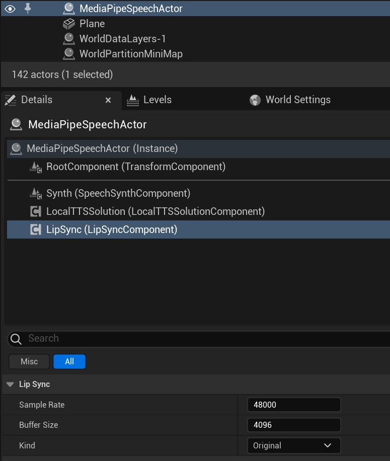
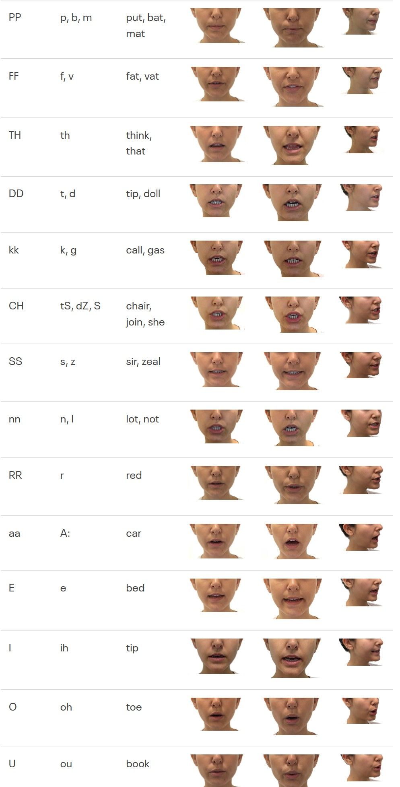

# 音唇同步(Lip Sync)

MediaPipe4USpeech 通过集成 OVRLipSync 组件，提供声音和口型同步的能力。   

{: .wanrning}
> OVRLipSync 库中包单独 Facebook(Meta) License 文件，请严格遵守这些条款。   
>        
> MediaPipe4U 依据 [Meta Platforms Technologies SDK License](https://developer.oculus.com/licenses/oculussdk/) 协议 1.1.1 内容分发 OVRLipSync 中的库，并且已在插件中包含单独的 License 文件。   
>
> 
   
> {: .highlight }   
> 1.1.1 If the SDK includes any libraries,
> sample source code, or other materials that we make available specifically for incorporation in your Application (as indicated by applicable documentation), 
> you may incorporate those materials and reproduce and distribute them as part of your Application, including by distributing those materials to third parties contributing to your Application.   
> 
   
>   
> 对协议的理解如有不妥，请与我联系，我将迅速下架 LipSync 功能。

## 准备资产

1. 制作符合 OVRLipSync 驱动标准的角色   
1. 向场景中添加 **AMediaPipeSpeechActor** 组件
1. 通过细节面板配置 LipSync   

### 关于唇形动画资产制作   

制作 15 个和 OVRLipSync 匹配的唇形动画，每一个唇形可以是一个 BlendShape 或者是 PoseAsset 中的一条曲线。   
> 具体唇形参考请查看 [OVRLipSync 文档](https://developer.oculus.com/documentation/unity/audio-ovrlipsync-viseme-reference)   
> 也可以参考此文档最后的附录（来自 Facebook 网站截图）。   
>    
> Pose Asset 中的曲线名称, 或者 BlendShape 名称约定为： SIL、PP、FF、TH、DD、KK、CH、SS、NN、RR、AA、E、I、O、U   

{: .highlight}
> 对于 **Metahuman** 你可以使用 MediaPipe4U 的 Control Rig Pose Baker 工具快速的烘焙音素姿势资产（Pose Asset）。   
> 关于 Control Rig Pose Baker 工具，请阅读[文档](../ue_tools/control_rig_pose_baker.md)

## 在动画蓝图中驱动口型动画

在动画蓝图中添加 **MediaPipe LipSync** 节点，如果你使用 PoseAsset ，还需要添加 Evalute Pose 节点。

> 说明，上图中的 Pose_LipSync 是一个 Evalute Pose 节点。

## LipSync 动画蓝图节点属性

**Alpha**   
控制唇形的平滑程度，数值越小，唇形动画越平滑。

**WeightScale**   
控制口型动画的缩放，数值越大，角色开口会越明显，某些语音的音色识别效果不明显时，我们需要用这个属性让它更明显。

**MaxDelaySeconds**   
语音延迟时间，以秒为单位，当使用分段语音块时，如果收到的语音高于这个时间，将不在执行口型动画。

**ApplyMode**   
口型动画的渲染方式。
- WeightedMovingAverage：口型动画不考虑当前姿势中的曲线值，仅平滑的向前移动。
- Blend：口型动画混合到当前姿势中的曲线值，这通常用于混合已有的音素曲线值。   

默认值： **WeightedMovingAverage**   

**UseGlobalParameters**   
是否使用全局口型动画参数。开启它能够支持运行时动态调整口型动画。   
默认值：**true**

{: .warning}
> 全局参数设置会影响所有的 LipSync 动画蓝图节点。   
> 当场景中有多个 LipSync 节点或多个动画蓝图都包含 LipSync 节时应该将 UseGlobalParameters 设为 false，

## 运行时设置口型动画

当动画蓝图节点启用了全局参数时（**UseGlobalParameters** 为 **true**），可以在蓝图中动态调整口型动画的参数。   
你可以在任意蓝图中调用 **SetGlobLipSyncParameters** 函数：

## 附录

下面是 OVRLipSync 唇形参考，你可以转到[Facebook 网站](https://developer.oculus.com/documentation/unity/audio-ovrlipsync-viseme-reference)阅读详细信息。

