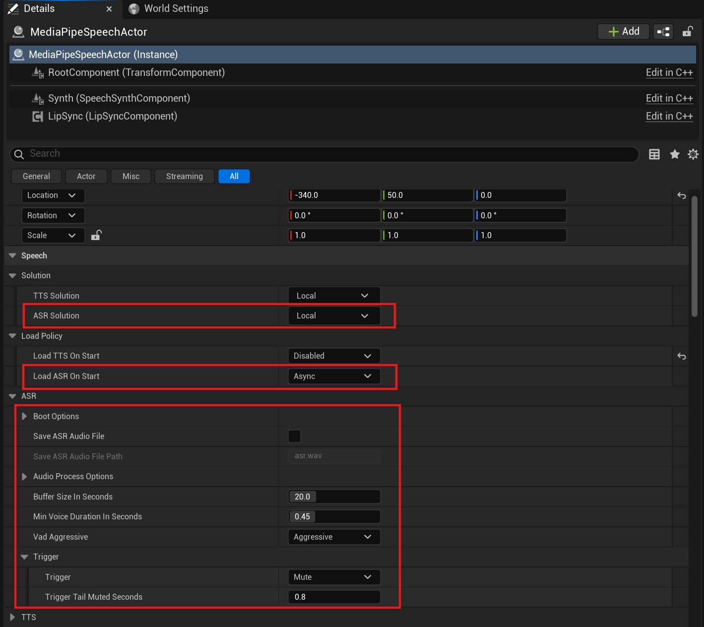

# Offline Speech Recognition (ASR)

`MediaPipe4USpeech` provides offline, real-time, end-to-end automatic speech recognition (ASR), converting audio input to text.

---   
## Usage

1. Add an `AMediaPipeSpeechActor` component to the scene.
2. Configure ASR in the Details panel.
3. Call functions such as `StartCaptureMicrophone` or `StartCaptureAudio` on `AMediaPipeSpeechActor`.
4. Receive recognized text from the `OnTextRecognized` event on `AMediaPipeSpeechActor`.

!!! tip "Voice Wake-Up Integration"

    To integrate ASR with voice wake-up, read [Voice Wake-Up](./wakeup.md).

---   
## Properties

`MediaPipeSpeechActor` provides many ASR properties:

**LoadASROnStart**     
How the model package is loaded at startup.   

- Disabled: Do not load the ASR model at startup.
- Async: Load asynchronously on a thread-pool thread.
- Sync: Load synchronously on the game thread.

!!! tip

    With asynchronous loading (`Async`), use `OnASRLoaded` to receive notification when loading finishes.

**ASRSolutionName**   
The solution used for ASR. Normally, use **Local** for offline ASR.

**SaveASRAudioFile**    
Whether to save audio as a .wav file, normally for debugging.

**AudioProcessOptions**    
Preprocessing before recognition, such as noise reduction and echo cancellation.

**SaveASRAudioFilePath**    
When SaveAudioFile is **true**, controls the audio-file save path.   
The path can be absolute or relative; relative paths are rooted at `Saved/M4UAudio`.
   
**BufferSizeInSeconds**    
Maximum audio length, in seconds, permitted during recognition. Recognition starts immediately when this length is exceeded, which may truncate audio.   
> For example, **20** limits an utterance to no more than **20** seconds.

**ASRMinVoiceDurationInSeconds**   
Minimum permitted audio length, in seconds.

**VadAggressive**   
VAD aggressiveness. VAD detects and distinguishes human voice from non-voice audio.

**Trigger**    
Recognition trigger mode; mute triggering is the default.

- `Mute`: Trigger on silence. After voice is detected, recognition starts automatically following a pause whose duration is controlled by `TriggerMuteSeconds`.
- `ManualStop`: Trigger manually when `StopCapture` or `StopCaptureAsync` is called on `MediaPipeSpeechActor`.

**TriggerMuteSeconds**    
When `Trigger` is **Mute**, the silence interval used to determine that an utterance has ended.

!!! tip

    Regardless of `Trigger`, recognition begins when audio reaches `BufferSizeInSeconds`.

---   
## Events   

**OnASRLoaded**   
Called when model loading finishes.    

**OnASRSlept**    
When ASR uses a wake-up model, triggered as ASR changes from awake to sleeping.   

**OnASRWokeUp**    
When ASR uses a wake-up model, triggered as ASR changes from sleeping to awake.

**OnTextRecognized**    
Triggered when recognition completes. Parameters:

- `Text`: Text recognized from the audio.
- `bIsFinished`: Whether recognition is fully complete. A streaming model may trigger `OnTextRecognized` multiple times for one segment; `bIsFinished` indicates final completion.

---   

## Functions

|Function| Description |
|----------|------------|
|IsASRLoading        | Indicates whether ASR is loading.  |
|IsASRReady          | Indicates whether ASR loaded successfully.  |
|HasASRVoice         | Indicates whether ASR currently detects human voice.  |
|IsASRWakeUpRunning  | Indicates whether the ASR wake-up model is running.  |
|IsASRWakeUpAvailable| Indicates whether ASR wake-up is available. |
|IsCapturing         | Indicates whether ASR is capturing audio. |
|IsCaptureStopping   | Indicates whether ASR is stopping capture. |
|IsASRAwake          | Indicates whether ASR is awake. |
|KeepASRAwake        | Resets the wake timer to keep ASR awake. |
|SleepASR            | Puts ASR to sleep so it must be awakened.|
|GetASRState         | Gets the ASR model loading state. |
|CanStartCapture     | Indicates whether ASR can start capturing audio. |
|StartCaptureMicrophone | Starts capturing microphone audio for recognition.|
|StartCaptureAudio   | Starts capturing audio from an `Audio Component` for recognition.|
|StopCapture         | Stops capturing audio.  Parameter:  `bSetToSleep`: if **false**, ASR only pauses and remains awake for the next capture; if **true**, ASR must be awakened before the next capture.|

## Async Functions

|Function| Description |
|----------|------------|
|LoadASRAsync     | When `LoadASROnStart` is **Disabled**, ASR is not loaded automatically; use this function to load it manually.|
|StartCaptureMicrophoneAsync   | Starts capturing microphone audio.|
|StopCaptureAsync    | Stops capturing audio.  Parameter:  `bSetToSleep`: if **false**, ASR only pauses and remains awake for the next capture; if **true**, ASR must be awakened before the next capture.|

## Blueprint Function Library

- `ListMicrophones`: Lists microphone devices on the current host.
- `ListASRSolutions`: Lists currently available ASR solutions.

