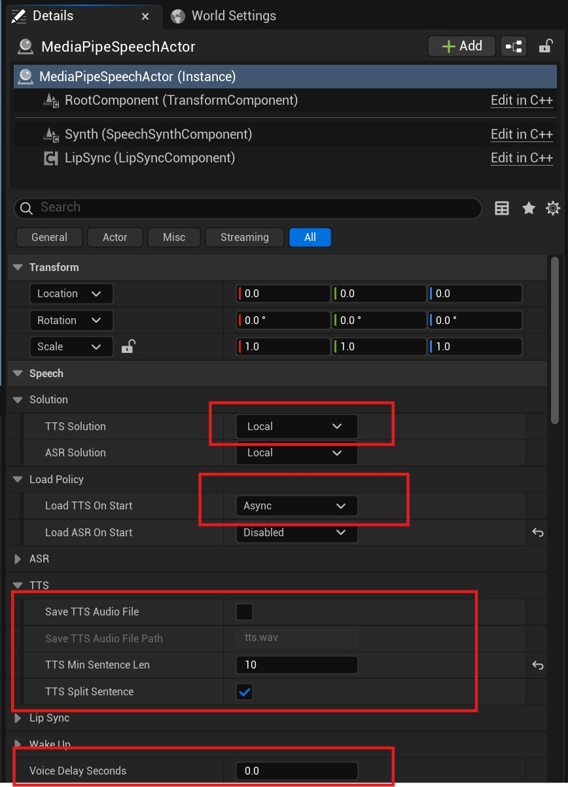

# Offline Speech Synthesis (TTS)

MediaPipe4USpeech provides offline, real-time text-to-speech, converting text into PCM audio data for playback in Unreal Engine.   

---   

## Usage

1. Install a TTS model.
1. Add a `MediaPipeSpeechActor` component to the scene.
2. Configure TTS in the Details panel.
3. Call `SpeakText` or `SpeakTextAsync` on `MediaPipeSpeechActor` to read text.

> To install a TTS model, read [Installing Speech Models](./setup_models.md).

---   

## Properties

`MediaPipeSpeechActor` provides many TTS properties:

**TTSSolutino**    
The solution used for TTS. Normally, use **Local** for offline TTS.
   
**LoadTTSOnStart**     
How TTS (the model) is loaded when the application starts.   

- `Disabled`: Do not load the TTS model at startup.
- `Async`: Load the model asynchronously on a thread-pool thread.
- `Async`: Load the model synchronously on the game thread.

!!! tip
    With asynchronous loading (`Async`), use `OnTTSLoaded` to receive notification when the TTS model finishes loading.
   

**SaveTTSAudioFile**
Whether to save audio as a .wav file, normally for debugging.   

**SaveTTSAudioFilePath**
When SaveAudioFile is **true**, controls the audio-file save path.   
The path can be absolute or relative; relative paths are rooted at `Saved/M4UAudio`.

---   

## Events

**OnTTSLoaded**    
Called when TTS loading finishes.

**OnTTSCompleted**    
Triggered when the TTS model finishes text-to-speech inference. Audio data has been produced, but playback may not yet be complete.

**OnTTSWaveReceived**   
Triggered when the audio playback component receives the inferred audio data.

**OnSpeakingCompleted**    
Triggered when reading finishes and the last audio chunk has played.

**OnSpeakingChunkStarted**    
Triggered when TTS starts reading an audio chunk.

**OnSpeakingChunkCompleted**    
Triggered when TTS finishes reading an audio chunk.

!!! tip
    
    TTS automatically splits long text and performs inference by segment, producing one audio chunk per segment for simultaneous inference and playback.

---   

## Functions     

|Function| Description |
|----------|------------|
|ListSpeakers     | Lists speakers when the TTS model supports multiple speakers. Returns an empty array if TTS has not loaded.  |
|GetSpeakerId     | Gets the current speaker ID. Returns **-1** if TTS has not loaded.  |
|IsTTSLoading     | Indicates whether TTS is loading.  |
|IsTTSReady       | Indicates whether TTS is ready (loading completed successfully).  |
|SetSpeakerId     | Sets the speaker by **ID**. Obtain IDs from `ListSpeakers`. |
|IsSpeaking       | Indicates whether TTS is speaking. |
|IsSpeakStopping  | Indicates whether TTS is stopping speech. |
|GetTTSState      | Gets the TTS model loading state. |
|SpeakText        | Reads text. `StopPrevious` indicates whether to interrupt current speech.|
|StopText         | Stops reading.|

## Async Functions   
|Function| Description |
|----------|------------|
|LoadTTSAsync     | When `LoadTTSOnStart` is **Disabled**, TTS is not loaded automatically; use this function to load it manually.|
|SpeakTextAsync   | Reads text. `StopPrevious` indicates whether to interrupt current speech.|
|StopTextAsync    | Stops reading.|

## Blueprint Function Library

- `ListTTSSolutions`: Lists currently available TTS solutions.

