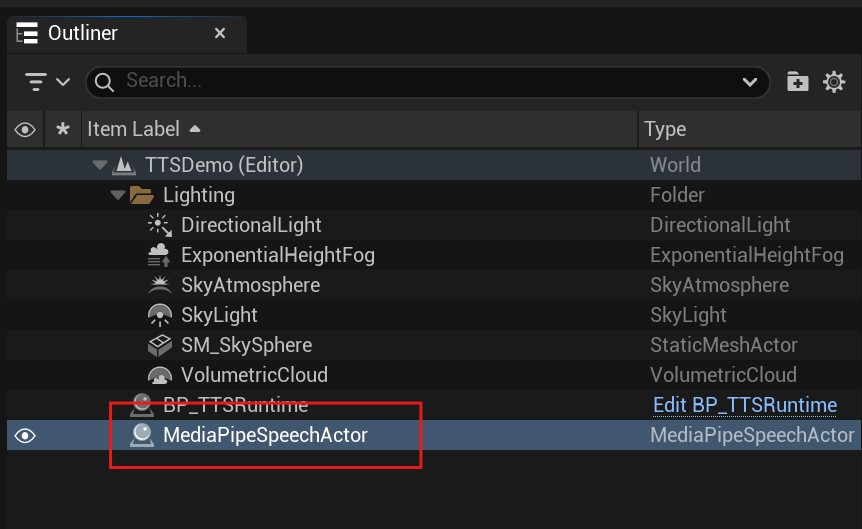
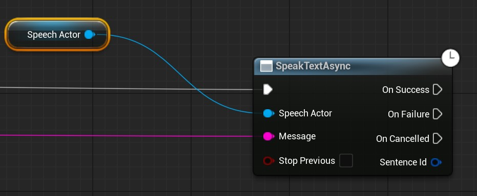
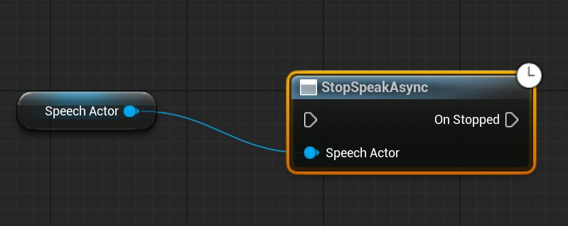
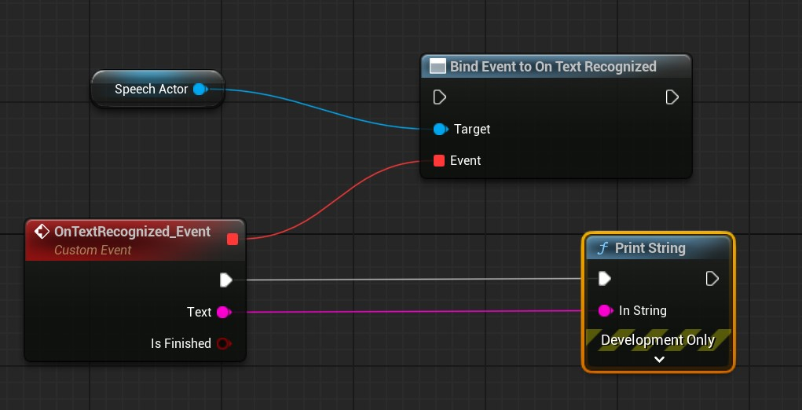
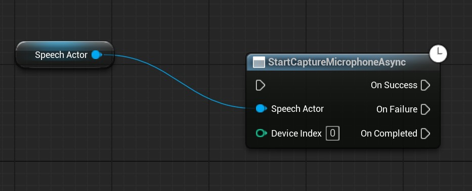
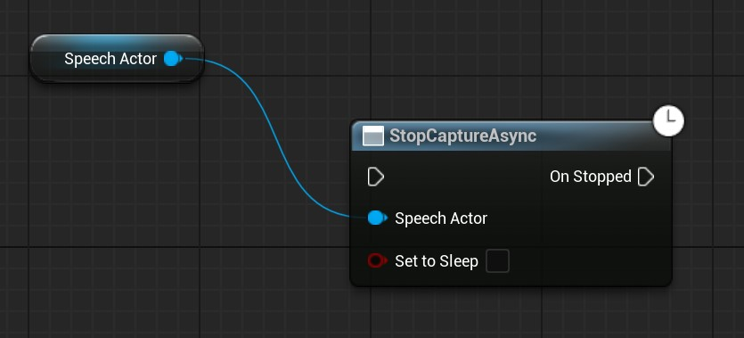
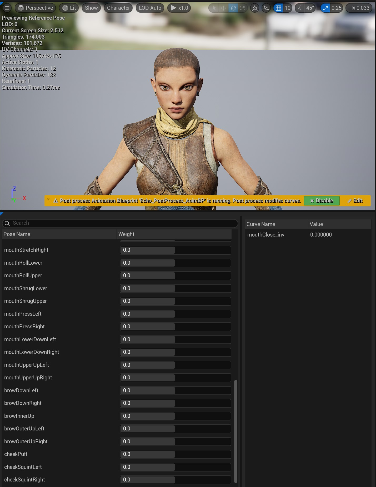
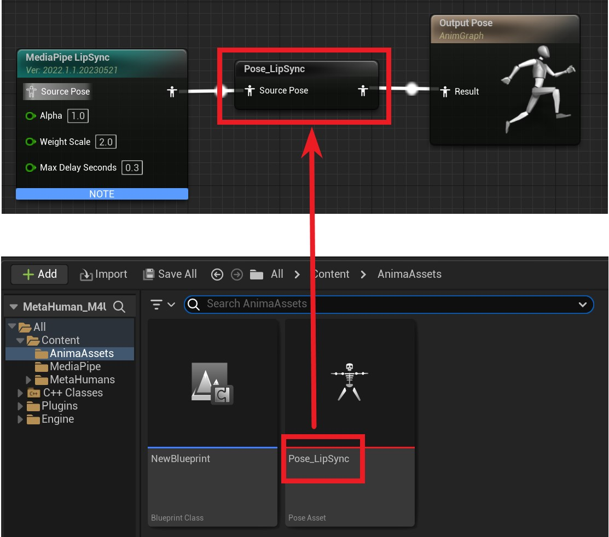
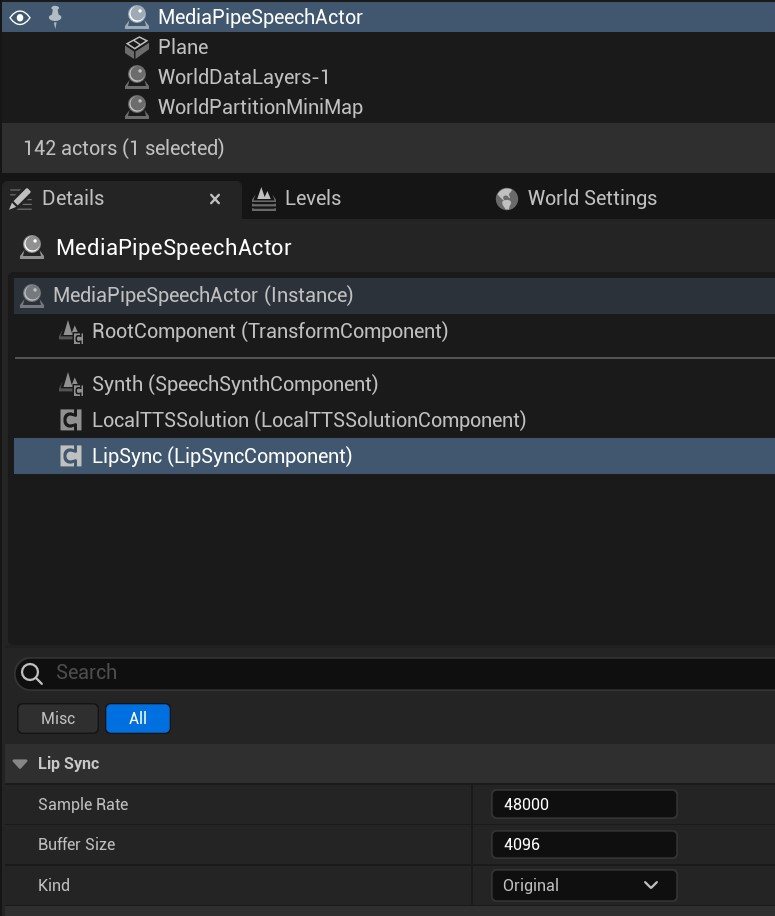

# Quick Start

`MediaPipe4U` provides offline, real-time speech synthesis and recognition, giving 3D characters the ability to "**listen**" and "**speak**".

## Install Model Packages

Before using the speech suite, download and install a speech model package.   
Find the model for your language at [https://huggingface.co/endink/M4U-Speech-Models](https://huggingface.co/endink/M4U-Speech-Models/tree/main).

For details, read [Installing Speech Models](./setup_models.md).   

## Use MediaPipeSpeechActor

Add a `MediaPipeSpeechActor` to the scene.

---

## Speech Synthesis (TTS)

### Start Reading Text

Use `SpeakTextAsync` on `MediaPipeSpeechActor` in Blueprint to read text aloud.

`Message` is the text to read.

### Stop Reading Text

Use `StopSpeakAsync` on `MediaPipeSpeechActor` to stop reading.

---

## Speech Recognition (ASR)

Convert input speech to text in a few steps:

1. Bind the recognition event to receive recognized text.
2. Start speech recognition in Blueprint.
   
!!! tip
    
    Stop speech recognition when it is no longer needed.

### Bind the Speech-Recognition Event

Bind `OnTextRecognized` on `MediaPipeSpeechActor` to receive ASR text in the event callback.

The event's `Text` parameter contains the recognized text.

### Start Speech Recognition

Call `StartCaptureMicrophoneAsync` on `MediaPipeSpeechActor` to capture audio from the default input device (microphone) and recognize it as text.   

!!! tip

    If speech is not recognized and the log contains no error, verify that the operating system's default audio-input device is your microphone. MediaPipe4U Speech automatically uses the default input device.

### Stop Speech Recognition

Call `StopCaptureAsync` on `MediaPipeSpeechActor` to stop capturing audio.   

---

## Lip Sync

Synchronize a 3D character's mouth with spoken text in a few steps:

1. Prepare animation assets
2. Add Animation Blueprint nodes
3. Enable lip sync
4. Create a `Character` and assign it to `LipSyncCharacter` on `MediaPipeSpeechActor`
5. Start reading

The steps are described below.

### Prepare Animation Assets

Create a PoseAsset compatible with the *ARKit Blend Shape* standard, containing **52** case-insensitively named curves.

### Add Animation Blueprint Nodes

Add `MediaPipe LipSync` and Evaluate Pose nodes to the Animation Blueprint.

### Create a Character

1. Create a `Character` and assign an Animation Blueprint containing `MediaPipe LipSync` to its `Mesh`.   
2. Place the `Character` in the Level.
3. Set `LipSyncCharacter` on `MediaPipeSpeechActor` to this `Character`.
4. Verify that `LipSync` is enabled on `MediaPipeSpeechActor`.

### Start Reading

When `SpeakTextAsync` on `MediaPipeSpeechActor` is called, it reads the text and generates matching lip animation on the `Character`.
