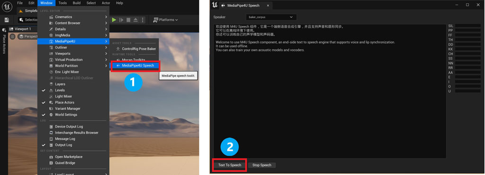

# 快速入门

在开始使用语音套件之前，你必须先下载和安装语音模型包。从 [https://github.com/endink/Mediapipe4u-plugin/releases](https://github.com/endink/Mediapipe4u-plugin/releases) 页面中找到 **Speech Models**， 下载对应语言的 TTS 模型包。

关于语音模型下载和安装的详细说明，请阅读[插件配置](./config.md)文档。   

--- 

## 创建 MediaPipeSpeechActor 组件

向场景中添加一个 MediaPipeSpeechActor 组件。

---

## 使用语音合成（TTS）和口型同步（LipSync）

此文档描述如何快速使用 MediaPipe4USpeech 插件完成 TTS 和驱动虚拟角色（数字化身）的口型同步。  
快速使用 MediaPipe4U 的语音套件，只需要几个简单步骤：

1. 准备动画资产
2. 添加动画蓝图节点
3. 运行程序

{: .warning}
> 语音套件**不包含**在免费授权许可中。
> 
> 语音套件是一个商业授权功能，只有 Ultimate 版本的授权许可能够打包此功能。   
> 
> 免费授权版本仅能够在 Ureal Editor 中使用它

下面，详细介绍这些步骤的操作方法。

### 准备动画资产

制作一个姿势资产（PoseAsset） 包含 15 个音素曲线（这里我将这个 Pose Asset 命名为 **Pose_LipSync**）。

> SIL 为自然状态下的面容。   
> 音素表情请参考[Lipsync文档](./lipsync.md)或[OVRLipSync文档](https://developer.oculus.com/documentation/unreal/audio-ovrlipsync-viseme-reference)

### 添加动画蓝图节点

在动画蓝图中添加 **MediaPipe LipSync** 节点和 Evalute Pose 节点。

### 使用蓝图中进行语音合成

在蓝图中使用 **MediaPipeSpeechActor** 的 **SpeakText** 函数，可以进行文本朗读。

在蓝图中使用 **MediaPipeSpeechActor** 的 **StopSpeak** 函数，可以停止朗读。

---   

## 使用语音识别

### 绑定语音识别事件

在蓝图中绑定 **MediaPipeSpeechActor** 的 **OnTextRecognized** 事件，可以在事件回调中获取到 ASR 识别到的文本。

  

### 在蓝图中进行语音识别

在蓝图中调用 **MediaPipeSpeechActor** 的 **StartASR** 函数，可以从默认的音频输入设备（麦克风）中捕获语音数据并识别为文本。   

在蓝图中调用 **MediaPipeSpeechActor** 的 **StopASR** 函数，可以停止捕获音频数据。   

---   

## 使用 MediaPipe4U 语音工具

MediaPipe4U Speech 提供了在 Unreal Editor 中快速测试的语音功能的工具，你可以从 `窗口（Windows）>> MediaPipe4U >> MediaPipe4U Speech` 菜单中打开它。

- 点击 `Text To Speech` 按钮可以朗读输入框中的文字。
- 点击 `Start ASR` 按钮可以启动麦克风语音识别，将会把识别到的文字输出到界面。
  
当 ASR 启动后，如果 VAD 被启用，语音工具界面中的 VAD 状态指示器为绿色时表示有人说话，方便你监视语音识别状态。