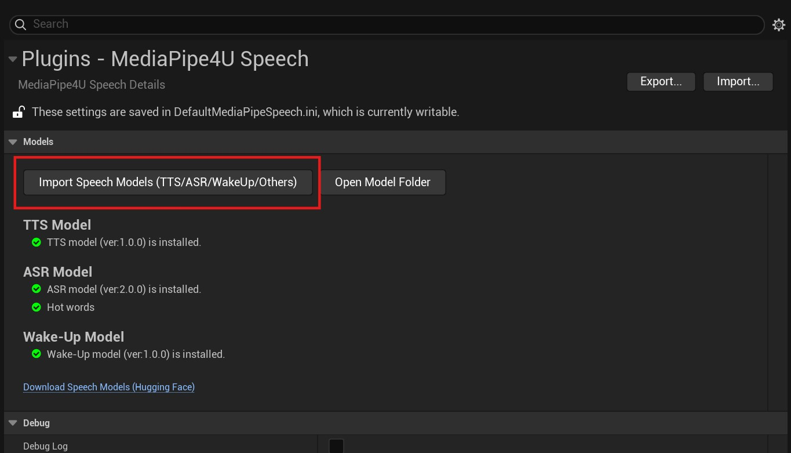

# Install Speech Models

Because speech model packages are very large, they are not included with the plugin and must be downloaded separately. Download links are available on the [speech model package releases page](https://huggingface.co/endink/M4U-Speech-Models/tree/main){: target='_blank'}.   

!!! tip

    Different languages use different model packages. Select the correct language when downloading.   
    For example, Chinese characters cannot be recognized when using an English model package.       

    > `zh_en` or `zh_mix` in a model-package filename indicates a primarily Chinese model that supports mixed Chinese and English.   

    After a model package is installed in the development environment, its model files are automatically included when packaging the project. Model packages are very large (1 GB). To exclude them from the packaged application, manually modify the Speech plugin's Build.cs file.

---   

## Installation Steps

Install a speech model package through UE Editor or by manually copying its folders.   
**Speech model releases page:**     

[https://huggingface.co/endink/M4U-Speech-Models](https://huggingface.co/endink/M4U-Speech-Models/tree/main){: target='_blank'}

---   

### Install in Unreal Editor

This is the easiest way to install a speech package and is **recommended**.

1. Download a model package (usually a .zip archive) from the [speech model releases page](https://huggingface.co/endink/M4U-Speech-Models/tree/main){: target='_blank'}.
1. Open UE Editor and select `Edit >> Project Settings` to open Project Settings.
1. In the left pane, select `Plugins >> MediaPipe4U Speech` to open the MediaPipe4U Speech settings page.
1. On the MediaPipe4U Speech settings page, click `Import Speech Models` and select the downloaded .zip file to install the model package.



!!! tip

    The MediaPipe4U Speech settings page also shows model-package status, but this only performs a basic check for the model-package folder.   
    When no model package is installed, the status indicator is red and displays a message.   
       
    Click `Download Speech Models` on the MediaPipe4U Speech settings page to quickly open the model download page.


---   

### Manual Installation
 
Install manually by extracting the downloaded model-package .zip file.

1. Download a model package (usually a .zip archive) from the [speech model releases page](https://huggingface.co/endink/M4U-Speech-Models/tree/main){: target='_blank'}.
2. Extract the model package.
3. Copy the extracted contents to `[Plugins Folder]\MediaPipe4USpeech\Source\ThirdParty\SpeechAPI\Data`.

After successful installation, the directory structure looks like this:

```
[Plugins Folder]\MediaPipe4USpeech\Source\ThirdParty\SpeechAPI\Data
├─asr
│  ├─fsmn_vad_model
│  ├─paraformer_model
│  └─punc_model
└─tts
    ├─dict
    │  ├─fastspeech2_nosil_baker_ckpt_0.4
    │  ├─jieba
    │  │  └─pos_dict
    │  ├─speedyspeech_nosil_baker_ckpt_0.5
    │  └─tranditional_to_simplified
    ├─models
    └─speech
        ├─dict
        └─models
```

> `Plugins Folder` is your project's Plugins directory.

### Model Packages

- Files beginning with `tts` are TTS (speech synthesis) model files.
- Files beginning with `asr` are ASR (speech recognition) model files.
- Files beginning with `wakeup` are voice wake-up model files.
