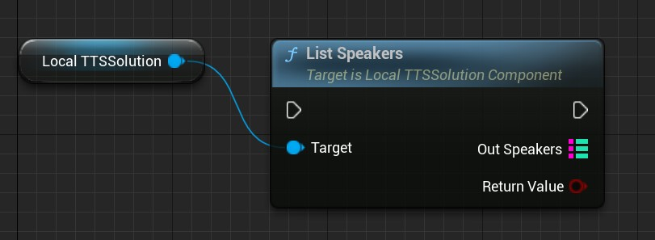
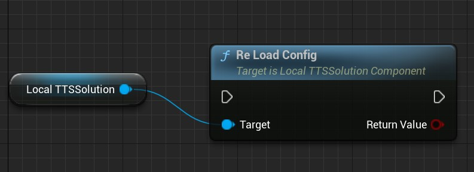

# 离线语音合成 (TTS)

MediaPipe4USpeech 内置一个 ULocalTTSSolutionComponent 组件，它提供离线 TTS 能力, 支持你将文本转为 PCM 语音数据输出。

## 如何使用

1. 向场景中添加 **AMediaPipeSpeechActor** 组件
2. 通过细节面板配置 LocalTTSSolution   

## 属性

**AcousticModelFile**   
声学模型文件，查找路径为 MediaPipe4USpeech/Source/ThirdParty/SpeechAPI/Data/speech/models   
   
**VoiceCoderModelFile**   
声码器模型文件，查找路径为 MediaPipe4USpeech/Source/ThirdParty/SpeechAPI/Data/speech/models   
   
**ConfigFile**   
TTS 配置文件，包含文本前端配置、音素配置和发音人配置，相信信息请参考[TTS 配置](../config.md)。   

## 功能函数     

### 列出发音人

你可以通过 **ListSpeakers** 函数列出发音人字典的内容。

### 重新加载配置   
使用 ReLoadConfig 函数重新加载配置。支持在运行过程中重新读取 TTS 配置信息。   
> 当你有多套 TTS 模型和配置时，这个函数可以用作切换 TTS 模型。

