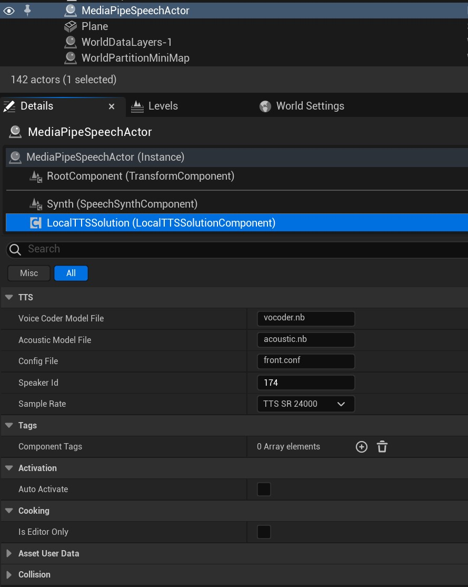
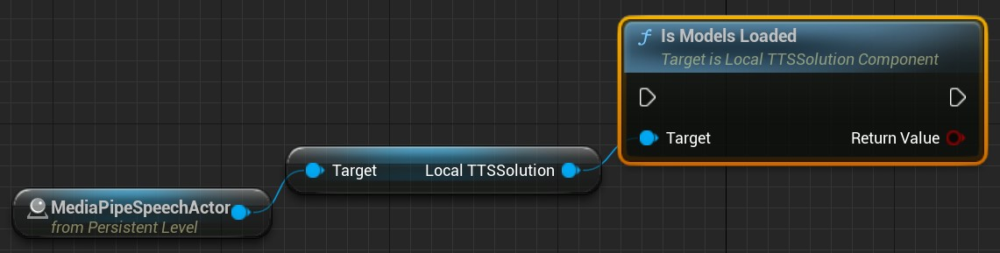

# 离线语音合成 (TTS)

MediaPipe4USpeech 内置一个 ULocalTTSSolutionComponent 组件，它提供离线 TTS 能力, 支持你将文本转为 PCM 语音数据输出。   

---   

## 如何使用

1. 向场景中添加 **AMediaPipeSpeechActor** 组件
2. 通过细节面板配置 LocalTTSSolution   

---   

## 属性

**ConfigFile**   
语音模型的配置文件，它是一个相对路径，根目录是`MediaPipe4USpeech/Source/ThirdParty/SpeechAPI/Data/tts`。  
   
**LoadModelOnStart**     
当程序启动后自动加载模型包的方式。   
- Disabled: 不在启动程序后加载 TTS 模型。
- Async: 异步加载模型（在线程池线程中）。
- Sync: 同步加载模型（在游戏线程中）。

{: .important}
> 当设置加载方式为异步加载（Async）时，你可以通过 `OnModelsLoadCompleted` 事件来获得模型加载完成的通知。
   
**SpeakerId**      
发音人 id， 如果你的 TTS 没有多发音人，请设置为 -1。

**SampleRate**  
音频采样率，你设置的采样率必须和模型包支持的采样率一致，默认的模型包支持所有的采样率。 

**SaveAudioFile**
是否将音频保存为语音文件（.wav），这通常用于调试。   

**SaveAudioFilePath**
当 SaveAudioFile 为 **true** 时，这个属性控制音频文件的保存路径。   
这个路径可以是绝对路径，也可以是相对路径，相对路径根目录为 `Saved/M4UAudio`。

---   

## 事件

**OnModelsLoadCompleted**   
模型加载结束时回调的事件。

---   

## 功能函数     

### 检查模型是否已经加载

你可以通过 **IsModelsLoaded** 函数列出发音人字典的内容。

