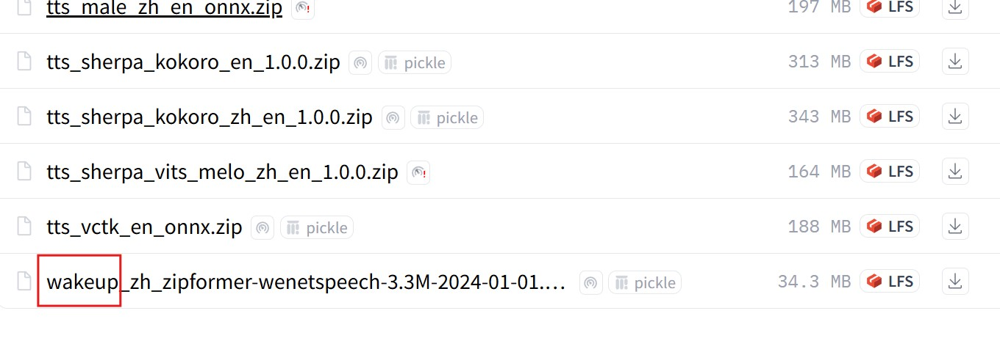
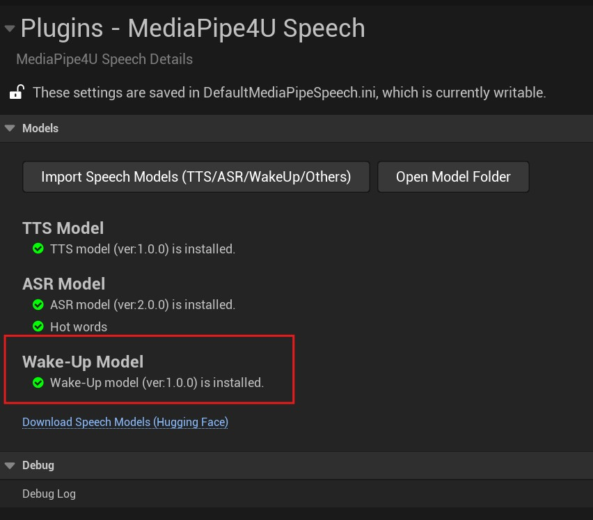
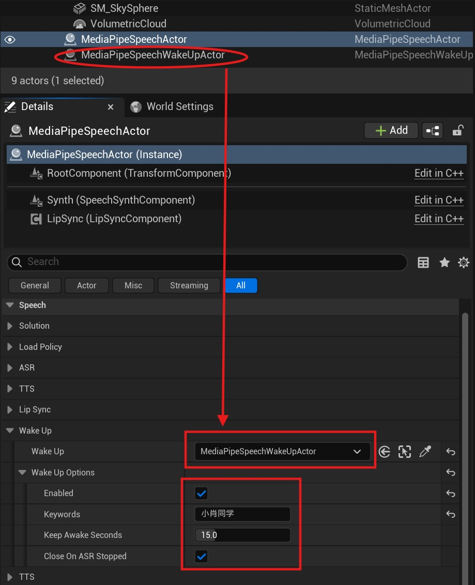
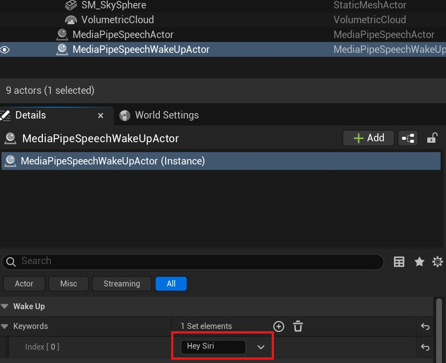
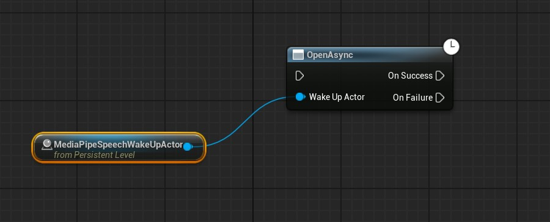
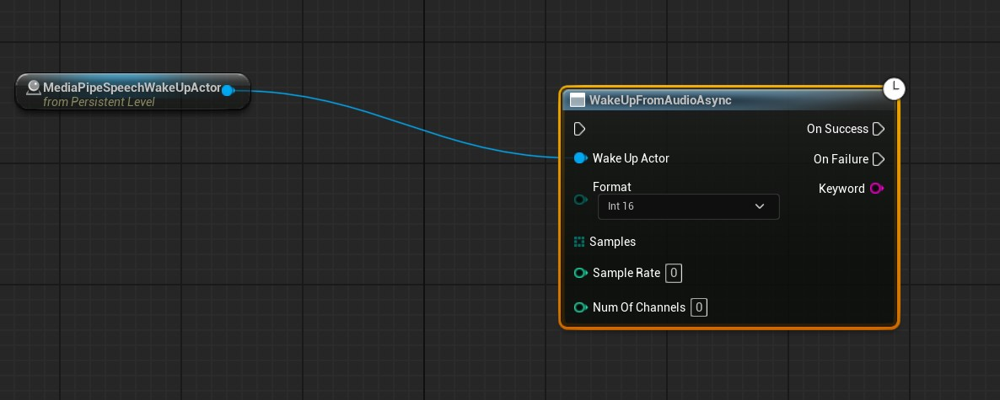
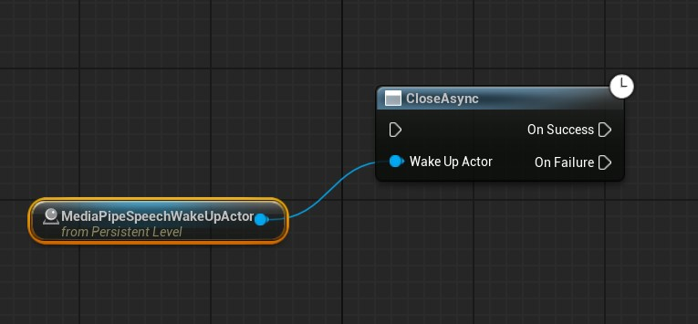

# Voice Wake-Up

`MediaPipe4USpeech` provides voice wake-up, allowing your application to react to spoken commands captured from a microphone.
It integrates with **ASR** to implement voice activation similar to "Hey Siri".

!!! tip

    Wake-up is difficult to use independently from ASR in the current version because few standalone functions are exposed. Integration with ASR is recommended.

## Install a Wake-Up Model

First install a wake-up model from the [speech model downloads](https://huggingface.co/endink/M4U-Speech-Models/tree/main) page.



!!! tip

    Chinese wake-up models support only Chinese keywords, while English models support only English keywords. The languages cannot be mixed.   


After installation, the `MediaPipe4U Speech` plugin settings page should show the wake-up model as installed.



---

## Integrate with ASR

### Add an Actor

Place a `MediaPipeSpeechWakeUpActor` in the Level. **No configuration** is required on this actor.

### Configure `MediaPipeSpeechActor`

After adding both `MediaPipeSpeechActor` and `MediaPipeSpeechWakeUpActor`, configure `MediaPipeSpeechActor` to enable ASR wake-up.



ASR enters the wake-up flow when:

- `Enable` under `WakeUpOptions` on `MediaPipeSpeechActor` is **true**.
- `WakeUp` on `MediaPipeSpeechActor` references a `MediaPipeSpeechWakeUpActor` instance.

!!! tip

    When integrated, `MediaPipeSpeechActor` takes ownership of `MediaPipeSpeechWakeUpActor`.   

    You do not need to open or close `MediaPipeSpeechWakeUpActor`;   
    do not configure wake words on `MediaPipeSpeechWakeUpActor`;   
    complete all settings on `MediaPipeSpeechActor`.

Wake-up properties on `MediaPipeSpeechActor`:   

- `WakeUp`: The `MediaPipeSpeechWakeUpActor` instance integrated with ASR.
- `WakeUpOptions`: Voice wake-up options.

  - `Enabled`: Whether wake-up is enabled.
  - `Keywords`: Wake words used to wake ASR.
  - `KeepAwakeSeconds`: How long ASR remains awake. The timer resets when ASR recognizes speech; after this many seconds without speech, ASR sleeps and must be awakened again.
  - `CloseOnASRStopped`: When **true**, stopping ASR automatically closes `MediaPipeSpeechWakeUpActor`; otherwise, close it manually with `Close`.


### Start Recognition After Wake-Up

Call `StartCaptureMicrophoneAsync` on `MediaPipeSpeechActor` to capture microphone audio. ASR must first hear a wake word before recognizing speech.

??? note "ASR Flow with Voice Wake-Up"

    ``` mermaid
    graph TD
      A[Audio] --> B{ASR Awake?};
      B --> |Yes| D{Recognize ?};
      B --> |No| C{Do Wake Up}
      C --> |Success| D
      C --> |Failure| H{Loop Next}
    
      D -->|Yes| E{Output Text};
      E --> H
     
      D -->|No| F{Exceed KeepAwakeSeconds?};
    
      F --> |Yes| G{Sleep ASR}
      G --> H
      F --> |No| H
      
    ```

---

## Standalone Usage

The current `MediaPipeSpeechWakeUpActor` does not integrate well with Unreal Engine when used alone, mainly because of limitations in Unreal Engine's audio system.
For example, PCM data is unavailable from `AudioCaptureComponent`, and sampling-rate information is difficult to obtain from other components.
Standalone usage therefore has limited value; integration with ASR is recommended.

!!! tip "Standalone Limitations"

    Other than SoundSubmix plus Audio Device, Unreal Engine provides almost no way to obtain PCM audio data.   
    SoundSubmix and Audio Device approaches are C++-only and not Blueprint-friendly.   

    Therefore, standalone `MediaPipeSpeechWakeUpActor` currently detects wake words only from raw PCM data.

### Add an Actor

Place a `MediaPipeSpeechWakeUpActor` in the Level and configure wake words.



!!! warning "Note"

    You can configure multiple wake words and respond differently to each in the wake-up event.
    
    > Multiple wake words can implement commands such as "turn on the light", "turn off the light", "play", and "pause".

    When integrating with ASR, configure ASR wake words on `MediaPipeSpeechActor`, **not** on `MediaPipeSpeechWakeUpActor`.

### Open WakeUp

Before detecting wake words from audio, call `Open` on `MediaPipeSpeechWakeUpActor` to load the model and allocate the audio buffer.




### Wake-Up Detection

Call `WakeUpFromAudio` to detect wake words in PCM audio.



On success, `Keyword` contains the detected wake word.    
Failure means no wake word was found in the audio.

### Close WakeUp

When wake-up is no longer needed, call `Close` on `MediaPipeSpeechWakeUpActor` to release substantial memory.



