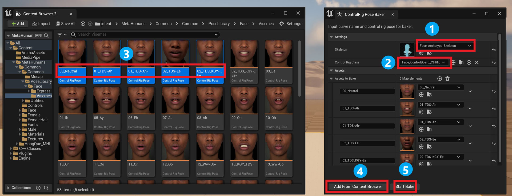
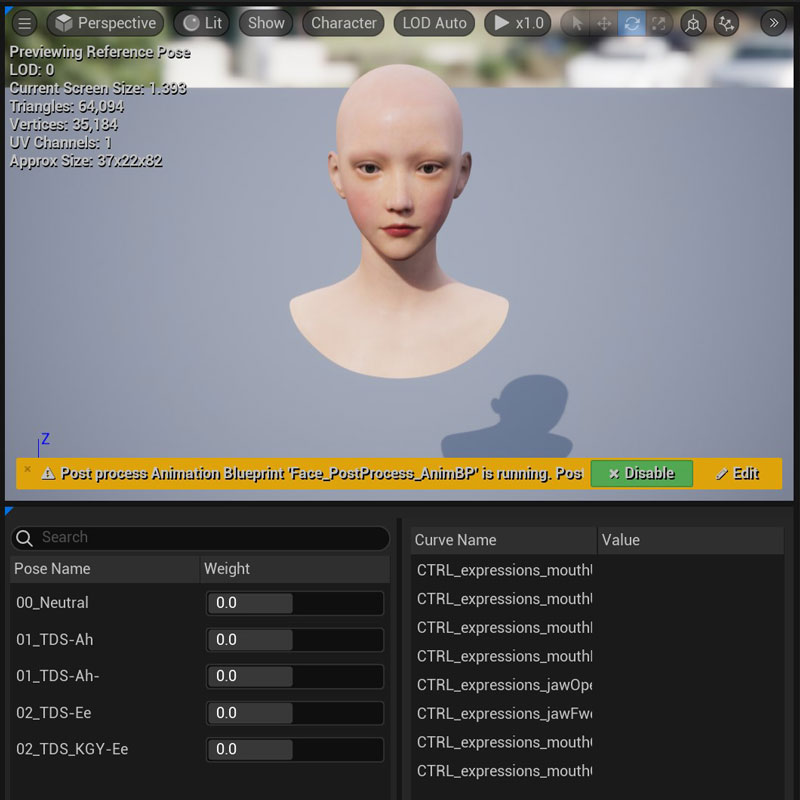

# Control Rig Pose Baker
{: .d-inline-block }

Beta
{: .label .label-green }  

MediaPipe4U provides a pose-asset baking tool that converts Control Rig assets (ControlRig Pose Assets) into Pose assets (PoseAsset) that can be used in Animation Blueprints.

{: .important}
> This is particularly useful for Metahuman users.    
> 
> Epic has already created phoneme animation assets for Metahuman, but they are in the Control Rig Pose format, which cannot be used directly in Animation Blueprints.   
> 
> The baking tool provided by MediaPipe4U can quickly convert these assets into PoseAssets that can be used in Animation Blueprints.   

## How to Use

1. In the Unreal Editor Window menu, find MediaPipe4U --> Control Rig Pose Baker to open the baking tool.
2. Select the Skeleton used by the Control Rig Pose to bake.
3. Select the Control Rig used by the Control Rig Pose to bake.
4. Select the Control Rig Pose assets to bake in the Content Browser (multiple assets can be selected).
5. Click the Add From Content Browser button to add poses.
6. Click Start Bake to bake.
7. Save the asset in the Pose Asset Editor.

When baking is complete, the Pose Asset Editor opens automatically and displays the baked Pose Asset.

