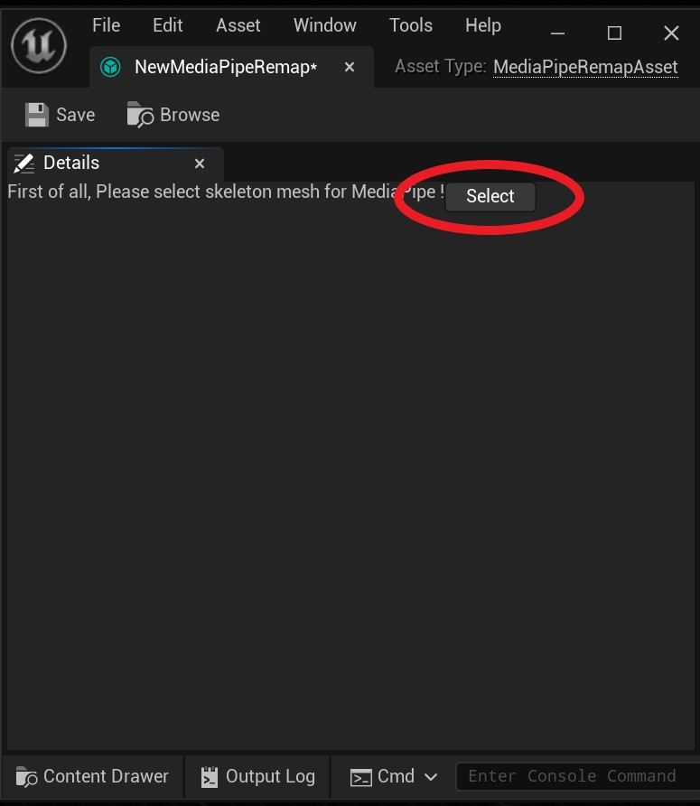

# 自定义骨骼

    **MediaPipe4U** 提供的了 VRoid 和 UE5 骨骼预设，这两种骨骼无需任何设置即可开始动补，如果你的骨骼不是这两种骨骼之一，本章节介绍映射任意的骨骼。    
>阅读本节内容之前，请先阅读 [准备动补角色](prepare_character.md) 一节，本节内容假设你已按照 [准备动补角色](prepare_character.md) 小节的步骤完成了动画蓝图节点配置。    

------   

## 创建 MediaPipe 映射资产

在内容浏览器任意文件夹单击鼠标右键 ---> 动画 --> MediaPipe Remap
> 你也可以点击内容浏览器左上角的添加按钮打开新建资产菜单

     

你将创建一个 RemapAsset, 双击打开它，你会看到一个空白的编辑窗口，这是因为重定向资产是骨骼网格绑定的，你必须先指定要用 MediaPipe4U 驱动的骨骼网格：
点击 Select 按钮选择一个骨骼网格。

   

当选择骨骼后，编辑界面将出现骨骼绑定列表，将列表中的 **MediaPipe4U** 需要的骨骼映射到你的骨骼网格体中的骨骼。

  

完成骨骼映射后保存资产，你现在有一个可供 **MediaPipe4U** 驱动的骨骼映射表了。      

---    

## 在动画蓝图中配置映射

动画蓝图中配置映射资产只需要完成以下步骤：
1. 动画蓝图变量 **BonePreset** 设置为 **Custom**。
2. 动画蓝图变量 **BoneRemap** 设置为你创建的 MediaPipe 映射资产。

  

> 动画蓝图必须继承自 **MediaPipeAnimInstance** 同时需要开启显示继承的变量，详情见 [准备动补角色](prepare_character.md)

完成以上设置后保存并编译你的动画蓝图即可开始 MediaPipe 动补。

