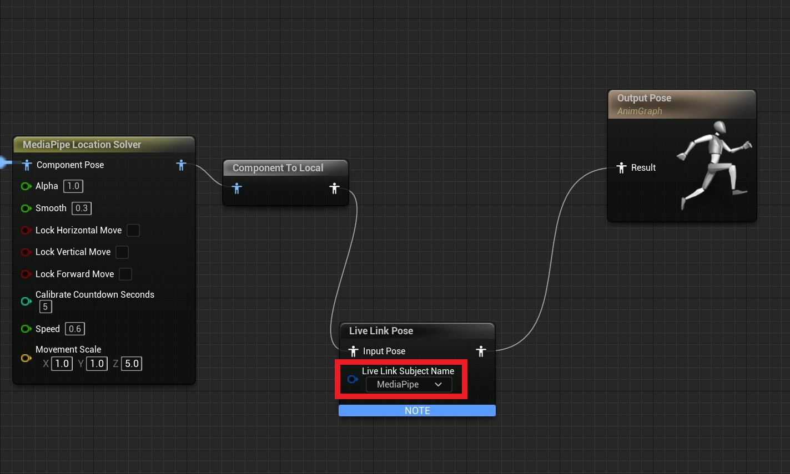

# 表情捕捉（实验性）

**MediaPipe4U** 能够不依赖 Iphone/IPad (Apple Arkit) 完成简单面补表情捕捉    
> 目前该功能很初级，不推荐使用，如果有条件，你还是应该使用 Apple Arkit 面补设备。    

------   

### 添加 MediaPipeLiveLinkComponent 组件

像 MediaPipe4U 组件所在的 Actor 添加 **MediaPipeLiveLinkComponent** 组件

   

---    

### 在动画蓝图中添加 LiveLink 节点

添加一个 LiveLink 节点，同时设置 Subject Name 为 "MediaPipe"，保存并编译动画蓝图。

   

> **UMediaPipeLiveLinkComponent** 会创建 LiveLink 源（LiveLinkSource），并且向 "MediaPipe" 主体（Subject）发送数据。

### 检查你的 LiveLink 源   

在 Unreal Editor 中打开 LiveLink 窗口，并添加一个 LiveLink Source, 你会看到 MediaPipe LiveLink Source 已经可用，但是添加之后处于 inactive 状态，说明你的 MediaPipeLinkLike 工作正常。

   

### 删除 LiveLink 窗口中的 MediaPipe 源

**MediaPipeLiveLinkComponent** 不支持在编辑器中使用，上述步骤仅为了检查你的 LiveLink 环境配置正确，请务必将你上述过程中添加的 LiveLinkSource 删除，保持窗口为空

  

> 因为 MediaPipeLiveLinkComponent 在运行时会自动创建 Source，所以必须保证你没有手动添加过 LiveLinkSource, 否则可能因为两个重名的 Source 导致 Live Link 无法正常工作。 

### 启动程序

在编辑器中点击运行，并且开始动补，你会发现 Live Link 窗口中自动创建了 MediaPipe Live Link Source ，并且处于 active 状态，说明 MediaPipe4U 已经开始发送 livelink 数据。

  

> 注意：只有程序运行并且已经开始动补，LiveLink 源才会被添加。

### 自定义 Live Link 主体（Subject）

默认情况下 **MediaPipeLiveLinkComponent** 使用的主体名称为 "MediaPipe", 你可以通过 **MediaPipeLiveLinkComponent** 的 Subject 字段来修改主体名称。

### 表情平滑度

 你可以通过 **MediaPipeLiveLinkComponent** 的 BlendShapeSmooth 来调整表情的平滑度，数值越大平滑度越高。