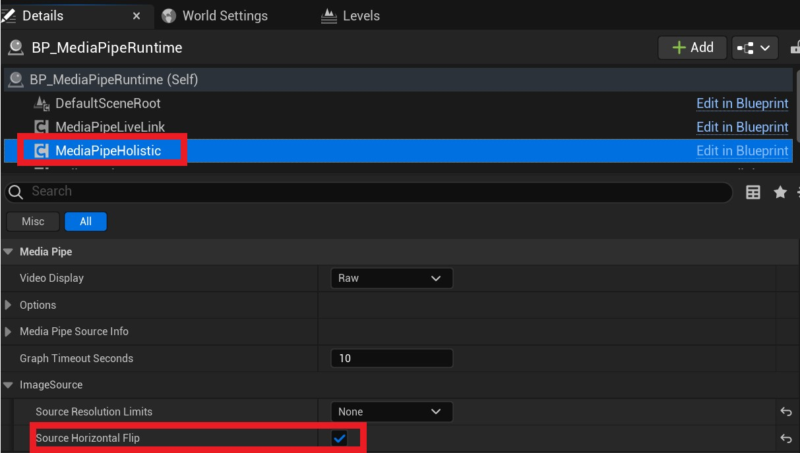

# Mirror/Flip Video Stream

In some cases, your video stream may be horizontally reversed, or you may want to reverse the image to produce a different motion-capture solving result.
You can horizontally flip the image by setting the **SourceHorizontalFlip** property of **UMediaPipeHolisticComponent**.   

**Note**: Not all image sources support flipping. The following table shows flip support for each image source:    

|Image Source| Image Source Description |Horizontal Flip Support|
|--------|------|--------|
| WebcamImageSource | Camera | Yes |
| GStreamerImageSource | Video stream | No |
| StaticImageSource | Image | No |
