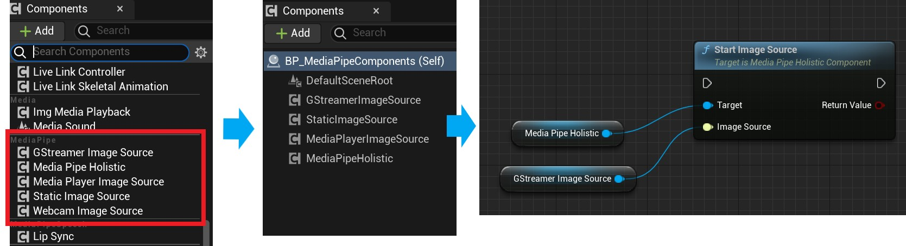
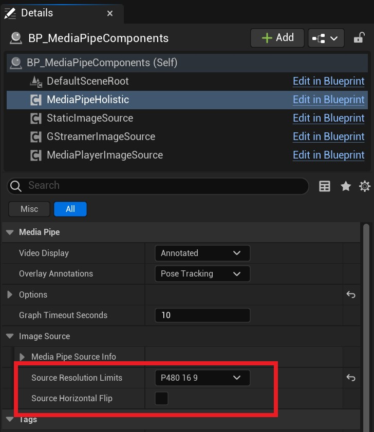
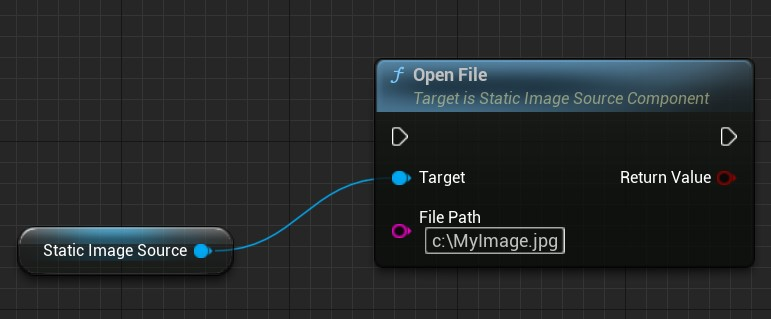
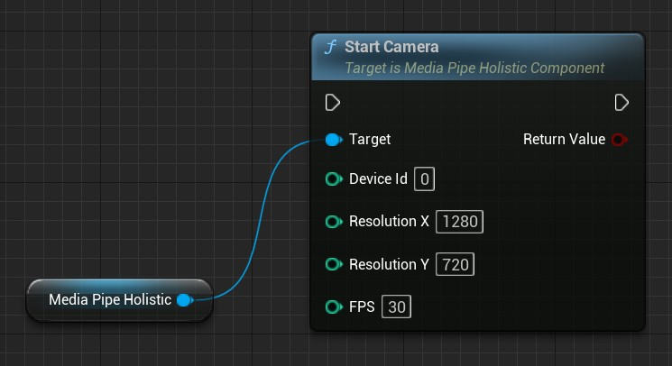
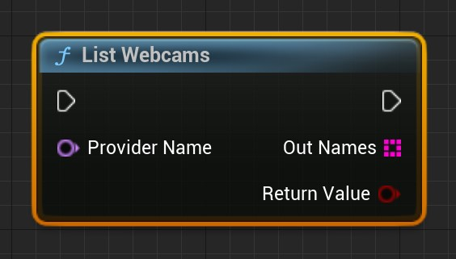
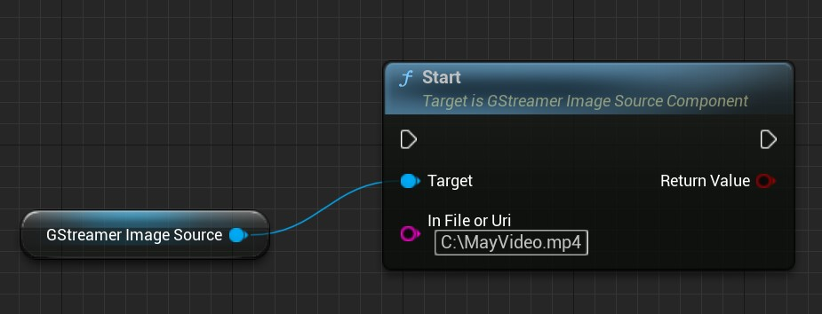
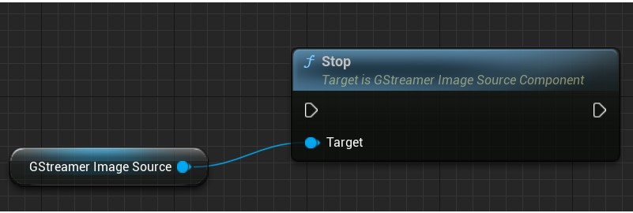
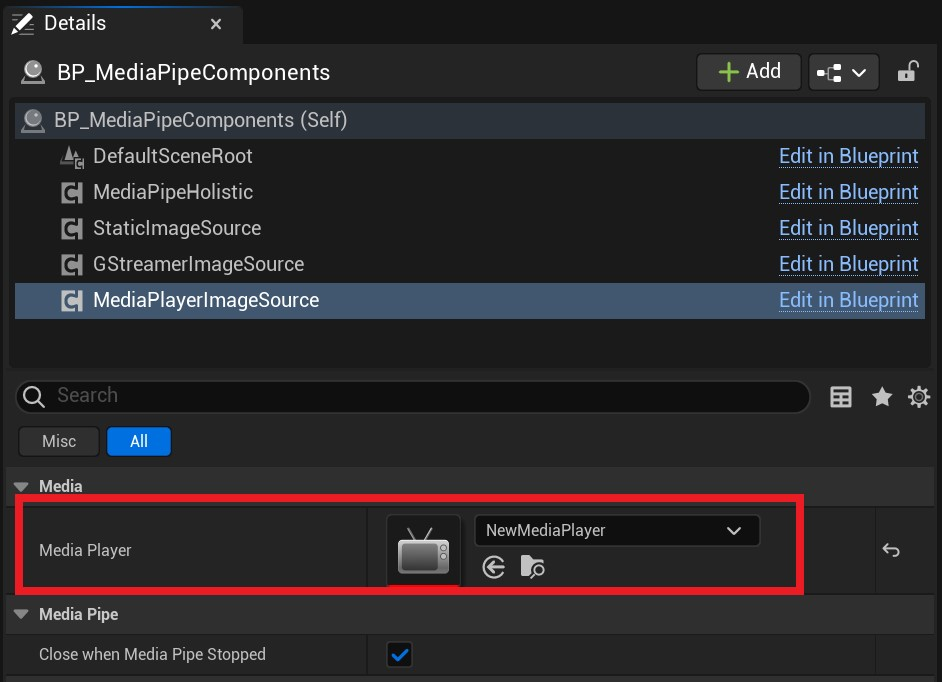
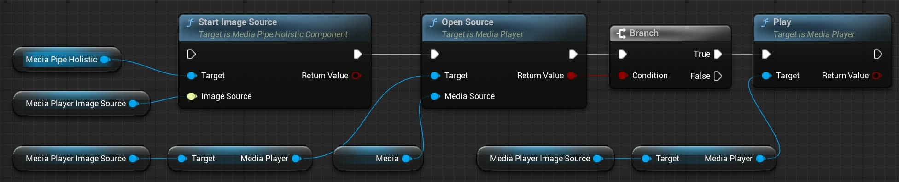

# Image Source 

An Image Source provides image data.   
MediaPipe4U abstracts components that supply static images, video streams, or video files behind the UE interface `IMediaPipeImageSource`, representing the image source used for motion and facial capture.   

## Built-in Image Sources    

MediaPipe4U includes four image-source types:

- `StaticImageSourceComponent`: Captures JPG, PNG, and other image files.   
- `WebcamImageSourceComponent`: Captures a local camera.   
- `GStreamerImageSourceComponent`: GStreamer media pipeline supporting video files and online streams over RTMP, RTSP, HTTP, and other protocols.   
- `MediaPlayerImageSourceComponent`: Captures Unreal Engine Media Player output (beta).   


## Using an Image Source

1. Add an Image Source component in the Blueprint editor.
2. Call `StartImageSource` on `MediaPipeHolisticComponent` to capture from it.
3. Call the Image Source's open function to open a camera, image, or video.

!!! tip "Tip"  

    Functions ending in Async are asynchronous and do not block the game thread. Prefer them whenever possible:   

    - `StartImageSource`: synchronous
    - `StartImageSourceAsync`: asynchronous

[](./images/image_source/components.jpg)


> Different Image Source components have different open functions, which are not shown above.
> 
> Continue reading for details about each type.

## Common Image Source Properties
   
**bCloseWhenMediaPipeStopped**   
Whether to stop the Image Source automatically, closing files, MediaPlayer, and related resources when MediaPipe capture stops, for example through `MediaPipeHolisticComponent::Stop`.   
Default: **true**

> When bCloseWhenMediaPipeStopped is true, calling Stop on MediaPipeHolisticComponent ends capture and closes the active Image Source.

---    

## Advanced Image Source Control   

Control advanced Image Source operations through MediaPipeHolisticComponent properties. Not all source types support them:

[](./images/image_source/advance_control.jpg)

|Property| Description |
|:------|:--------|
| SourceHorizontalFlip | Flips the image horizontally. |
| SourceResolutionLimits | Limits image resolution. |

!!! tip "Tip"  

    Limiting resolution with **SourceResolutionLimits** can significantly improve MediaPipe solver performance.

## StaticImageSourceComponent

### Open an Image   

Call **OpenFile** on StaticImageSourceComponent to open a JPG or PNG file.

[](./images/image_source/static_open_file.jpg)

---   

## WebcamImageSourceComponent

Represents a host camera, normally USB, and supports both Windows and Android.    

### Open a Camera   

The built-in WebcamImageSourceComponent supports camera capture.      

!!! tip "Tip"   

    - `WebcamImageSourceComponent` is built into `MediaPipeHolisticComponent` and does not need to be added manually.  
    - Use `StartCamera` or `StartCameraAsync` on MediaPipeHolisticComponent, not `StartImageSource`.   
    - Windows cameras use OpenCV and support only DirectShow cameras. A camera without DirectShow support may not work.    
    - Android cameras use CameraX.   

Call `StartCamera` or `StartCameraAsync`:  

[](./images/image_source/start_camera.jpg)   

StartCamera parameters:   


| Parameter | Description | Example |
|:------|:------:|:------|
| DeviceId | Zero-based camera ID | 0 |
| ResolutionX | Horizontal resolution | 1280 |
| ResolutionY | Vertical resolution | 720 |
| FPS | Frame rate | 30 |

> On mobile devices such as Android, `DeviceId` selects the front or rear camera: **0** is front and **1** is rear.
   
!!! tip "Tip"  

    - MediaPipe4U finds only DirectShow cameras, so IDs may differ from other software.   
    - If the requested resolution is unsupported, an appropriate resolution is selected automatically.   
    - If the requested frame rate is unsupported, an appropriate frame rate is selected automatically.   

### List Cameras   

`StartCamera` and `StartCameraAsync` accept a camera ID. Use `ListWebcams` in the MediaPipe4U Blueprint function library to list local cameras; the array index is suitable for DeviceId.  

[](./images/image_source/list_webcams.jpg)

!!! tip     

    Provider identifies the camera provider. OpenCV is the default and currently the only implementation, so this parameter can be ignored.   
    
    `ListWebcams` returns a bool indicating success.
    
    On Android, `ListWebcams` always returns IDs **0** and **1** for the front and rear cameras respectively.


### Close the Camera   

Call `Stop` or `StopAsync` on MediaPipeHolisticComponent.

---   

## GStreamerImageSourceComponent

`GStreamerImageSourceComponent` currently supports Windows only.   

Use it to capture from a video file or online stream.   

### Open a File or Stream

Call `Start` on `GStreamerImageSourceComponent`.   

[](./images/image_source/gstreamer_start.jpg)

`Start` parameter:     

**InFileOrUri**    

Video file or stream to open. Examples:   

- C:\MyVide.mp4   
- C:\MyVide.avi   
- rtsp://wowzaec2demo.streamlock.net/vod/mp4:BigBuckBunny_115k.mov   
- http://clips.vorwaerts-gmbh.de/big_buck_bunny.mp4   
   

Return value: whether the operation succeeded.

### Use a Custom GStreamer Expression

`GStreamerImageSourceComponent` supports GStreamer Launch expressions through `StartGStreamerLaunch`.    

Parameter: 

**GStreamerCommand**

GStreamer expression to run, for example:

```
playbin uri=https://xxx.webm ! videoconvert ! video/x-raw,format=(string)RGBA ! appsink name=mediapipe4u_sink
```

Important:

A GStreamer expression is a pipeline whose stages are separated by `!`. MediaPipe4U defines the custom sink `mediapipe4u_sink`, so the final stage must always be `appsink name=mediapipe4u_sink`.   

`mediapipe4u_sink` accepts RGBA images.

GStreamer expressions can process streams, cameras, WebRTC, and many other media protocols. See the official [GStreamer Launch documentation](https://gstreamer.freedesktop.org/documentation/tools/gst-launch.html).


### Close a File or Stream

Call `Stop` on `GStreamerImageSourceComponent`.   

[](./images/image_source/gstreamer_stop.jpg)   

---   

## MediaPlayerImageSourceComponent

MediaPipe4U integrates with Unreal Engine MediaPlayer and captures its output.      

!!! tip  

    `MediaPlayerImageSourceComponent` is a **Beta** feature and may be unstable.   
      
    It supports these pixel formats:   
    
    - BGRA
    - YUY2 (YUNV, YUYV)
    - NV12
    - NV21
    
    The current implementation does not support advanced controls such as horizontal flipping or resolution limits.
   

> **GStreamer** is recommended instead because `GStreamerImageSourceComponent` has better decoding performance and supports advanced features such as resolution limits.

### Configure MediaPlayerImageSourceComponent   

MediaPlayerImageSourceComponent must be bound to MediaPlayer, so set the MediaPlayer property first.

[](./images/image_source/mp_properties.jpg)
 

### Start Capture

MediaPlayerImageSourceComponent captures automatically after MediaPlayer opens, so MediaPlayer controls capture.

Use `Open Source` or `Open Url` on MediaPlayer.   

Complete Blueprint flow:

 [](./images/image_source/mp_start.jpg)

`Media` in the image is a `FileMediaSource` instance.
