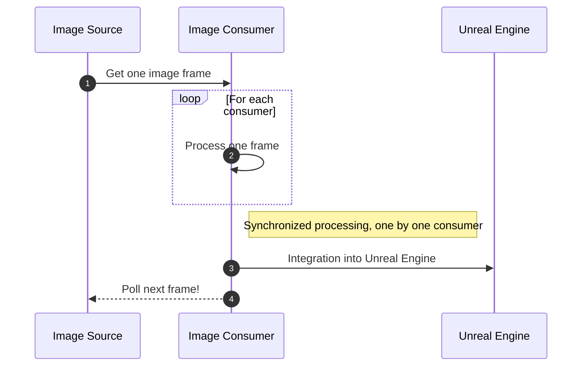

# Vision Tasks verviews

MediaPipe4U internally uses a unified and general-purpose pipeline to handle vision tasks, including but not limited to motion capture and facial expression capture.

## Vision Task Workflow

Vision tasks refer to tasks that apply AI algorithms to images. We have defined a unified vision task processing pipeline to accomplish these tasks.

!!! tip

    Motion capture and facial expression capture are typical vision tasks.

    The vision task processing workflow is defined in the `MediaPipe4U` plugin.

    The motion capture components are defined in the `MediaPipe4UMoion` plugin.

    The facial expression capture components are defined in the `MediaPipe4ULiveLink` plugin.

Brief workflow explanation:

1. `Image Source` is responsible for obtaining an image frame from various media sources.
1. `Image Consumer` is responsible for processing an image frame. There can be multiple `Image Consumers` in the pipeline, and the same frame is distributed to each `Image Consumer` in turn.
1. `Image Consumer` integrates with Unreal Engine and sends the processed results back to `Unreal Engine`.
1. After all `Image Consumers` have finished processing, `Image Source` pulls the next frame through a `Poll` operation to begin the next processing cycle.

## Components and Abstractions

- `Image Source`: Corresponds to the `ImageSourceComponent` interface in MediaPipe4U.
- `Image Consumer`: Corresponds to the `IImageConsumer` or `IImageConsumerProvider` interface in MediaPipe4U.

## Built-in Components

MediaPipe4U benefits from a unified vision task processing pipeline and comes with several built-in `Image Source` components and two main `Image Consumer` components:

- `ImageSourceComponent`: MediaPipe4U includes a variety of image providers capable of acquiring images from common types of media. For more information about `Image Source`, please read the [Image Source documentation](./image_source.md)
- `MediaPipeHolisticComponent`: Aan `Image Consumer` that uses Google's MediaPipe algorithm to process images and calculate character joint rotations, which are then applied to 3D skeletal meshes in Unreal Engine.
- `MediaPipeFaceLinkActor`: An `Image Consumer` that uses algorithms (eg., MediaPipe, Nvidia Maxine AR) to compute facial expression coefficients from images and transmits these coefficients to Unreal Engine via the `Live Link` data protocol.

## Extension Support (C++)

**Image Consumer**

MediaPipe4U allows you to register your own `Image Consumer` to use our vision task pipeline for handling additional vision tasks.

For more information about `Image Consumer`, please refer to the [Image Consumer documentation](./image_consumer.md).