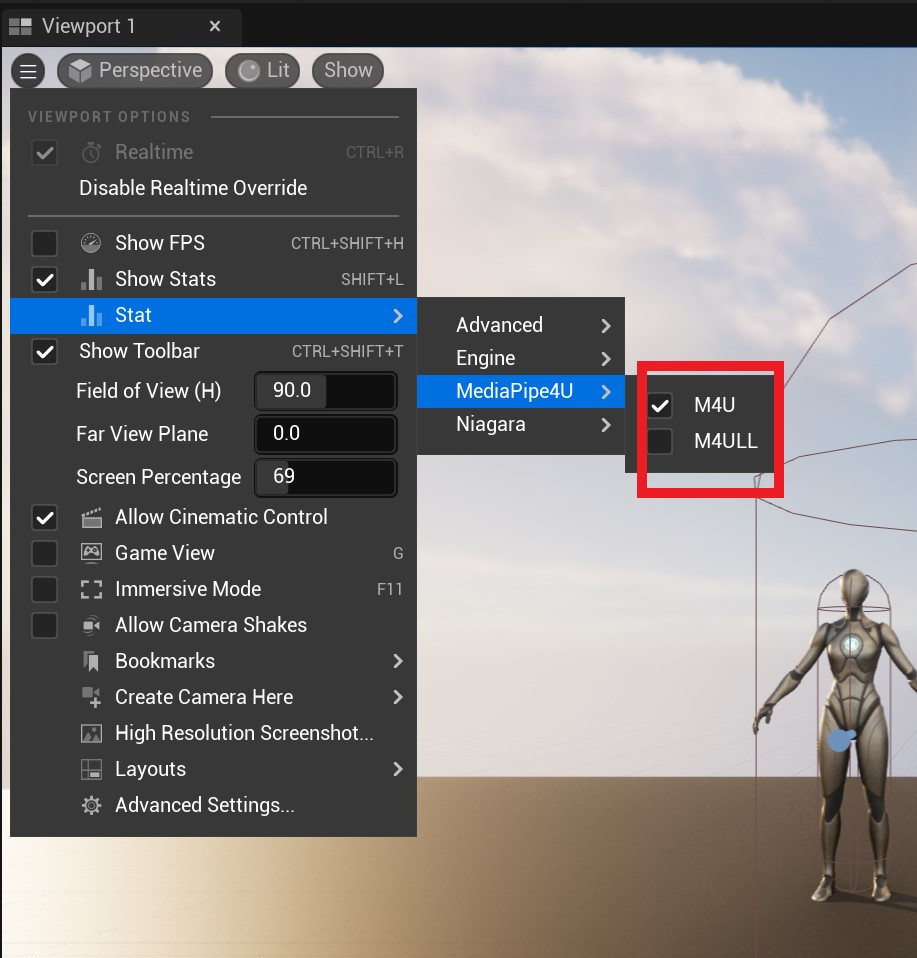
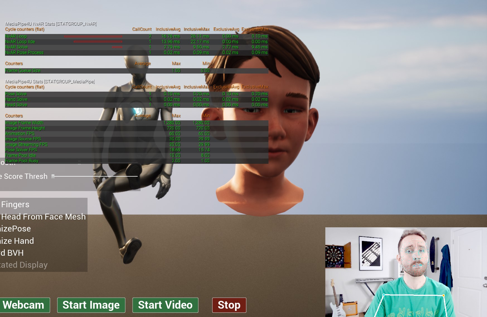

# Statistics (Stat)

**MediaPipe4U** uses standard Unreal Engine Stat instrumentation to collect key plugin metrics and help diagnose performance issues.

## MediaPipe Statistics

Open the **MediaPipe4U** statistics panel from the View Port menu in UE Editor.   

   

>You can also use these commands:
> - stat m4u: opens the basic MediaPipe4U statistics panel
> - stat m4ull: opens the basic MediaPipe4U Live Link statistics panel

   

**Key Performance Metrics**

|Stat| Description | Primary Factors |
|-------------| -------------------- | -------- |
| Pose Solver FPS | Solver frame rate: the number of MediaPipe data frames solved per second | CPU performance, image resolution |
| Animation FPS | Frame rate at which **MediaPipe4U** Animation Blueprint nodes run | GPU performance, CPU performance |
| Image Source FPS | Frame rate of the image source (camera or video) | Camera resolution, frame rate, frame encoding, CPU performance |
| Image Streaming FPS | Frame rate at which sampled images are streamed to the MediaPipe workflow | Application code |
| Image Pool Idle | Number of idle frame objects in the frame-object pool | Downstream Consumer performance, solver performance |
| Image Pool Busy | Number of frames being processed in the image pipeline | Downstream Consumer performance, solver performance |

**Solver Performance**

|Stat| Description |
|-------------| -------------------- |
| Pose Solve | Time required by the pose solver to process one data frame |
| Hand Solve | Time required by the hand solver to process one data frame |
| Head Solve | Time required by the head solver to process one data frame |
| Location Solve | Time required by the location solver to process one data frame |
