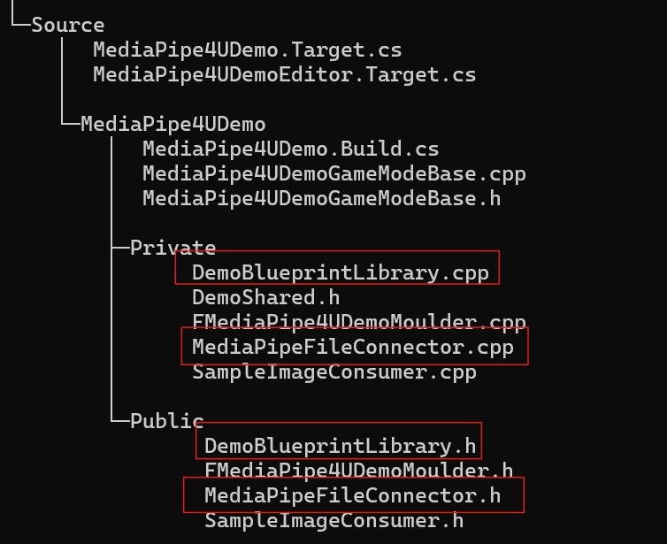
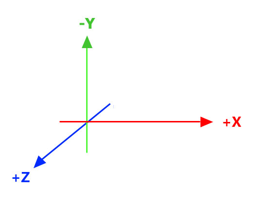

# Replace Google MediaPipe Entirely (C++)

MediaPipe4U provides pluggable algorithm connectors. Replace the built-in Google MediaPipe solver with your own algorithm or MediaPipe application, such as a Python server running MediaPipe.

## Prerequisites

MediaPipe4U uses the [**BlazePose**](https://research.google/blog/on-device-real-time-body-pose-tracking-with-mediapipe-blazepose/) skeleton structure. Other structures such as **SMPL** and **SMPLX** do not work correctly.

A replacement algorithm must:

- Output a skeleton matching [BlazePose](https://research.google/blog/on-device-real-time-body-pose-tracking-with-mediapipe-blazepose/).
- Use the same landmark coordinate systems as Google MediaPipe.
- Output Apple ARKit-compatible BlendShapes when expressions are included.

!!! tip

    Landmark specifications must also match Google MediaPipe:

    **NormalizedLandmark**      
    `x`, `y`, and `z`: real-world 3D coordinates in meters, with the origin centered between the hips.   

    **Landmark**   
    `x` and `y`: coordinates normalized to [0.0, 1.0] by image width and height; [0.0, 0.0] is the upper-left corner.    
    `z`: landmark depth relative to the midpoint of the hips. Smaller values are closer to the camera, using roughly the same scale as `x`.
  
    > MediaPipe4U uses **NormalizedLandmark** for `PoseWorldLandmark` and **Landmark** for all others.


## Implementation Steps

To replace Google MediaPipe completely:

1. Implement a custom Connector derived from `IMediaPipeHolisticConnector`.
2. Provide a `UBlueprintFunctionLibrary` that calls `StartCustomConnector` or `StartCustomConnectorAsync` on `UMediaPipeHolisticComponent`.
3. In Blueprint, use the function from step **2** instead of `StartCamera`, `StartImageSource`, and similar functions.

The following sections describe the details.


## IMediaPipeHolisticConnector

`IMediaPipeHolisticConnector` defines the connection between Unreal Engine and the Google MediaPipe API.
Implement a derived C++ class to replace the built-in Connector.

```cpp

class IMediaPipeHolisticConnector
{
public:
	static IMediaPipeHolisticConnector& Get();
	static IMediaPipeHolisticFeatureRegistry& GetFeatureRegistry();
	 
	virtual bool ConfigureGraph(const MediaPipeGraphCnf& InConfig) const = 0;
	virtual void EnableFrameCallback(bool Enabled) = 0;

	virtual bool IsConnected(UObject* Owner) const = 0;
	virtual bool Connect(UObject* Owner) = 0;
	virtual bool Disconnect(const UObject* Owner) = 0;
	
	virtual bool StartPipeline(long long SessionId, IImageSource* ImageSource, const FMediaPipeHolisticOptions& Options) = 0;
	virtual void StopPipeline() = 0;
	virtual bool PushFrameToPipeline(TSharedRef<IMediaPipeTexture> InTexture,  int RotationDegrees) = 0;
	
	virtual FLandmarksOutputEvent& OnPoseLandmarksTrigger() = 0;
	virtual FLandmarksOutputEvent& OnPoseWorldLandmarksTrigger() = 0;
	virtual FLandmarksOutputEvent& OnLeftHandLandmarksTrigger() = 0;
	virtual FLandmarksOutputEvent& OnRightHandLandmarksTrigger() = 0;
	virtual FFaceBlendShapesOutputEvent& OnFaceBlendShapesTrigger() = 0;
	virtual FFaceGeometryOutputEvent& OnFaceGeometryTrigger() = 0;
	virtual FLandmarksOutputEvent& OnFaceLandmarksTrigger() = 0;
	virtual FImageSizeDetectedEvent& OnImageSizeDetectedTrigger() = 0;
	virtual FMediaPipeFailedEvent& OnMediaPipeFailedTrigger() = 0;
	virtual FMediaPipeFrameEvent& OnMediaPipeFrameTrigger() = 0;
	
	virtual bool AddListener(const TSharedPtr<FMediaPipeHolisticListener>& InListener) = 0;
	virtual bool RemoveListener(const TSharedPtr<FMediaPipeHolisticListener>& InListener) = 0;
protected:
	virtual ~IMediaPipeHolisticConnector() = default;
};

```


### Lifecycle Functions

!!! tip

    `IMediaPipeHolisticConnector` lifecycle order:
    
	``` mermaid
	graph LR
	A[Connect] --> B{StartPipeline};
	B --> C{StopPipeline}
	C --> D{Disconnect}
	```
    
    - `Connect`: Called for the built-in Connector when MediaPipeHolisticComponent initializes, and for a custom Connector when a StartXXX function is called.
    - `StartPipeline`: Called by a StartXX function on UMediaPipeHolisticComponent.
    - `StopPipeline`: Called by `Stop` or `StopAsync`.
    - `Disconnect`: Called for the built-in Connector when MediaPipeHolisticComponent uninitializes, and for a custom Connector by `Stop` or `StopAsync`.


These custom-Connector implementations can be minimal:

- `ConfigureGraph`: return **true**.
- `EnableFrameCallback`: do nothing.
- `Connect`: return **true** when connection logic is handled in `StartPipeline`.
- `Disconnect`: return **true** when disconnection logic is handled in `StopPipeline`.


This function does not need meaningful implementation:

- `PushFrameToPipeline`: Receives pushed frames when ImageSource uses **Push** mode. Custom Connectors currently do not use ImageSource.


### Event Functions

Functions beginning with **On** and ending with **Trigger** are events to trigger when the custom algorithm solves data. Implement more events for more complete functionality.

|Function| Data Type | Affected Feature |
|--------|----------|-------|
| OnPoseLandmarksTrigger | Primary data | Character location through `MediaPipe Location Solver`. |
| OnPoseWorldLandmarksTrigger | NormalizedLandmark | Character pose through `MediaPipe Pose Solver`. |
| OnLeftHandLandmarksTrigger | Landmark | **Left-hand** pose and wrist rotation through `MediaPipe Hand Solver`. |
| OnRightHandLandmarksTrigger | Landmark | **Right-hand** pose and wrist rotation through `MediaPipe Hand Solver`. |
| OnFaceBlendShapesTrigger | Blend Shape Map | Facial expressions through `MediaPipeLiveLinkActor`. |
| OnFaceGeometryTrigger | Landmark | None. |
| OnFaceLandmarksTrigger | Landmark | Head rotation through `MediaPipe Head Solver`. |
| OnImageSizeDetectedTrigger | Landmark | Character location together with `PoseLandmarks` through `MediaPipe Location Solver`. |
| OnMediaPipeFailedTrigger | int64 | Error handling in `MediaPipeHolisticComponent`.<br />Parameter:<br>`session id` from the first `StartPipeline` argument. |
| OnMediaPipeFrameTrigger | IMediaPipeOutFrame | Output image displayed by `MediaPipeHolisticComponent`. |

!!! tip "IMediaPipeOutFrame"

	`IMediaPipeOutFrame` represents a display image, normally an annotated frame in the built-in Connector.   

	It must implement reference counting, similar to a smart pointer.   

	`IncreaseReferenceCount`: increment reference count by 1; output starts with a count of 1.  
	`Release`: decrement by 1; release memory when the count reaches 0. 

	> If display images are unnecessary, omit the event by never triggering `OnMediaPipeFrameTrigger`.

### Listener Functions

`AddListener` and `RemoveListener` support external data listeners used by other MediaPipe4U features.


## Use the FMediaPipeConnectorBase Base Class

MediaPipe4U provides the simpler `FMediaPipeConnectorBase`, which is recommended over implementing `IMediaPipeHolisticConnector` directly.

Implement only:

- `OnConnect`
- `OnStartPipeline`
- `OnStopPipeline`
- `OnDisconnect`


## Example

The [MediaPipe4U Demo project](https://gitlab.com/endink/MediaPipe4U-Demo){: target='_blank'} contains an example that replaces Google MediaPipe by reading MediaPipe data from a file instead of calculating it from images.


Focus on these files:



- `MediaPipeFileConnector.h`: Connector header, [source](https://gitlab.com/endink/MediaPipe4U-Demo/-/blob/main/Source/MediaPipe4UDemo/Public/MediaPipeFileConnector.h){: target='_blank' }
- `MediaPipeFileConnector`: Connector implementation, [source](https://gitlab.com/endink/MediaPipe4U-Demo/-/blob/main/Source/MediaPipe4UDemo/Private/MediaPipeFileConnector.cpp){: target='_blank' }
- `DemoBlueprintLibrary.cpp`: Blueprint function-library header, [source](https://gitlab.com/endink/MediaPipe4U-Demo/-/blob/main/Source/MediaPipe4UDemo/Public/DemoBlueprintLibrary.h){: target='_blank' }
- `DemoBlueprintLibrary.cpp`: Blueprint function-library implementation, [source](https://gitlab.com/endink/MediaPipe4U-Demo/-/blob/main/Source/MediaPipe4UDemo/Private/DemoBlueprintLibrary.cpp){: target='_blank' }


In Blueprint, call `StartMediaPipeDataFile` to read a local MediaPipe data file.

> The data file is in the demo-project root ([view file](https://gitlab.com/endink/MediaPipe4U-Demo/-/blob/main/mediapipe_pose_data.txt){: target='_blank' }).


## MediaPipe Reference

### MediaPipe 3D Coordinate System



### 33 Body Landmarks

{ width="400" }

### 21 Hand Landmarks


