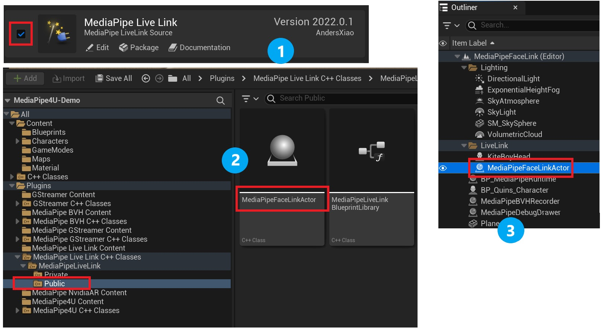
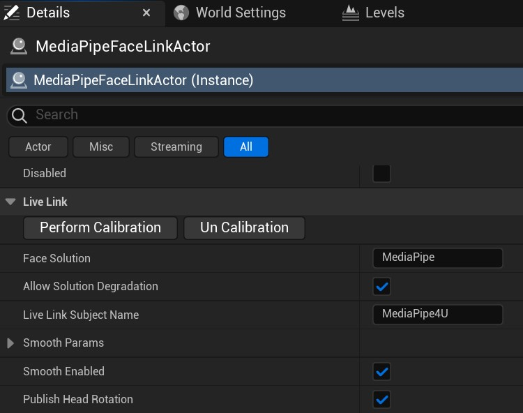
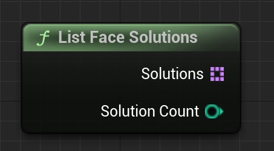
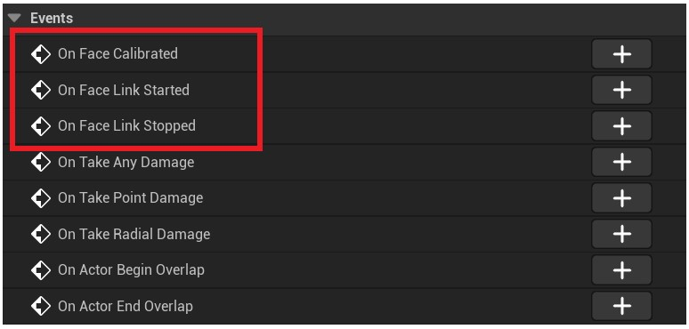
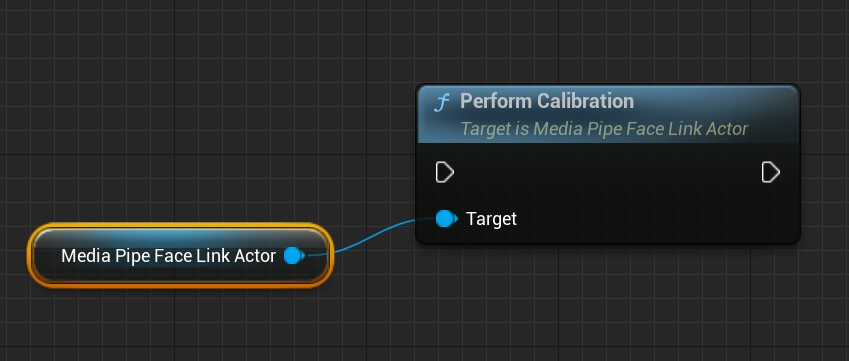
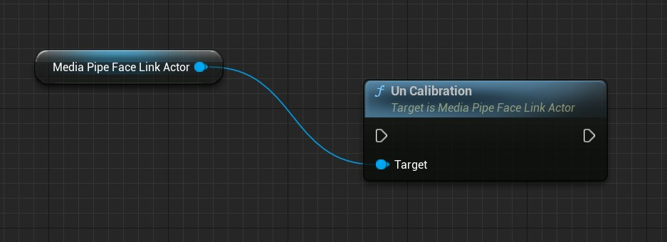
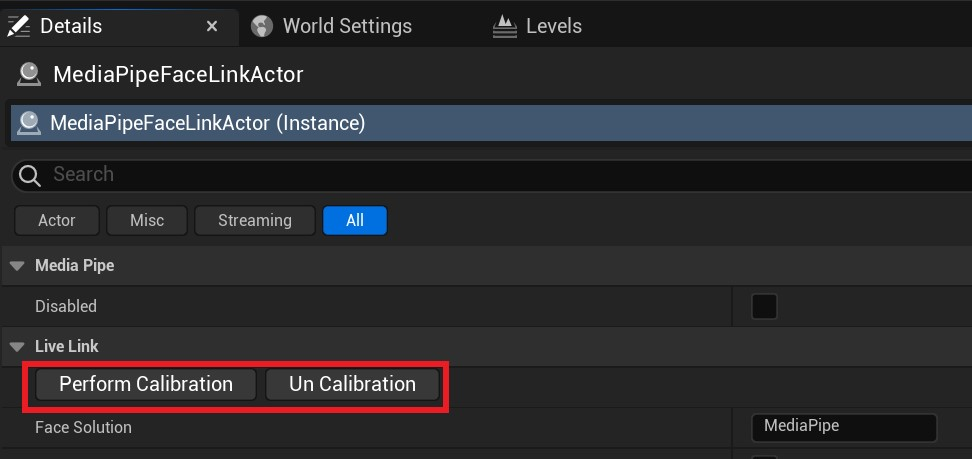

# Using Facial-Expression Capture

MediaPipe4U includes facial-expression capture in the `MediaPipe4ULiveLink` plugin. This plugin uses a separate Actor (AActor class) to solve BlendShapes from an image source (ImageSource).   

[FaceLink](./images/get_started/live_link_cover.jpg "FaceLink")

!!! tip

    If you have used Epic's Live Link Face app on an Apple device, you can think of this Actor as an emulation of that app. It solves 51 expressions compatible with the Apple ARKit standard from an image source (`tongueOut` is not supported) and sends the data in the same Live Link format used by the Live Link Face app. You can therefore receive MediaPipe4U's BlendShape results in the same way you receive data from Live Link Face.
    
    It does not yet provide some Live Link Face features, such as data recording and head-pose solving, but these features will be integrated into this Actor as MediaPipe4U continues to evolve.

---   

## Configure Plugins

1. Enable Epic's `Live Link` plugin.
2. Copy the `MediaPipe4ULiveLink` folder into the project's Plugins directory.
3. Enable the `MediaPipe Live Link` plugin in the project.
4. Find `MediaPipeFaceLinkActor` in the plugin's C++ directory and drag it into your Level.
5. Select `MediaPipeFaceLinkActor` and configure the Actor in the Details panel.
   

After MediaPipe motion capture starts (after the `MediaPipeHolisticComponent` component starts), facial-expression capture begins automatically and sends data to the Live Link receiver, which is usually the LiveLinkPose node in your Animation Blueprint.

---   

## Properties

`MediaPipeFaceLinkActor` has very few properties, and facial-expression capture itself does not require many parameters. `MediaPipeFaceLinkActor` works well with its default values.

**FaceSolution**    
The FaceSolution property specifies the solution name to use. FaceLinkActor supports switching among multiple BlendShape (BS) solving algorithms, each of which is a Face Solution.   
Default: **MediaPipe**    
> The default MediaPipe solution has no hardware dependencies and offers broad compatibility.   

   
**AllowSolutionDegradation**   
Whether solution fallback is allowed.   
After the facial solver starts, if FaceSolution is set to a solution that does not exist and bAllowSolutionDegradation is **true**, it falls back to the "MediaPipe" solution. If the property is **false**, the facial solver fails to start and prints an error in the log.
   
**LiveLinkSubjectName**    
Specifies the Subject name used to send Live Link data. If you use a LiveLinkPose node in an Animation Blueprint, this name must match the Subject property on the LiveLinkPose node so the node can receive data from MediaPipe4U.   
Default: **MediaPipe4U**  
   
**SmoothParams**    
Specifies the degree of smoothing for each facial region and the smoothing algorithm's parameters. This property is described in detail below.   
   
**SmoothEnabled**    
You may sometimes want to use your own smoothing algorithm. This switch enables or disables the plugin's built-in smoothing algorithm.   
Default: **true**

**PublishHeadRotation**   
Whether head-rotation solving is enabled. When set to true, three additional curves are sent to Live Link: **HeadPitch**, **HeadRoll**, and **HeadYaw**.   
Default: **true**

!!! tip

    Not every Face Solution supports head-rotation solving. Your application should account for differences in head-rotation support between solutions.

**Disabled**  
Whether MediaPipe4U's BS solving is disabled. When set to **true**, MediaPipeFaceLinkActor data is no longer sent.
   
---   

## Face Solution

`MediaPipeFaceLinkActor` supports different algorithms through Face Solutions. Because some algorithms may have specific hardware requirements, you can select the Face Solution best suited to your facial-capture needs.   

### Built-in Face Solutions

- MediaPipe
- Remoting (requires the M4URemoting app, paid edition)
- NvAR (requires the MediaPipe4U NvAR plugin)   
  
> At present, the NvAR solution is more accurate than MediaPipe.

!!! warning

   Although you can set `FaceSolution` after MediaPipe4U motion capture has started, the change does not take effect. You must stop and restart motion capture to switch solutions.   
 
   In short, `FaceSolution` **cannot** be switched while mediapipe is running.

You can use the `ListFaceSolutions` function in the `MediaPipeLiveLinkBlueprintLibrary` Blueprint library to list the currently available solutions:

The function returns a list of solutions and the number of solutions.

## Animation Smoothing   

`MediaPipeFaceLinkActor` can smooth expressions by facial region, primarily through the `SmoothParams` property.   

The `SmoothParams` properties are as follows:      

|          Property        |               Description                    |
|:---------------------|:---------------------------------------|
| Iterations |  The number of smoothing algorithm iterations. This is mainly used to eliminate jitter. Higher values reduce jitter but also reduce expression sensitivity. |
| EyesSmooth |  BS smoothing for the eye region, from 0.0 to 1.0. Higher values produce greater smoothing. |
| EyeBallsSmooth |  BS smoothing for the eyeball region, from 0.0 to 1.0. Higher values produce greater smoothing. |
| BrownSmooth |  BS smoothing for the eyebrow region, from 0.0 to 1.0. Higher values produce greater smoothing. |
| MouthSmooth |  BS smoothing for the mouth region, from 0.0 to 1.0. Higher values produce greater smoothing. |
| CheekSmooth |  BS smoothing for the cheek region, from 0.0 to 1.0. Higher values produce greater smoothing. |
| JawSmooth |  BS smoothing for the jaw region, from 0.0 to 1.0. Higher values produce greater smoothing. |
| NoseSmooth |  BS smoothing for the nose region, from 0.0 to 1.0. Higher values produce greater smoothing. |
| HeadSmooth |  Head-rotation smoothing, from 0.0 to 1.0. Higher values produce greater smoothing. The Face Solution must support head-rotation solving. |

> If you perform smoothing in the Animation Blueprint or the algorithm has built-in smoothing, use the `SmoothEnabled` function to disable the plugin's built-in smoothing.   

---   
   
## Events

MediaPipeFaceLinkActor cannot be started or stopped manually; it automatically follows mediapipe's start and stop state. MediaPipeFaceLinkActor therefore exposes the necessary events so you know when it starts and stops.   

**OnFaceLinkStarted**   
Triggered when MediaPipeFaceLinkActor starts the facial-expression capture process.   

**OnFaceLinkStarted**   
Triggered when MediaPipeFaceLinkActor stops the facial-expression capture process.   
   
**OnFaceCalibrated**   
Triggered when face calibration is complete.
   
---   

## Calibration

Expressions captured from different people may produce different results. For example, a person's eye size may affect EyeBlink-related BS values. MediaPipeFaceLinkActor therefore provides facial calibration.
To calibrate the face, simply call the `PerformCalibration` function.

!!! warning

    `PerformCalibration` is an asynchronous function. The face is not calibrated immediately when the call returns; calibration must wait for the next frame of BlendShape data. When calibration completes, the application is notified through the `OnFaceCalibrated` event.   
    
    `PerformCalibration` must be called while mediapipe is running because it requires a BS data frame. If `PerformCalibration` is called while mediapipe is stopped, the `OnFaceCalibrated` callback will never be triggered.
    
    Use `MediaPipeHolisticComponent::IsRunning` or `MediaPipeAnimationInstance::IsMediaPipeRunning` to determine whether mediapipe is running.

If you want to calibrate the face using the previous calibration data (although this is not recommended), you can use `PerformCalibrationImmediately` and pass it frame data to calibrate immediately.
The `PerformCalibrationImmediately` function does not depend on whether mediapipe is running, so you can calibrate the face at any time.

!!! tip

    Although you can use PerformCalibrationImmediately under any circumstances, you must ensure that the Face Solution being calibrated is the same Face Solution that produced the calibration frame data. Pay attention to the following:    

    1. Because `MediaPipeFaceLinkActor` can fall back automatically, you cannot use `FaceSolution` to determine the solution actually in use. Use the `GetActualFaceSolution` function to obtain the running solution.
    2. Note that `GetActualFaceSolution` returns the correct solution name only while mediapipe is running. If mediapipe is stopped, it returns an empty string.
    
    In summary, calibrating the face while mediapipe is stopped is not recommended because it introduces unnecessary complications. Always perform facial calibration while mediapipe is running.

### Clear Calibration Data   

Facial information is recorded after calibration. You can clear this calibration data with the `UnCalibration` function.

---   
   
## Calibration in the UE Editor

For convenience during development, you can also calibrate in the editor. The Details panel provides buttons for calibration and clearing calibration.

# BlendShape Support by Face Solution

|Name               | MediaPipe | Remoting | NvAR  | Description|
|:-----------------|:-----:|:---:|:------:|--------:|
|eyeBlinkLeft      |  ✅  |✅  | ✅ |  Left eye blink
|eyeLookDownLeft   |  ✅  |✅  | ✅ |  Left eye looks down
|eyeLookInLeft     |  ✅  |✅  | ✅ |  Left eye looks toward the nose
|eyeLookOutLeft    |  ✅  |✅  | ✅ |  Left eye looks left
|eyeLookUpLeft     |  ✅  |✅  | ✅ |  Left eye looks up
|eyeSquintLeft     |  ✅  |✅  | ✅ |  Left eye squints
|eyeWideLeft       |  ✅  |✅  | ✅ |  Left eye opens wide
|eyeBlinkRight     |  ✅  |✅  | ✅ |  Right eye blink
|eyeLookDownRight  |  ✅  |✅  | ✅ |  Right eye looks down
|eyeLookInRight    |  ✅  |✅  | ✅ |  Right eye looks toward the nose
|eyeLookOutRight   |  ✅  |✅  | ✅ |  Right eye looks left
|eyeLookUpRight    |  ✅  |✅  | ✅ |  Right eye looks up
|eyeSquintRight    |  ✅  |✅  | ✅ |  Right eye squints
|eyeWideRight      |  ✅  |✅  | ✅ |  Right eye opens wide
|jawForward        |  ✅  |✅  | ✅ |  Jaw moves forward when pouting
|jawLeft           |  ✅  |✅  | ✅ |  Jaw moves left when grimacing
|jawRight          |  ✅  |✅  | ✅ |  Jaw moves right when grimacing
|jawOpen           |  ✅  |✅  | ✅ |  Jaw moves down when opening the mouth
|mouthClose        |  ✅  |✅  | ✅ |  Mouth closes
|mouthFunnel       |  ✅  |✅  | ✅ |  Mouth opens slightly and lips spread
|mouthPucker       |  ✅  |✅  | ✅ |  Lips pucker
|mouthLeft         |  ✅  |✅  | ✅ |  Mouth moves left
|mouthRight        |  ✅  |✅  | ✅ |  Mouth moves right
|mouthSmileLeft    |  ✅  |✅  | ✅ |  Left side of the mouth smiles
|mouthSmileRight   |  ✅  |✅  | ✅ |  Right side of the mouth smiles
|mouthFrownLeft    |  ✅  |✅  | ✅ |  Left lip presses down
|mouthFrownRight   |  ✅  |✅  | ✅ |  Right lip presses down
|mouthDimpleLeft   |  ✅  |✅  | ✅ |  Left lip moves backward
|mouthDimpleRight  |  ✅  |✅  | ✅ |  Right lip moves backward
|mouthStretchLeft  |  ✅  |✅  | ✅ |  Left corner of the mouth moves left
|mouthStretchRight |  ✅  |✅  | ✅ |  Right corner of the mouth moves right
|mouthRollLower    |  ✅  |✅  | ✅ |  Lower lip rolls inward
|mouthRollUpper    |  ✅  |✅  | ✅ |  Lower lip rolls upward
|mouthShrugLower   |  ✅  |✅  | ✅ |  Lower lip moves down
|mouthShrugUpper   |  ✅  |✅  | ✅ |  Upper lip moves up
|mouthPressLeft    |  ✅  |✅  | ✅ |  Lower lip presses left
|mouthPressRight   |  ✅  |✅  | ✅ |  Lower lip presses right
|mouthLowerDownLeft|  ✅  |✅  | ✅ |  Lower lip presses down and left
|mouthLowerDownRigh|  ✅  |✅  | ✅ |  Lower lip presses down and right
|mouthUpperUpLeft  |  ✅  |✅  | ✅ |  Upper lip presses up and left
|mouthUpperUpRight |  ✅  |✅  | ✅ |  Upper lip presses up and right
|browDownLeft      |  ✅  |✅  | ✅ |  Left eyebrow moves outward
|browDownRight     |  ✅  |✅  | ✅ |  Right eyebrow moves outward
|browInnerUp       |  ✅  |✅  | ✅ |  Brows furrow
|browOuterUpLeft   |  ✅  |✅  | ✅ |  Left eyebrow moves up and left
|browOuterUpRight  |  ✅  |✅  | ✅ |  Right eyebrow moves up and right
|cheekPuff         |  ✅  |✅  | ✅ |  Cheeks puff outward
|cheekSquintLeft   |  ✅  |✅  | ✅ |  Left cheek moves up and inward
|cheekSquintRight  |  ✅  |✅  | ✅ |  Right cheek moves up and inward
|noseSneerLeft     |  ✅  |✅  | ✅ |  Left side of the nose sneers
|noseSneerRight    |  ✅  |✅  | ✅ |  Right side of the nose sneers
|tongueOut         |  ⭕  |⭕  | ⭕ |  Tongue sticks out
|HeadYaw           |  ⭕  |⭕  | ✅ |  Head turns left or right
|HeadPitch         |  ⭕  |⭕  | ✅ |  Head tilts up or down
|HeadRoll          |  ⭕  |⭕  | ✅ |  Head tilts toward a shoulder

> For more information about the ARKit BlendShape standard, see [this documentation](https://developer.apple.com/documentation/arkit/arfaceanchor/blendshapelocation)
