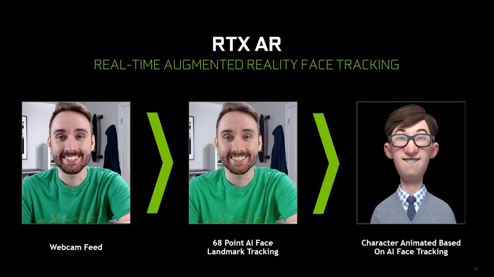
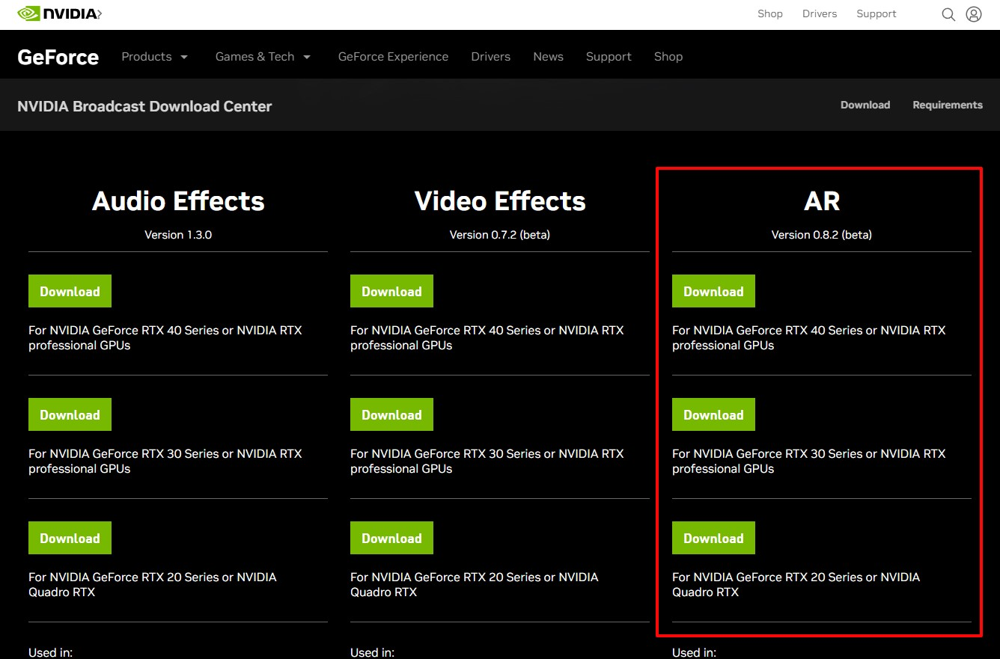
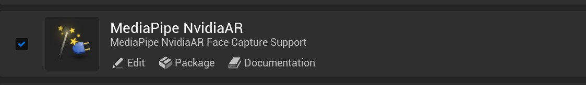

# NvAR Facial-Expression Capture


With an Nvidia RTX 20XX or newer GPU, **MediaPipe4UNvAR** provides facial-expression capture comparable to Apple ARKit.



!!! tip
    Before reading this chapter, read [Using Facial-Expression Capture](./get_started.md).

---

The `MediaPipe4UNvAR` plugin registers Nvidia's algorithm as a BlendShape solving solution (Face Solution) in MediaPipe LiveLink.    

Set `FaceSolution` on `MediaPipeFaceLinkActor` to **NvAR** to use it.

Demo:


If YouTube is unavailable, watch the Bilibili video:

[Bilibili demo](https://www.bilibili.com/video/BV1sD4y1N7HX/?share_source=copy_web&vd_source=f77a8ce9c4c322dcc88515970bea1630){: target='_blank' }


For NvAR details, see:     
[https://developer.nvidia.com/maxine](https://developer.nvidia.com/maxine){: target='_blank' }

## Requirements

### Software

|Software|Requirement|
|----|--------|
Windows OS | 64-bit Windows 10 or later
NVIDIA Graphics Driver for Windows | 511.65 or later
Nvidia Maxine AR SDK | `0.8.2`, `0.8.7`

> The **Nvidia Maxine AR SDK** must be installed on the PC in both development and packaged deployment environments.   
> The NvAR plugin is very large (over 1 GB), so having users install it separately avoids a similarly large application package.

### Hardware

NvAR requires an Nvidia GPU with one of these architectures:

- **NVIDIA Turing™**: GeForce RTX 20XX
- **NVIDIA Ampere™**: GeForce RTX 30XX
- **NVIDIA Ada™**: GeForce RTX 40XX
- **Other GPUs with Tensor Cores**: H100, etc. (no downloadable SDK; consult Nvidia)   

Official requirements:

[https://docs.nvidia.com/deeplearning/maxine/ar-sdk-system-guide/index.html](https://docs.nvidia.com/deeplearning/maxine/ar-sdk-system-guide/index.html){: target='_blank' }

!!! warning

    Different GPUs require different redistributable packages. For example, an Nvidia 2060 cannot use the 30XX redistributable package; doing so may prevent NvAR from working.

### Plugin Dependencies

Enable these Unreal Engine plugins:   

- MediaPipe4U
- MediaPipeLiveLink


## Getting Started

### Install the Nvidia Redistributable SDK Package

Download the package for your GPU from:   

[https://www.nvidia.com/broadcast-sdk-resources](https://www.nvidia.com/broadcast-sdk-resources){: target='_blank' }




### Install MediaPipe4UNvAR   

Copy the `MediaPipe4UNvAR` directory from the downloaded MediaPipe4U package into your Unreal Engine project's **Plugins** directory and enable it.   



`MediaPipe4UNvAR` automatically registers an **NvAR** Face Solution with `MediaPipeFaceLinkActor` for use in that Actor.

!!! tip

    MediaPipe4UNvAR contains only the algorithm and no standalone Unreal Engine feature. Facial-expression capture with this algorithm requires MediaPipe Live Link.    
    For MediaPipeFaceLinkActor usage, read [Using Facial-Expression Capture](./get_started.md).

### Head-Rotation Curves

NvAR can include head-rotation curves in its BlendShapes. MediaPipe4U normalizes them as follows: 

| Curve | Value Range | Euler Range |
|---------|----------|------------|
| HeadPitch |-1.0 ~ 1.0  | -45° ~ 45° |
| HeadYaw   |-1.0 ~ 1.0  | -90° ~ 90° |
| HeadRoll  |-1.0 ~ 1.0  | -60° ~ 60° |

Convert these curves back to Euler angles:

```

PitchDegrees = HeadPitch * 45.0
YawDegrees = HeadYaw * 90.0
RollDegrees = HeadPitch * 60.0

```


## NvAR Support for ARKit Expressions

|Name|Description|NvAR Support|
|----|----|--------|
|eyeBlinkLeft| Blink left eye|Yes|
|eyeLookDownLeft |Look down with left eye|Yes|
|eyeLookInLeft |Look toward nose with left eye|Yes|
|eyeLookOutLeft| Look left with left eye|Yes|
|eyeLookUpLeft| Look up with left eye|Yes|
|eyeSquintLeft| Squint left eye|Yes|
|eyeWideLeft |Open left eye wide|Yes|
|eyeBlinkRight |Blink right eye|Yes|
|eyeLookDownRight |Look down with right eye|Yes|
|eyeLookInRight |Look toward nose with right eye|Yes|
|eyeLookOutRight |Look right with right eye|Yes|
|eyeLookUpRight |Look up with right eye|Yes|
|eyeSquintRight| Squint right eye|Yes|
|eyeWideRight |Open right eye wide|Yes|
|jawForward |Move jaw forward|Yes|
|jawLeft |Move jaw left|Yes|
|jawRight |Move jaw right|Yes|
|jawOpen |Open jaw|Yes|
|mouthClose |Close mouth|Yes|
|mouthFunnel |Funnel lips|Yes|
|mouthPucker |Pucker lips|Yes|
|mouthLeft |Move mouth left|Yes|
|mouthRight |Move mouth right|Yes|
|mouthSmileLeft |Smile left|Yes|
|mouthSmileRight| Smile right|Yes|
|mouthFrownLeft |Frown left|Yes|
|mouthFrownRight |Frown right|Yes|
|mouthDimpleLeft |Dimple left|Yes|
|mouthDimpleRight |Dimple right|Yes|
|mouthStretchLeft |Stretch mouth left|Yes|
|mouthStretchRight |Stretch mouth right|Yes|
|mouthRollLower |Roll lower lip inward|Yes|
|mouthRollUpper |Roll upper lip inward|Yes|
|mouthShrugLower |Shrug lower lip|Yes|
|mouthShrugUpper |Shrug upper lip|Yes|
|mouthPressLeft |Press lips left|Yes|
|mouthPressRight |Press lips right|Yes|
|mouthLowerDownLeft |Lower left lip|Yes|
|mouthLowerDownRight |Lower right lip|Yes|
|mouthUpperUpLeft |Raise upper-left lip|Yes|
|mouthUpperUpRight |Raise upper-right lip|Yes|
|browDownLeft |Lower left brow|Yes|
|browDownRight| Lower right brow|Yes|
|browInnerUp |Raise inner brows|Yes|
|browOuterUpLeft |Raise outer left brow|Yes|
|browOuterUpRight |Raise outer right brow|Yes|
|cheekPuff| Puff cheeks|Yes|
|cheekSquintLeft |Squint left cheek|Yes|
|cheekSquintRight |Squint right cheek|Yes|
|noseSneerLeft |Sneer left nostril|Yes|
|noseSneerRight| Sneer right nostril|Yes|
|tongueOut |Extend tongue|<mark>No</mark>|
|HeadYaw| Turn head left/right|Yes|
|HeadPitch| Tilt head up/down|Yes|
|HeadRoll| Tilt head toward shoulder|Yes|
