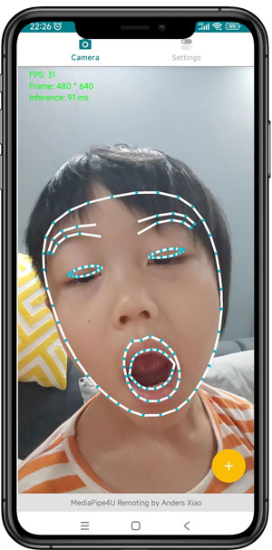
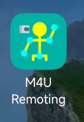
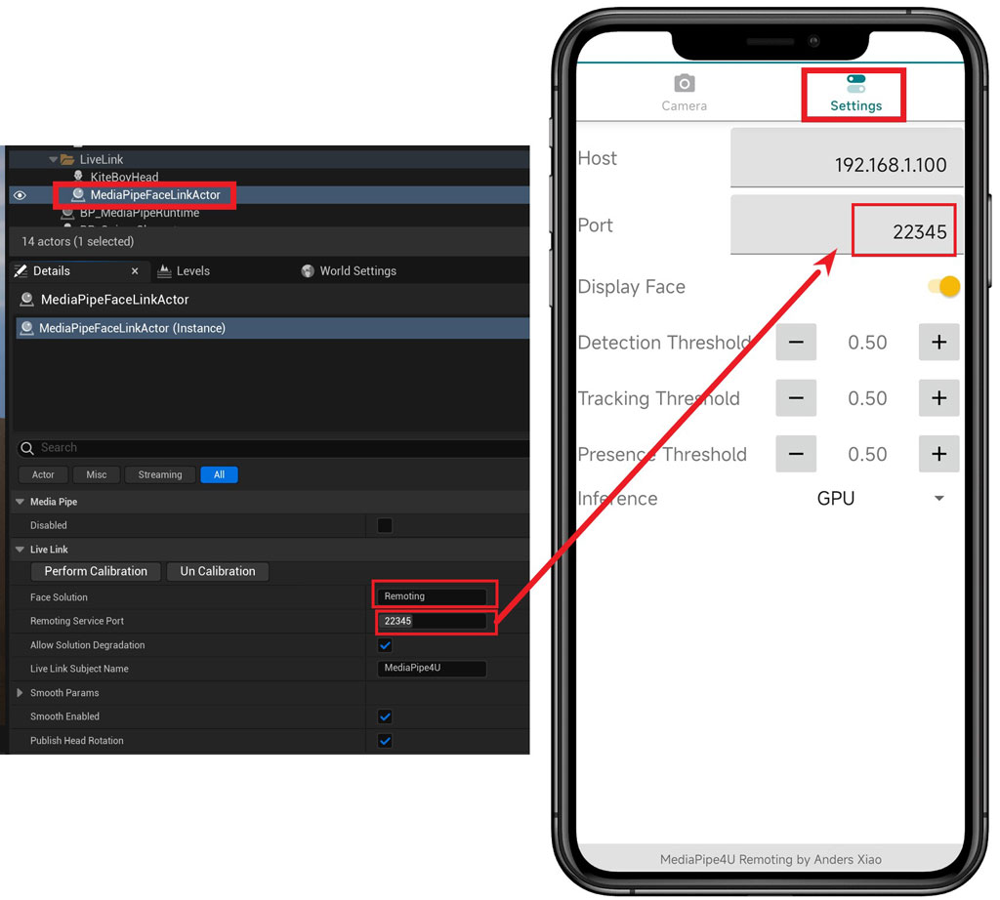

# M4U Rmoting 
{: .d-inline-block }

Since v20230423
{: .label .label-green }

Commerical License
{: .label .label-yellow }

M4U Remoting is an Android app that extends MediaPipe4U capture to mobile devices (currently Android only). M4U Remoting is still evolving and currently supports facial-expression capture only.   


{: .warning}
> M4U Remoting is **not included** in the free license.   
> With a free MediaPipe4U license, you can try this feature in UE Editor, but it becomes unavailable in packaged builds.  

[](./images/remoting_main_ui.jpg)

Find the M4U Remoting APK on the MediaPipe4U releases page, download it, and install it on your Android phone:

[https://github.com/endink/Mediapipe4u-plugin/releases](https://github.com/endink/Mediapipe4u-plugin/releases)

[](./images/remoting_icon.jpg)

## Facial-Expression Capture

The MediaPipe4U plugin includes a Face Solution named **Remoting**. It receives expression data captured by the M4U Remoting app and sends it to a Live Link receiver (usually the LiveLinkPose Animation Blueprint node) through the Live Link protocol.   

> Mobile facial-expression capture removes the constraints of cables. Because mobile MediaPipe supports GPU inference and runs only one facial-expression solver, it usually achieves a higher solving frame rate than a Windows camera.   
> Android facial-expression capture has been measured at 30 FPS.
 
{: .important}    
> This document assumes that you already know how to use MediaPipe4U for facial-expression capture and understand these MediaPipe4U concepts:
> - Face Solution
> - Face Link Actor 
>   
> If these concepts are unfamiliar, first read [Facial-Expression Capture](./face_link_actor.md).


### Usage:

1. Start the M4U Remoting app on the phone and enter the correct host IP address in Settings.
2. Configure MediaPipe4U facial-expression capture.
3. Set the Face Solution of the Face Link Actor to "**Remoting**".
4. Run the Unreal Engine project that uses the MediaPipe4U plugin.

> By default, MediaPipe4U listens for M4U Remoting packets on port **22345**. You can change the port, but the mobile app must use the same port setting.

[](./images/remoting_setup.jpg)


### Mobile Calibration Command

M4U Remoting can remotely control MediaPipe4U. Send a calibration instruction from the Android device by tapping the + button on the main screen, and MediaPipe4U performs calibration.

### About Firewalls

Your firewall may prevent the phone from accessing the host port (22345 by default). Save the following content as a BAT file and execute it to allow the port through the firewall.

```powershell
netsh advfirewall firewall add rule name="Port22345" dir=in action=allow protocol=UDP localport=22345
```
{: .important}
> After saving the command as a BAT file, right-click the file and select "Run as administrator".


### Settings

M4U Remoting generally works out of the box with zero configuration, but provides a few settings:

|Setting| Description |
|:------|:-----|
|Host | IP address of the host running MediaPipe4U.|
|Port | Communication port exposed by the host running MediaPipe4U.|
|Display Face |For privacy, use this switch to hide or show the camera image.|
|Detection Threshold |Face-detection threshold. Higher values impose stricter requirements for face clarity, occlusion, and other conditions.|
|Tacking Threshold |Continuous face-tracking threshold. Reusing data from the previous frame, such as face position, improves efficiency for video streams. Higher values require greater confidence in the previous frame.|
|Present Threshold |Face-landmark confidence threshold. After facial landmarks are detected, confidence is evaluated for each region. Expression solving fails for a region below this threshold.|
|Inference | AI inference method. GPU-accelerated inference is preferred; switch to CPU inference if GPU inference causes problems.|
