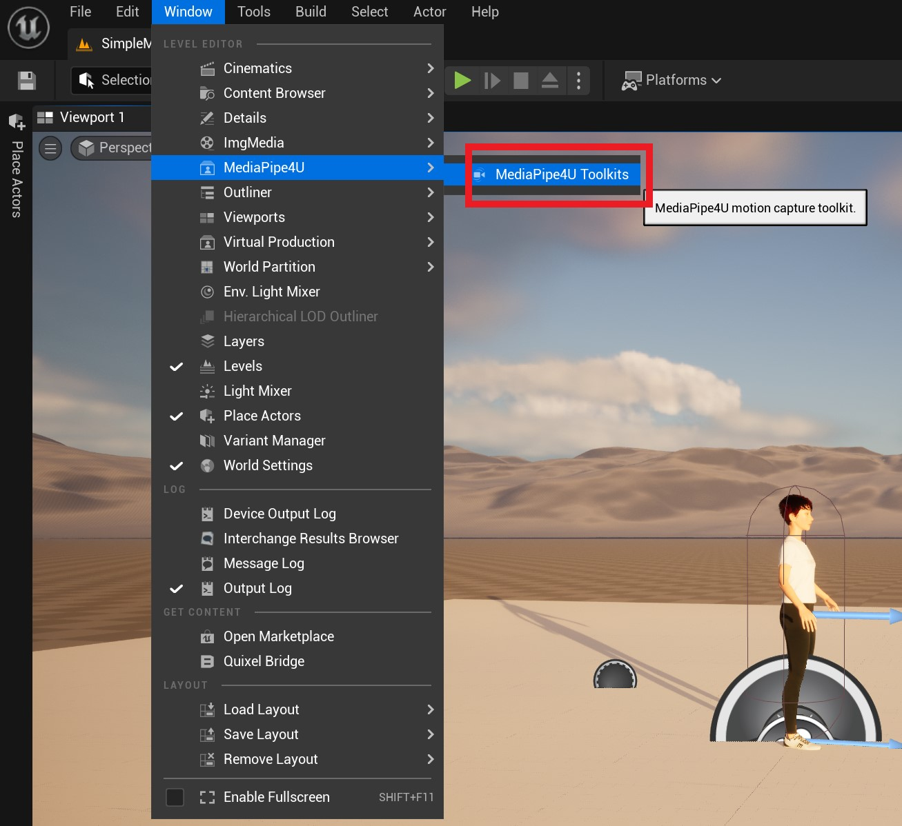
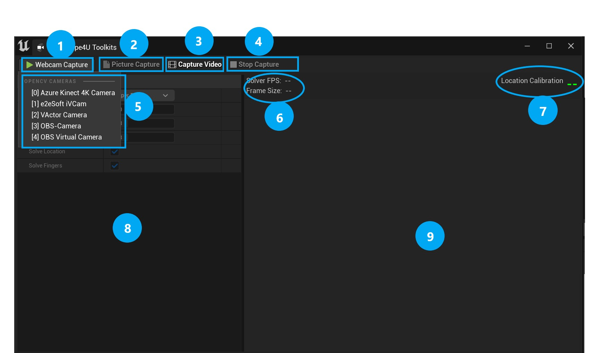
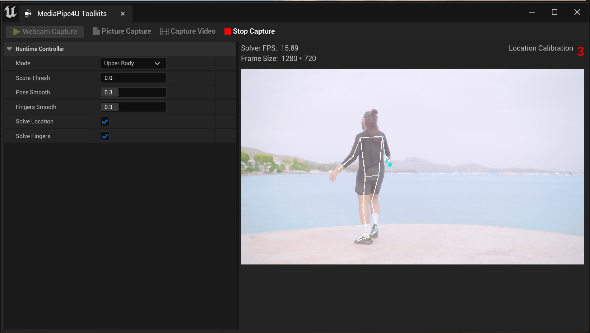

# UE Editor Toolkit

MediaPipe4U provides tools designed for use with Unreal Engine Editor, allowing you to quickly preview motion-capture results and tune parameters at runtime.

## Using the Toolkit

In UE Editor, select Window -> MediaPipe4U -> MediaPipe Toolkits to open the toolkit.

{: .waning}
> The UE Editor toolkit is activated only while the Editor is running the game. If the game is not running, the contents of the toolkit window are disabled.

When the toolkit opens, the MediaPipe4U Toolkits window appears:

Toolkit sections:

- **1**: Start camera motion capture
- **2**: Start image motion capture (**Note**: the button is available only when the scene contains **StaticImageSourceComponent**) 
- **3**: Start video motion capture (**Note**: the button is visible only when the MediaPipe GStreamer plugin is used, and is available only when the scene contains **GStreamerImageSourceComponent**)
- **4**: Stop motion capture
- **5**: Camera list. The content in **square brackets** (`[]`) is the camera index used by the StartCamera function of MediaPipeHolisticComponent
- **6**: Runtime status
- **7**: Location-solver calibration countdown
- **8**: Runtime control panel
- **9**: Motion-capture image-frame display area

The toolkit makes it easy to start motion capture with the same behavior as the current scene, view the image output, and adjust parameters while observing MediaPipe4U's motion-capture behavior.

{: .note}
> Changes made in the runtime control panel are not saved to any asset. They affect only the runtime instance and do not change the configured defaults, so you can safely experiment with the parameters.

