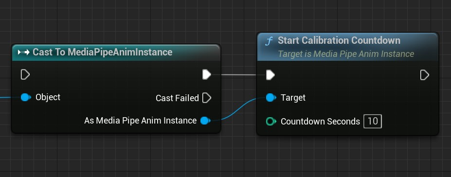
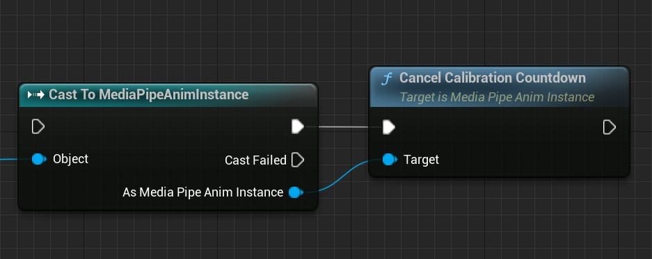
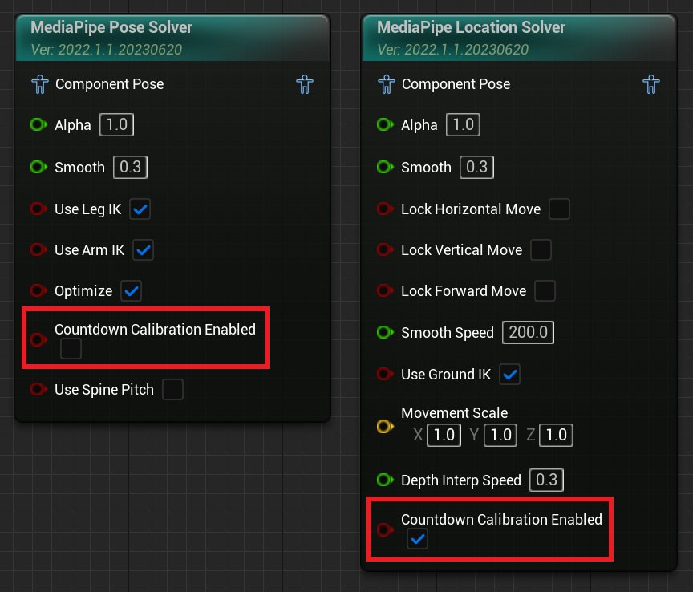
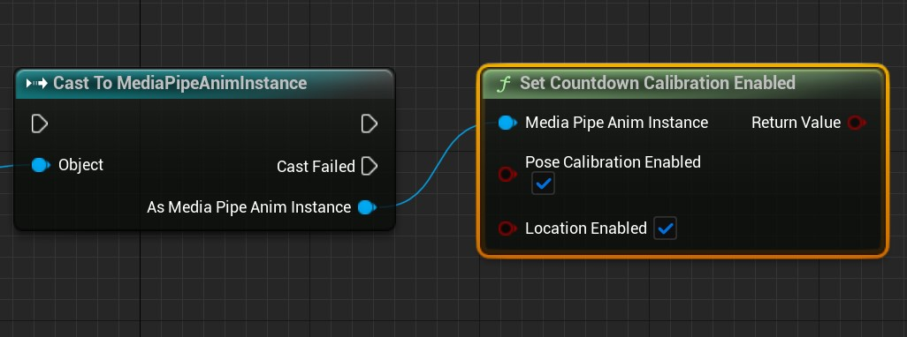
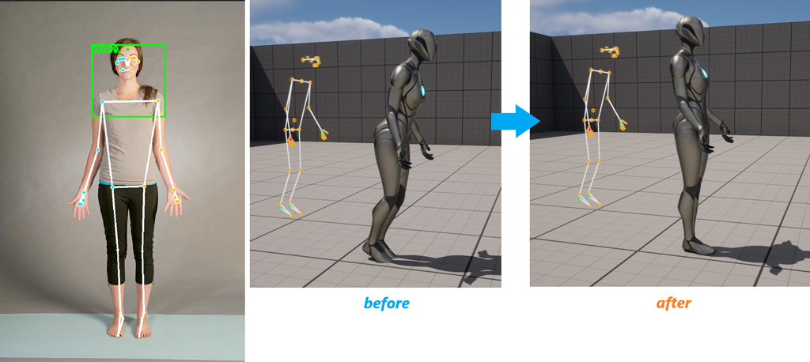
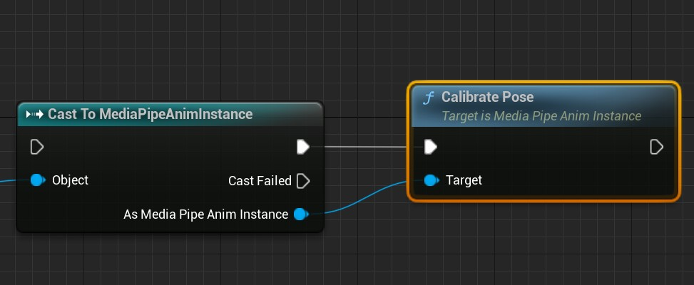
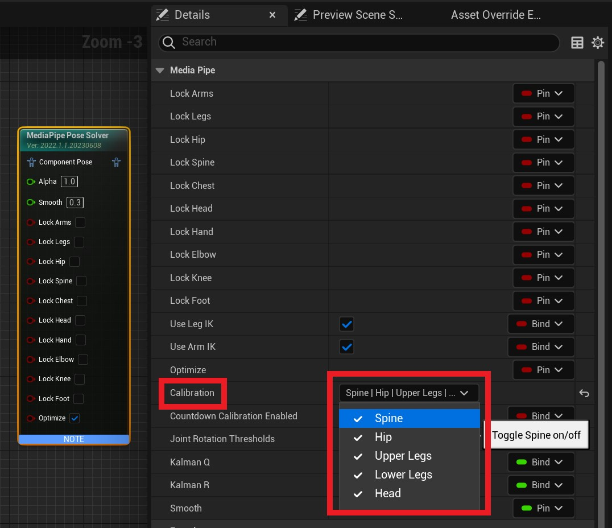
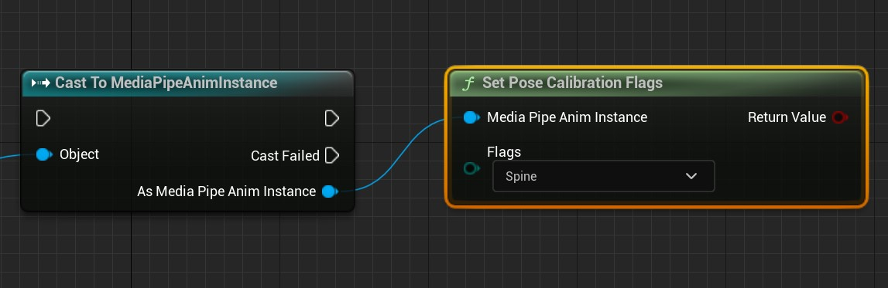
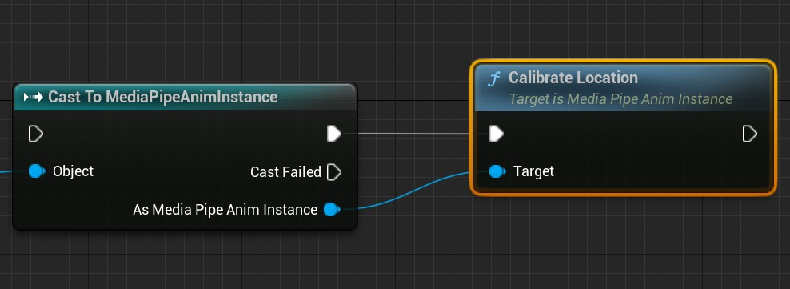

# Calibration

MediaPipe4U uses a calibration-free camera design and therefore cannot obtain physical camera parameters. Calibrating the character before motion capture corrects inaccurate position, leaning, and related issues.

Calibration has two parts:

- Pose calibration: corrects character leaning and legs that cannot fully extend.
- Location calibration: corrects an incorrect initial character position.
     
---   
## Overview

By default, MediaPipe4U starts a countdown before each capture and performs pose and location calibration when it ends.   
Control this behavior with `CalibrationCountdownSeconds` and `CalibrationPolicy` on MediaPipeAnimInstance.   

| Property | Description |
|-----|------|
|CalibrationCountdownSeconds|Countdown duration in seconds.|
|CalibrationPolicy|Countdown calibration behavior when capture starts.|

!!! tip

    CalibrationPolicy values:   
    
    **CountdownOnStart**: Count down and calibrate whenever capture starts.   
    **Manual**: Do not count down when capture starts.

### Runtime Countdown Calibration

With `CalibrationPolicy` set to **Manual**, MediaPipe4U does not start a countdown.   
Call `StartCalibrationCountdown` on `MediaPipeAnimInstance` at any time to start one manually.     
 
   
   
   
Call **CancelCalibrationCountdown** on MediaPipeAnimInstance to cancel it.   
   

 **Control Pose and Location Calibration**

By default, countdown completion calibrates location but not pose. Control this on the Animation Blueprint nodes.   

- **CountdownCalibrationEnabled** on MediaPipe Pose Solver controls pose calibration.   
- **CountdownCalibrationEnabled** on MediaPipe Location Solver controls location calibration.

!!! wanring
    
    Location calibration: a character cannot move until location calibration runs. If countdown location calibration is disabled, implement manual location calibration. 

   

The Blueprint function **SetCountdownCalibrationEnabled** provides the same control.

> **SetCountdownCalibrationEnabled** returns whether the operation succeeded; normally this return value can be ignored.

   

!!! tip

    Pose calibration requires the person to stand in a standard pose, so it is normally unsuitable for video capture unless the video begins with several seconds in that pose.    
    
    Before video capture, call **SetCountdownCalibrationEnabled** in Blueprint to disable countdown pose calibration.

    C++ can perform the same operation through static functions on `UMediaPipeMotionUtils`.

### Pose Calibration Invalidation

Some runtime operations invalidate pose calibration and require recalibration.

!!! warning

    Pose-calibration data is reset when these settings change at runtime:   
       
    - Disable/enable spine pitch (SpinePitchEnable)   
    - Spine pitch span (SetHipPitchSpan)   
    - Joint-lock state
       
    - For spine pitch and span concepts, read [Pose Solver: Spine Rotation Mode](../features/pose_solver.md).
  
---     

### Manual Calibration
In addition to countdown calibration, calibrate pose or location immediately in Blueprint or C++ as described below.
 
## Pose Calibration

Pose calibration records current joint angles as correction angles and applies them to every capture frame to correct bone-rotation offsets.   

 

Pose calibration is applied to the MediaPipe Pose Solver Animation Blueprint node.

- Call `CalibratePose` on MediaPipeAnimInstance to calibrate pose.      
- Call `UnCalibratePose` to clear pose-calibration data.   

Use `Calibration` to control which joints are calibrated.

Use `SetPoseCalibrationFlags` from the Blueprint function library to change calibrated joints at runtime.

> `SetPoseCalibrationFlags` returns whether the operation succeeded; normally this can be ignored.

---

## Location Calibration

Location calibration captures an image and simulates parameters such as camera FOV to calculate the relationship between camera and 3D coordinates.

- Call `CalibrateLocation` on `MediaPipeAnimInstance` to calibrate location.      
- Call `UnCalibrateLocation` to clear location-calibration data.   

 
